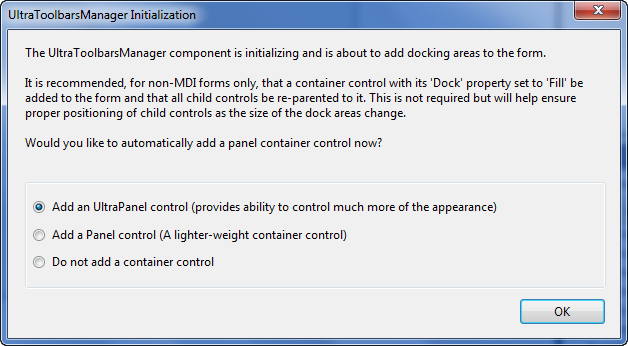
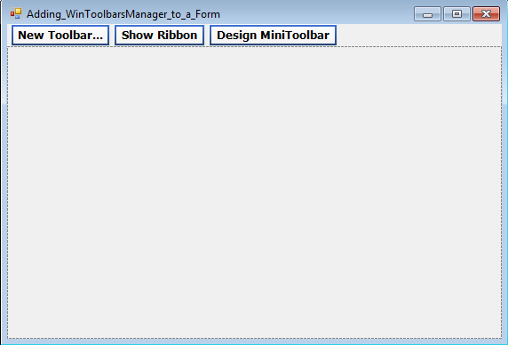

////

|metadata|
{
    "name": "wintoolbarsmanager-adding-wintoolbarsmanager-to-a-form",
    "controlName": ["WinToolbarsManager"],
    "tags": ["Getting Started"],
    "guid": "{3B2FCFF7-C596-41F8-992A-38FD80FEE21E}",  
    "buildFlags": [],
    "createdOn": "2005-07-07T00:00:00Z"
}
|metadata|
////

= Adding WinToolbarsManager to a Form

This topic is designed to get you up and running as quickly as possible by describing the minimum basic procedure for adding the WinToolbarsManager's™ component to a form in Visual Studio. In this exercise, you will see how to add the WinToolbarsManager to a Visual Basic.NET project and create a simple toolbar at design-time. You will also see some of the features of the component that are available to users at run-time, and how your setup of the element affects those features.

[start=1]
. Create a new Windows Application.
[start=2]
. Select the UltraToolbarsManager component in your toolbox and drag it onto the form.

As soon as you add the component to the form, you will see the following dialog:

This dialog appears because the component creates docking areas at the edge of each form to hold docked toolbars. These docking areas grow and shrink depending on the number of toolbars that are docked in them and their arrangement. If a control is placed directly on the form near a docking area, it is possible the area might overlap the control, rendering it inaccessible. As the message indicates, this caveat only applies to SDI forms; MDI forms that contain toolbars handle these issues automatically.
[start=3]
. Click "Yes" to have the control automatically add a Panel container control to fill the non-docking areas of the form. Any controls you place in the form will actually be placed inside the Panel container.

The ToolbarsManager is a non-visual control, so you do not need to draw it on the form. The control will appear in the component tray immediately under the form.
[start=4]
. Select the WinToolbarsManager component in the component tray and you will notice on the form several buttons appear across the top of the form. These buttons are available to aid in designing toolbars. The provide quick an easy setup of a basic toolbar, ribbon, or minitoolbar.

[start=5]
. Click the "New Toolbar" button. The New Toolbar dialog appears, which allows you to add toolbars to the form and set a name for the toolbar, a location, and change the type if you want. Accept the default settings and select OK.
[start=6]
. On the newly created toolbar click "Insert New Tool" and select "Insert New Tool" off the menu that appears. The New Tool dialog will appear. You use this dialog to specify the settings of the tools you create. You will begin by creating a "create new file" button. A series of default settings are specified for you to use when creating a new tool.
[start=7]
. Select the *Key* value field and change the text to "

[source]
----
FileNew
----

". This will be the unique identifier you use to refer to this tool in code. Next, change the text in the *Caption* box to "New". This is the text that will be displayed with the tool. You will see this text in the run-time customizer, and it will be used for the tooltip of the button, but the default button style displays an image without text, so this text will not appear on the toolbar using the current settings. Finally, select the *Category* combo and enter a new category for this tool by typing "File", and select the Add button to add the tool to the toolbar.
[start=8]
. Notice that the New Tool dialog remains open, but the settings of the dialog have been reset to their default values, except for the Category combo box. Once the new tool is added, the dialog is ready for you to immediately add another tool in the same category.
[start=9]
. Use the New Tool dialog to add a second tool. Give this one a Key value of "

[source]
----
FileOpen
----

" and a Caption value of "

[source]
----
Open
----

". Leave the Category set to "File". Click "Add" to create the tool.
[start=10]
. Add a third button tool with a Key of "

[source]
----
FileSave
----

" and a caption of "

[source]
----
Save
----

". After you click "Add" to create the tool, click "Close" to dismiss the dialog.
[start=11]
. Right click in the Toolbar region or on the UltraToolBarsManager and select the link labeled "Customize...". This will launch the WinToolbarsManager designer. In the Toolbars tab make sure that "UltraToolbar1" is selected and navigate in the properties grid to *Settings* > *ToolDisplayStyle* , and change it to TextOnlyAlways. Click "Close" to close the designer. This will make the toolbar display the Caption value assigned to the tool, instead of the image, since we didn't assign an image to the tools.
[start=12]
. Double-Click the WinToolbarsManager control in the component tray. The code window will open up with the *ToolClick* event displayed and ready for you to enter code. Enter the following example code:

*In Visual Basic:*

----
Private Sub UltraToolbarsManager1_ToolClick(ByVal sender As Object, _
  ByVal e As Infragistics.Win.UltraWinToolbars.ToolClickEventArgs) _
  Handles UltraToolbarsManager1.ToolClick
	Select Case e.Tool.Key
	Case "FileNew"
		MessageBox.Show("Create New File!")
	Case "FileOpen"
		MessageBox.Show("Open Existing File!")
	Case "FileSave"
		MessageBox.Show("Save Current File!")
	End Select
End Sub
----

*In C#:*

----
private void ultraToolbarsManager1_ToolClick(object sender, 
  Infragistics.Win.UltraWinToolbars.ToolClickEventArgs e)
{
	switch(e.Tool.Key)
	{
		case "FileNew":
			MessageBox.Show("Create New File!");
			break;
		case "FileOpen":
			MessageBox.Show("Open Existing File!");
			break;
		case "FileSave":
			MessageBox.Show("Save Current File!");
			break;
	}
}
----

[start=13]
. Run the project. When the form appears click the New button. You will see the message box appear. You can also test the other buttons.