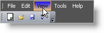

////

|metadata|
{
    "name": "wintoolbarsmanager-change-a-tools-appearance",
    "controlName": ["WinToolbarsManager"],
    "tags": ["Styling"],
    "guid": "{87141F5A-7A42-43D1-BF76-A23EB919B368}",  
    "buildFlags": [],
    "createdOn": "2005-07-07T00:00:00Z"
}
|metadata|
////

= Change a Tool's Appearance

In the  pick:[win-forms="link:{ApiPlatform}win.ultrawintoolbars{ApiVersion}~infragistics.win.ultrawintoolbars.toolappearances.html[ToolAppearances]"]  class there are a few appearance properties where you can control the look of the tools.

== Tools

*  pick:[win-forms="link:{ApiPlatform}win.ultrawintoolbars{ApiVersion}~infragistics.win.ultrawintoolbars.toolappearances~appearance.html[Appearance]"]  - General appearance of the specific tool.
*  pick:[win-forms="link:{ApiPlatform}win.ultrawintoolbars{ApiVersion}~infragistics.win.ultrawintoolbars.toolappearances~appearanceonmenu.html[AppearanceOnMenu]"]  - Appearance of a tool when it is on a menu overrides the Appearance property.
*  pick:[win-forms="link:{ApiPlatform}win.ultrawintoolbars{ApiVersion}~infragistics.win.ultrawintoolbars.toolappearances~appearanceontoolbar.html[AppearanceOnToolBar]"]  - Appearance of the tool when it is on the toolbar.
*  pick:[win-forms="link:{ApiPlatform}win.ultrawintoolbars{ApiVersion}~infragistics.win.ultrawintoolbars.toolappearances~hottrackappearance.html[HotTrackAppearance]"]  - Appearance of the tool as you mouse over.
*  pick:[win-forms="link:{ApiPlatform}win.ultrawintoolbars{ApiVersion}~infragistics.win.ultrawintoolbars.toolappearances~hottrackappearanceonmenu.html[HotTrackAppearanceOnMenu]"]  - Appearance of the tool as you mouse over the tool when it is on a menu.
*  pick:[win-forms="link:{ApiPlatform}win.ultrawintoolbars{ApiVersion}~infragistics.win.ultrawintoolbars.toolappearances~hottrackappearanceontoolbar.html[HotTrackAppearanceOnToolBar]"]  - Appearance of the tool as you mouse over the tool when it is on a toolbar.
*  pick:[win-forms="link:{ApiPlatform}win.ultrawintoolbars{ApiVersion}~infragistics.win.ultrawintoolbars.toolappearances~pressedappearance.html[PressedAppearance]"]  - Appearance of the tool when it is clicked on.Good for State buttons
*  pick:[win-forms="link:{ApiPlatform}win.ultrawintoolbars{ApiVersion}~infragistics.win.ultrawintoolbars.toolappearances~pressedappearanceonmenu.html[PressedAppearanceOnMenu]"]  - Appearance of the menu tool when it is clicked on.
*  pick:[win-forms="link:{ApiPlatform}win.ultrawintoolbars{ApiVersion}~infragistics.win.ultrawintoolbars.toolappearances~pressedappearanceontoolbar.html[PressedAppearanceOnToolbar]"]  - Appearance of the toolbar tool when it is clicked on.

== At Design Time

[start=1]
. Right click on the  pick:[win-forms="link:{ApiPlatform}win.ultrawintoolbars{ApiVersion}~infragistics.win.ultrawintoolbars.ultratoolbarsmanager.html[UltraToolBarsManager]"]  and choose Customize.
[start=2]
. In the tool tab choose one of your button tools.
[start=3]
. Open the  pick:[win-forms="link:{ApiPlatform}win.ultrawintoolbars{ApiVersion}~infragistics.win.ultrawintoolbars.sharedprops.html[SharedProps]"]  class then in the AppearanceSmall or AppearancesLarge property you will see all the above properties.
[start=4]
. Set some properties on each of them to see the different effects that you can achieve.

== At Run Time

*In Visual Basic:*

----
Imports Infragistics.Win
...
Private Sub Change_a_Tools_Appearance_Load(ByVal sender As System.Object, _
  ByVal e As System.EventArgs) Handles MyBase.Load
	Me.UltraToolbarsManager1.Toolbars(0).Tools(2).SharedProps.AppearancesSmall. _
	  AppearanceOnToolbar.BackColor = Color.Beige
	Me.UltraToolbarsManager1.Toolbars(0).Tools(2).SharedProps.AppearancesSmall. _
	  HotTrackAppearance.BackColor = Color.Blue
End Sub
----

*In C#:*

----
using Infragistics.Win;
...
private void Change_a_Tools_Appearance_Load(object sender, EventArgs e)
{
	this.ultraToolbarsManager1.Toolbars[0].Tools[2].SharedProps.AppearancesSmall. 
	  AppearanceOnToolbar.BackColor = Color.Beige;
	this.ultraToolbarsManager1.Toolbars[0].Tools[2].SharedProps.AppearancesSmall. 
	  HotTrackAppearance.BackColor = Color.Blue;
}
----

