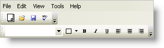

////

|metadata|
{
    "name": "wintoolbarsmanager-change-the-style-of-wintoolbarsmanager",
    "controlName": ["WinToolbarsManager"],
    "tags": ["Styling"],
    "guid": "{61179972-1994-487E-BE26-33F7DA8BDA6B}",  
    "buildFlags": [],
    "createdOn": "2005-07-07T00:00:00Z"
}
|metadata|
////

= Change the Style of WinToolbarsManager

WinToolbarsManager™ has various styles available to change the appearance of the element:

* Office 2000
* Office XP
* Office 2003
* Visual Studio 2005
* Office 2007
* Windows Vista
* Scenic Ribbon
* Office 2010

The style for the UltraToolBarsManager can be set at both design-time and at run-time. At design-time, it can be set through the  pick:[win-forms="link:{ApiPlatform}win.ultrawintoolbars{ApiVersion}~infragistics.win.ultrawintoolbars.ultratoolbarsmanager~style.html[Style]"]  property located in the Properties window. The style can also be changed in code by setting the Style property of the UltraToolbarsManager to one of the four styles.

To change the style at run-time, use the following code:

*In Visual Basic:*

----
Imports Infragistics.Win.UltraWinToolbars
...
Private Sub Change_the_Style_of_WinToolbarsManager_Load( _
  ByVal sender As System.Object, _
  ByVal e As System.EventArgs) Handles MyBase.Load
        Me.UltraToolbarsManager1.Style = ToolbarStyle.VisualStudio2005
End Sub
----

*In C#:*

----
using Infragistics.Win.UltraWinToolbars;
...
private void Change_the_Style_of_WinToolbarsManager_Load( 
  object sender, EventArgs e)
{
        this.ultraToolbarsManager1.Style = ToolbarStyle.VisualStudio2005;
}
----

