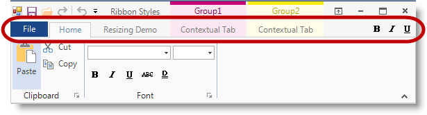
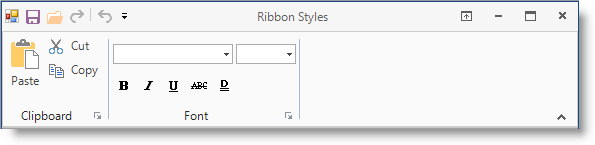
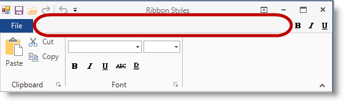

////

|metadata|
{
    "name": "wintoolbarsmanager-configuring-ribbon-tab-item-visibility",
    "controlName": [],
    "tags": [],
    "guid": "3ecb93ec-8a43-4322-b442-107ddf5b8b20",  
    "buildFlags": [],
    "createdOn": "2014-01-29T16:27:08.7883852Z"
}
|metadata|
////

= Configuring Ribbon Tab Item Visibility

== Topic Overview

=== Purpose

This topic provides an overview on how to configure Ribbon tab items visibility to reclaim unused space allocated for a tab items.

=== In this topic

This topic contains the following sections:

* <<_Ref376430810,Tab Item Visibility Overview>>

** <<_Ref370929747,Introduction>>
** <<_Ref376430820,Configuring Tab item visibility>>

* <<_Ref370929790,Related Content>>

[[_Ref376430810]]
== Tab Item Visibility Overview

[[_Ref370929747]]

=== Introduction

This feature allows developers to configure the visibility of tab items using the link:{ApiPlatform}win.ultrawintoolbars{ApiVersion}~infragistics.win.ultrawintoolbars.ribbon~tabitemareadisplaystyle.html[TabItemAreaDisplayStyle] property in  _UltraToolbarsManager_  ’s Ribbon.

[[_Ref376430820]]

=== Configuring Tab item visibility

The visibility of the tab item area can be configured to show or hide tab items. Hiding tab items will also reduce the height of the ribbon area. The available options from the link:{ApiPlatform}win.ultrawintoolbars{ApiVersion}~infragistics.win.ultrawintoolbars.ribbon~tabitemareadisplaystyle.html[TabItemAreaDisplayStyle] configurable property are listed in the following table:

[options="header", cols="a,a"]
|====
|Value|Description

|Visible
|Display all Tab items (Default).

|Hidden
|Hides all Ribbon tab items, including the application menu button and Tab item tool bar, thus reducing the overall tab area.

|HideTabs
|Hides only Ribbon tab items, including contextual tabs.

|====

.Note:
[NOTE]
====
You may configure ribbons containing contextual tabs, using either the  _Hidden_   or  _Hide Tabs_   options, to hide the entire group of contextual tabs.
====

Ribbon Tab item area –  *Visible* .

Ribbon Tab item area –  *Hidden*  (Tab area reduced).

Ribbon Tab item area –  *HideTabs* .

[[_Ref370929790]]
== Related Content

=== Topics

The following topic provides additional information related to this topic.

[options="header", cols="a,a"]
|====
|Topic|Purpose

| link:wintoolbarsmanager-add-a-tab-to-the-ribbon.html[Add a Tab to the Ribbon]
|This topic discusses how you can add a single tab to the Ribbon. After the tab has been added, you can then add a group to a Ribbon tab, and then add a tool to a Ribbon group.

|====