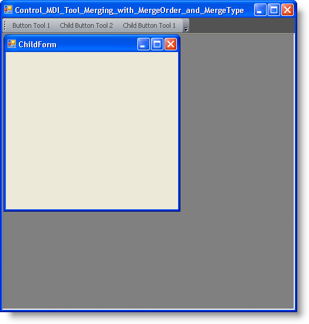

////

|metadata|
{
    "name": "wintoolbarsmanager-control-mdi-tool-merging-with-mergeorder-and-mergetype",
    "controlName": ["WinToolbarsManager"],
    "tags": [],
    "guid": "{1848ABD8-7BAD-4977-95FE-148EE716899D}",  
    "buildFlags": [],
    "createdOn": "2005-07-07T00:00:00Z"
}
|metadata|
////

= Control MDI Tool Merging with MergeOrder and MergeType

When a MDI child form is activated at run-time, its  pick:[win-forms="link:{ApiPlatform}win.ultrawintoolbars{ApiVersion}~infragistics.win.ultrawintoolbars.toolbarscollection.html[Toolbars]"]  will be merged with the toolbars contained in its MDI parent form. If two toolbars have the same key, the tools on those toolbars will be merged into one toolbar. (Any Toolbar that is set to be the main menubar for a form will be merged regardless of whether the keys are the same.)

When the two toolbars are merged, each tool from the MDI child is added to the toolbar in the MDI parent unless it has the same key and is the same type as a tool that is already present in the toolbar on the MDI parent. In this case, the  pick:[win-forms="link:{ApiPlatform}win.ultrawintoolbars{ApiVersion}~infragistics.win.ultrawintoolbars.sharedprops~mergetype.html[MergeType]"]  property of the tool will determine what action is taken. Possible actions include Default, Add, Replace, MergeItems (for  pick:[win-forms="link:{ApiPlatform}win.ultrawintoolbars{ApiVersion}~infragistics.win.ultrawintoolbars.popupmenutool.html[PopupMenuTools]"]  only) and Remove.

.Note
[NOTE]
====
When there is a conflict between the MergeType settings of tools, the MergeType set for the tool on the child form takes precedence.
====

All tools start out with a MergeType of Default. When set to this value, the tool will take a default action, based on what type of tool it is. Most tools default to "Replace" but the value effectively works as "Replace or Add". The tool on the MDI child's toolbar will replace the one on the MDI parent's toolbar that has the same key and the same type, but if there is no such tool on the parent's toolbar, the child's tool will be added to the parent's toolbar.

The PopupMenu tool has a default action of "MergeItems." This action will merge the tools contained in two menus that have the same key so that they appear on one menu.

The "Add" action causes the tool on the MDI child's toolbar to appear in addition to the one on the MDI parent's toolbar. Both tools remain available.

The "Remove" action will remove a tool from both the child and parent toolbar when the toolbars are merged. This gives you a way to override tools that are available on the parent toolbar. For example, if you have a tool that should be available on all MDI child forms but one, you can add the tool to that form and set its MergeType to "Remove". You would also place the same tool on the parent form's toolbar to make it available for all other forms. When the child form with the tool becomes active, the tool is removed from the parent's toolbar.

When the tools are merged into one toolbar, the  pick:[win-forms="link:{ApiPlatform}win.ultrawintoolbars{ApiVersion}~infragistics.win.ultrawintoolbars.sharedprops~mergeorder.html[MergeOrder]"]  property will be used to determine the order in which the tools are displayed. The collection of merged tools will be displayed in order of the value of their MergeOrder property. If two tools have the same MergeOrder, tools on the MDI parent will be displayed in their original order followed by tools on the MDI child in their original order.

At design-time, the MergeType properties for each tool can be set by right clicking on the UltraToolBarsManager element and selecting "Customize". Then select the tool under the Tools tab. The MergeType and MergeOrder properties will be available under SharedProps.

== Code in Parent Form

*In Visual Basic:*

----
Imports Infragistics.Win.UltraWinToolbars
...
Private Sub Control_MDI_Tool_Merging_with_MergeOrder_and_MergeType_Load( _
  ByVal sender As System.Object, _
  ByVal e As System.EventArgs) Handles MyBase.Load
	' Creates three new button tools
	Dim button1 As New ButtonTool("button1")
	Dim button2 As New ButtonTool("button2")
	Dim button3 As New ButtonTool("button3")
	' Adds the buttons tools to the Tools collection
	Me.UltraToolbarsManager1.Tools.Add(button1)
	Me.UltraToolbarsManager1.Tools.Add(button2)
	Me.UltraToolbarsManager1.Tools.Add(button3)
	' Sets the display for the tools
	button1.SharedProps.Caption = "Button Tool 1"
	button2.SharedProps.Caption = "Button Tool 2"
	button3.SharedProps.Caption = "Button Tool 3"
	button1.SharedProps.DisplayStyle = ToolDisplayStyle.TextOnlyAlways
	button2.SharedProps.DisplayStyle = ToolDisplayStyle.TextOnlyAlways
	button3.SharedProps.DisplayStyle = ToolDisplayStyle.TextOnlyAlways
	' Add the tools to the toolbar
	Me.UltraToolbarsManager1.Toolbars("UltraToolbar1").Tools.AddTool("button1")
	Me.UltraToolbarsManager1.Toolbars("UltraToolbar1").Tools.AddTool("button2")
	Me.UltraToolbarsManager1.Toolbars("UltraToolbar1").Tools.AddTool("button3")
	' Sets the MergeOrder for each of the button tools
	' MergeType will be default for all three button tools
	button1.SharedProps.MergeOrder = 1
	button2.SharedProps.MergeOrder = 2
	button3.SharedProps.MergeOrder = 3
End Sub
----

*In C#:*

----
using Infragistics.Win.UltraWinToolbars;
...
private void Control_MDI_Tool_Merging_with_MergeOrder_and_MergeType_Load(
  object sender, 
  EventArgs e)
{
	// Creates three new button tools
	ButtonTool button1 = new ButtonTool("button1");
	ButtonTool button2 = new ButtonTool("button2");
	ButtonTool button3 = new ButtonTool("button3");
	// Adds the buttons tools to the Tools collection
	this.ultraToolbarsManager1.Tools.Add(button1);
	this.ultraToolbarsManager1.Tools.Add(button2);
	this.ultraToolbarsManager1.Tools.Add(button3); 
	// Sets the display for the tools
	button1.SharedProps.Caption = "Button Tool 1";
	button2.SharedProps.Caption = "Button Tool 2";
	button3.SharedProps.Caption = "Button Tool 3";
	button1.SharedProps.DisplayStyle = ToolDisplayStyle.TextOnlyAlways;
	button2.SharedProps.DisplayStyle = ToolDisplayStyle.TextOnlyAlways;
	button3.SharedProps.DisplayStyle = ToolDisplayStyle.TextOnlyAlways;
	// Add the tools to the toolbar
	this.ultraToolbarsManager1.Toolbars["UltraToolbar1"].Tools.AddTool("button1");
	this.ultraToolbarsManager1.Toolbars["UltraToolbar1"].Tools.AddTool("button2");
	this.ultraToolbarsManager1.Toolbars["UltraToolbar1"].Tools.AddTool("button3");
	// Sets the MergeOrder for each of the button tools
	// MergeType will be default for all three button tools
	button1.SharedProps.MergeOrder = 1; 
	button2.SharedProps.MergeOrder = 2;
	button3.SharedProps.MergeOrder = 3;
}
----

== Code in the MDI Child Form

*In Visual Basic:*

----
Private Sub ChildForm_ToolbarsManager_Load(ByVal sender As System.Object, _
  ByVal e As System.EventArgs) Handles MyBase.Load
	' The toolbars on this form will be merged with the toolbars on the MDI Parent
	Me.UltraToolbarsManager1.MdiMergeable = True
	' Creates three new button tools with the same keys as the button 
	' tools in the MDI Parent
	Dim button1 As New ButtonTool("button1")
	Dim button2 As New ButtonTool("button2")
	Dim button3 As New ButtonTool("button3")
	' Adds the buttons tools to the Tools collection
	Me.UltraToolbarsManager1.Tools.Add(button1)
	Me.UltraToolbarsManager1.Tools.Add(button2)
	Me.UltraToolbarsManager1.Tools.Add(button3)
	' Sets the display for each Button tool
	button1.SharedProps.Caption = "Child Button Tool 1"
	button2.SharedProps.Caption = "Child Button Tool 2"
	button3.SharedProps.Caption = "Child Button Tool 3"
	button1.SharedProps.DisplayStyle = ToolDisplayStyle.TextOnlyAlways
	button2.SharedProps.DisplayStyle = ToolDisplayStyle.TextOnlyAlways
	button3.SharedProps.DisplayStyle = ToolDisplayStyle.TextOnlyAlways
	' Add the tools to the toolbar
	Me.UltraToolbarsManager1.Toolbars("UltraToolbar1").Tools.AddTool("button1")
	Me.UltraToolbarsManager1.Toolbars("UltraToolbar1").Tools.AddTool("button2")
	Me.UltraToolbarsManager1.Toolbars("UltraToolbar1").Tools.AddTool("button3")
	' This tool will be added to the toolbar in addition to the one with 
	' the same key
	button1.SharedProps.MergeType = MenuMergeType.Add
	' It will be displayed as the last button tool since its MergeOrder 
	' is the highest
	button1.SharedProps.MergeOrder = 5
	' This tool will replace the tool with the same key current on the 
	' Parent's toolbar
	button2.SharedProps.MergeType = MenuMergeType.Replace
	' It will be displayed as the second tool in the toolbar
	button2.SharedProps.MergeOrder = 2
	' This tool will be removed from the toolbar
	button3.SharedProps.MergeType = MenuMergeType.Remove
	button3.SharedProps.MergeOrder = 3
End Sub
----

*In C#:*

----
private void ChildForm_Toolbars_Load(object sender, EventArgs e)
{
	// The toolbars on this form will be merged with the toolbars on the 
	// MDI Parent
	this.ultraToolbarsManager1.MdiMergeable = true;
	// Creates three new button tools with the same keys as the button 
	// tools in the MDI Parent
	ButtonTool button1 = new ButtonTool("button1");
	ButtonTool button2 = new ButtonTool("button2");
	ButtonTool button3 = new ButtonTool("button3");
	// Adds the buttons tools to the Tools collection
	this.ultraToolbarsManager1.Tools.Add(button1);
	this.ultraToolbarsManager1.Tools.Add(button2);
	this.ultraToolbarsManager1.Tools.Add(button3);
	// Sets the display for each Button tool
	button1.SharedProps.Caption = "Child Button Tool 1";
	button2.SharedProps.Caption = "Child Button Tool 2";
	button3.SharedProps.Caption = "Child Button Tool 3";
	button1.SharedProps.DisplayStyle = ToolDisplayStyle.TextOnlyAlways;
	button2.SharedProps.DisplayStyle = ToolDisplayStyle.TextOnlyAlways;
	button3.SharedProps.DisplayStyle = ToolDisplayStyle.TextOnlyAlways;
	// Add the tools to the toolbar
	this.ultraToolbarsManager1.Toolbars["UltraToolbar1"].Tools.AddTool("button1");
	this.ultraToolbarsManager1.Toolbars["UltraToolbar1"].Tools.AddTool("button2");
	this.ultraToolbarsManager1.Toolbars["UltraToolbar1"].Tools.AddTool("button3");
	// This tool will be added to the toolbar in addition to the one 
	// with the same key
	button1.SharedProps.MergeType = MenuMergeType.Add;
	// It will be displayed as the last button tool since its MergeOrder 
	// is the highest
	button1.SharedProps.MergeOrder = 5;
	// This tool will replace the tool with the same key current on the 
	// parent's toolbar
	button2.SharedProps.MergeType = MenuMergeType.Replace;
	// It will be displayed as the second tool in the toolbar
	button2.SharedProps.MergeOrder = 2;
	// This tool will be removed from the toolbar
	button3.SharedProps.MergeType = MenuMergeType.Remove;
	button3.SharedProps.MergeOrder = 3;
}
----

