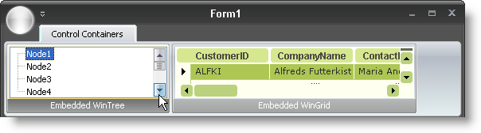

////

|metadata|
{
    "name": "wintoolbarsmanager-controlcontainer-tool-now-works-inside-the-ribbon-whats-new-20071",
    "controlName": [],
    "tags": [],
    "guid": "{27484DBE-6609-477A-AAB5-EF0CCA3F3578}",  
    "buildFlags": [],
    "createdOn": "2006-11-12T15:25:13Z"
}
|metadata|
////

= ControlContainer Now Works Inside the Ribbon

In the 2006 Volume 3 release, the  pick:[win-forms="link:{ApiPlatform}win.ultrawintoolbars{ApiVersion}~infragistics.win.ultrawintoolbars.controlcontainertool.html[ControlContainerTool]"]  was one of the few tools that the Ribbon did not support. The ControlContainer tool can be an extremely important piece of any toolbar, though. This tool can host any .NET control, giving you ultimate customizability in a toolbar. Now the ControlContainer tool can be used in a RibbonGroup, allowing for the Ribbon to host any of our Windows Forms controls.

With both design-time and run-time support, adding a ControlContainer tool is just as easy as adding any other tool to the Ribbon. Once you've instantiated one of our Windows Forms controls, or any .NET control for that matter, you simply need to set the ControlContainer's  pick:[win-forms="link:{ApiPlatform}win.ultrawintoolbars{ApiVersion}~infragistics.win.ultrawintoolbars.controlcontainertool~control.html[Control]"]  property to that control and you're done.

== Related Topics

link:wintoolbarsmanager-controlcontainer.html[ControlContainer Tool]

link:wintoolbarsmanager-add-a-tool-to-a-ribbon-group.html[Add a Tool to a Ribbon Group]