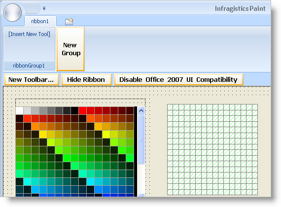
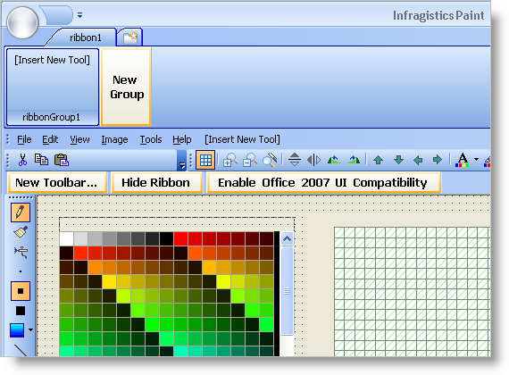
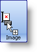
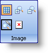
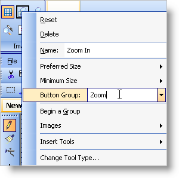
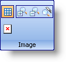
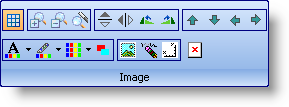
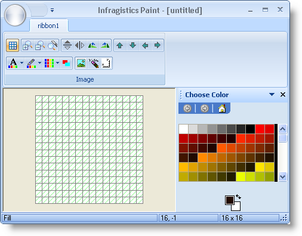

////

|metadata|
{
    "name": "wintoolbarsmanager-converting-a-standard-toolbar-to-a-ribbon",
    "controlName": ["WinToolbarsManager"],
    "tags": ["Application Scenarios"],
    "guid": "{0AA0DB3F-68DC-472E-BCE2-6D601CEFAA33}",  
    "buildFlags": [],
    "createdOn": "2006-06-10T10:45:29Z"
}
|metadata|
////

= Converting a Standard Toolbar to a Ribbon

{Warning}

== Before You Begin

Because of their unique object models, the Ribbon and a standard toolbar are actually quite similar. Both the toolbar and Ribbon use the same tools. Adding tools to these two objects is surprisingly similar. WinToolbarsManager™ includes a  pick:[win-forms="link:{ApiPlatform}win.ultrawintoolbars{ApiVersion}~infragistics.win.ultrawintoolbars.toolbarscollection.html[Toolbars]"]  collection and a  pick:[win-forms="link:{ApiPlatform}win.ultrawintoolbars{ApiVersion}~infragistics.win.ultrawintoolbars.ribbon.html[Ribbon]"]  off the main class. Each toolbar includes a  pick:[win-forms="link:{ApiPlatform}win.ultrawintoolbars{ApiVersion}~infragistics.win.ultrawintoolbars.toolscollection.html[Tools]"]  collection. The Ribbon includes a Groups collection, and then a Tools collection. Once you know how to add and manipulate tools on a standard toolbar, the Ribbon can be modified in the same way.

Both at design time and in the run time object model, you can add tools to the Ribbon just as you would a standard toolbar. At design time, when the WinToolbarsManager component is selected in the component tray, you will notice a button that says Show Ribbon. Clicking this button displays the Ribbon. You can then click the Add Tab button followed by the Add Group button. For more information on these buttons, see link:wintoolbarsmanager-add-a-tab-to-the-ribbon.html[Add a Tab to the Ribbon] and link:wintoolbarsmanager-add-a-group-to-a-ribbon-tab.html[Add a Group to a Ribbon Tab]. Once you have a group in the Ribbon, you will see the Add Tool button. Once you click this button, you will have the choice between adding a new tool or adding an existing tool. This is where the toolbar conversion process begins.

To "convert" your standard toolbar to a Ribbon, you need only add all your previously existing tools to the Ribbon. In essence, you aren't actually converting your toolbar to a Ribbon, you are simply re-adding all the tools. Your standard toolbar and Ribbon can exist only if the Office2007UICompatibility property is set to False. You will need to do this so you can see both Ribbon and standard toolbar in order to drag tools from the standard toolbar to the Ribbon.

== What You Will Accomplish

Follow along as we guide you through the simple process of creating a Ribbon based on a standard toolbar. You will open the IGPaint sample that ships as part of the Infragistics Professional SDK install. You will drag tools from existing toolbars onto the Ribbon. You will then tweak the appearance of these tools to give them an organized feel.

== Follow these Steps

[start=1]
. *Copy the IGPaint sample to your Visual Studio Projects\2005 folder.*

First you need to copy the IGPaint sample to your project folder so you don't modify the original. You will find the sample in the following default installation folder:

*Visual Basic project:*

** XP -- {InstallPathXP}{ProductNameVersion}\Samples\Win\WinToolbars\VB\Infragistics Paint VB
** Vista -- {InstallPathVista}{ProductNameVersion}\Samples\Win\WinToolbars\VB\Infragistics Paint VB

*C# project:*

** XP -- {InstallPathXP}{ProductNameVersion}\Samples\Win\WinToolbars\CS\Infragistics Paint CS
** Vista -- {InstallPathVista}{ProductNameVersion}\Samples\Win\WinToolbars\CS\Infragistics Paint CS

Copy the Infragistics Paint CS\VB folder to your Visual Studio Projects\2005 folder. Open the solution file. The solution will load in the Solution Explorer. Right-click ImageEditor in the Solution Explorer and select View Designer. The main form of the paint program opens.
[start=2]
. *Create the Ribbon group to hold the tools.*

You need to create a new  pick:[win-forms="link:{ApiPlatform}win.ultrawintoolbars{ApiVersion}~infragistics.win.ultrawintoolbars.ribbontab.html[RibbonTab]"]  and  pick:[win-forms="link:{ApiPlatform}win.ultrawintoolbars{ApiVersion}~infragistics.win.ultrawintoolbars.ribbongroup.html[RibbonGroup]"]  to place the existing tools inside.

.. With the ultraToolbarsManager1 component selected, click the Show Ribbon button towards the top of the form. The Ribbon displays and all other toolbars disappear.
.. Click the New Tab button. A new tab appears.
.. Click the New Group button. A new group appears.

You are now ready to transfer tools from the standard toolbar to the Ribbon.
[start=3]
. *Setup the form to display both toolbars and Ribbon.*

In order to transfer the tools, you need to be able to see both the standard toolbars and Ribbon at the same time. In order to do this, you will need to click the Disable Office 2007 UI Compatibility button. Once you do this, the standard toolbars will reappear and the Ribbon will change to the Office 2003 look and feel, matching the standard toolbars.

Now that you can see both toolbars and Ribbon, you need to simply drag and drop tools from the toolbars into groups on the Ribbon. This walkthrough will focus on the image toolbar.

image::images/WinToolbarsManager_Converting_a_Standard_Toolbar_to_a_Ribbon_03.png[example of ultratoolbarsmanager toolbar]

You may repeat the steps of this walkthrough for all other toolbars in the sample if you wish.
[start=4]
. *Setup the Ribbon group to display the tools properly.*

You are going to change three properties on the group you created. First you are going to change the caption of the group to Image. This reflects the purpose of the tools that you are going to transfer from the toolbar. These tools will affect various image properties. The next thing that you will change is how the buttons are displayed. We only want the image of the button to display, not the text as well. This is useful if you have several buttons and including their text would take up too much space. The third thing to change is the layout directions of the buttons. By default, buttons will be arranged from top to bottom, then left to right. Small buttons will take up three rows before going on to the next column. Large buttons will fill the entire three rows. You will want to change the layout of these buttons from vertical to horizontal. Perform these three actions by following these steps:

.. Expand the Ribbon object in the properties window and find the Tabs collection.
.. Click on the ellipsis (...) to open the RibbonTab Collection Editor. The RibbonTab Collection Editor appears.
.. Click on the ellipsis next to the Groups Collection in the properties window of the RibbonTab CollectionEditor. The RibbonGroup Collection Editor appears.
.. Set the Caption property to 'Image'.
.. Set the PreferredToolSize property to ImageOnly.
.. Set the LayoutDirection property to Horizontal.
.. Click OK to close the RibbonGroup Collection Editor.
.. Click OK to close the RibbonTab Collection Editor.

[start=5]
. *Transfer the tools from the standard toolbar to the Ribbon group.*

You may notice that the standard toolbar is divided up into sections: the grid, the magnifying glass, the flip and rotate buttons, the move buttons, etc. Each tool to the immediate right of a vertical line has their InstanceProps.IsFirstInGroup property set to true. These vertical lines show a clear indication of groups of tools. The Ribbon can also display groups of tools, but does so in a different manner. Each tool has a ButtonGroup property. If two tools are set to the same button group, they will both display as a single group.

.. Click and drag the Display Image Grid tool from the toolbar into the Ribbon group. The mouse cursor will turn into a pointer with a plus sign when you are hovering over a valid location to drop the tool. A thick, vertical line will show you where the tool will be placed.

.. Click and drag each of the zoom tools and place them one after the other right after the Display Image Grid tool. The Ribbon group should now look like this:

.. Right-click the Zoom In tool and type 'Zoom' in the Button Group textbox.

.. Right-click the other two zoom tools and set their Button Group property to the same. Now that you've already entered in Zoom once, you can select it from the drop-down. Your Ribbon group should now look like this:

If you repeat steps 2 through 4 for the remaining button groups (naming them 'FlipRotate', 'Move', 'Color', and 'Image' respectively), your Ribbon group will look like this:

You can repeat the steps in this walkthrough for all the other toolbars in the sample. You can create new Ribbon groups, or even a new Ribbon tab with other Ribbon groups. You can even transfer the MainMenu toolbar to the ApplicationMenu in the upper left corner of the Ribbon.

For now, let's just see what the one group looks like that we just created. Click the Enable Office 2007 UI Compatibility button again. The standard toolbars will disappear and the look and feel of the Ribbon will resolve to Office 2007. The actual Style property of the toolbar, however, will still be set to Office2003. Change it to Office2007.

.Note
[NOTE]
====
The Style property must be set to Office2007 while the Ribbon is shown.
====

[start=6]
. *Run the application.*

When you run the application, you will see no toolbars. You will only see one Ribbon tab with one Ribbon group. All the tools that you transferred to the group will be fully functioning as if they were originally made for the Ribbon.

