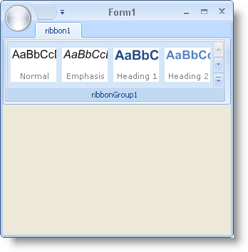

////

|metadata|
{
    "name": "wintoolbarsmanager-creating-a-gallery-of-styles",
    "controlName": ["WinToolbarsManager"],
    "tags": ["Styling"],
    "guid": "{75D5417A-3380-41E2-85F9-D9712F7C30AF}",  
    "buildFlags": [],
    "createdOn": "2006-06-10T10:52:25Z"
}
|metadata|
////

= Creating a Gallery of Styles

== Before You Begin

The purpose of the  pick:[win-forms="link:{ApiPlatform}win.ultrawintoolbars{ApiVersion}~infragistics.win.ultrawintoolbars.popupgallerytool.html[PopupGalleryTool]"]  is to showcase a collection of visual items that the end user can quickly view and select from. The PopupGalleryTool displays a preview and a drop-down box over the preview. The preview only shows a few  pick:[win-forms="link:{ApiPlatform}win.ultrawintoolbars{ApiVersion}~infragistics.win.ultrawintoolbars.gallerytoolitem.html[GalleryToolItems]"]  at a time, but can be scrolled through. The drop-down can show several GalleryToolItems at a time, but can also be resized to show more or less items.

The original Popup Gallery is used in Microsoft's Office 2007 Ribbon as a style gallery. This gallery shows the end user what styles they can apply to their text. The gallery items display with a sample of the style and a caption underneath stating which style it is. These gallery items are simply images of the styles. The only difficult part of creating these images is that you need to capture an image of the WinFormattedLinkLabel™ control emulating these styles. Once you have the image of the style, you can add a caption to the bottom of the image.

== What You Will Accomplish

This walkthrough will guide you step-by-step through creating a PopupGalleryTool and adding several items to it. Once you have a PopupGalleryTool complete with items, you will then add images to those items based on styles created with the WinFormattedLinkLabel control. This will involve creating a method that will literally take a screenshot of a control, in this case, a WinFormattedLinkLabel control. The method will accept a control to screenshot, a string of styles, and a string for the caption to place at the bottom of the image. The method will return a Bitmap that you can use as the image for the GalleryToolItem (This is discussed in-depth in step 4).

.Note
[NOTE]
====
this walkthrough assumes that you have a Ribbon on your form with a  pick:[win-forms="link:{ApiPlatform}win.ultrawintoolbars{ApiVersion}~infragistics.win.ultrawintoolbars.ribbontab.html[RibbonTab]"]  and a  pick:[win-forms="link:{ApiPlatform}win.ultrawintoolbars{ApiVersion}~infragistics.win.ultrawintoolbars.ribbongroup.html[RibbonGroup]"]  inside that tab. If this is not the case, see link:wintoolbarsmanager-add-a-group-to-a-ribbon-tab.html[Add a Group to a Ribbon Tab] for more information.
====

== Follow these Steps

[start=1]
. Before you start writing any code, you should place using/Imports directives in your code-behind so you don't need to always type out a member's fully qualified name.

*In Visual Basic:*

----
Imports Infragistics.Win
Imports Infragistics.Win.UltraWinToolbars
Imports Infragistics.Win.FormattedLinkLabel
----

*In C#:*

----
using Infragistics.Win;
using Infragistics.Win.UltraWinToolbars;
using Infragistics.Win.FormattedLinkLabel;
----

[start=2]
. You need to create the style gallery itself and add it to the main  pick:[win-forms="link:{ApiPlatform}win.ultrawintoolbars{ApiVersion}~infragistics.win.ultrawintoolbars.toolscollection.html[Tools]"]  collection and then to the Group's  pick:[win-forms="link:{ApiPlatform}win.ultrawintoolbars{ApiVersion}~infragistics.win.ultrawintoolbars.ribbongroup~tools.html[Tools]"]  collection. After doing this, you'll be able to set some properties on the gallery that will restrict its behavior. We won't go into detail on these properties here, but read the code comments for a description of the property and what it changes. In the FormLoad event, add the following code:

*In Visual Basic:*

----
' Create a new PopupGalleryTool.
Dim styleGallery As PopupGalleryTool = New PopupGalleryTool("StyleGallery")
' Add the new PopupGalleryTool to the main Tools collection.
Me.UltraToolbarsManager1.Tools.Add(styleGallery)
' Add the new PopupGalleryTool to the Group's Tools collection.
Me.UltraToolbarsManager1.Ribbon.Tabs(0).Groups(0).Tools. _
  AddTool("StyleGallery")
----

*In C#:*

----
// Create a new PopupGalleryTool.
PopupGalleryTool styleGallery = new PopupGalleryTool("StyleGallery");
// Add the new PopupGalleryTool to the main Tools collection.
this.ultraToolbarsManager1.Tools.Add(styleGallery);
// Add the new PopupGalleryTool to the Group's Tools collection.
this.ultraToolbarsManager1.Ribbon.Tabs[0].Groups[0].Tools.
  AddTool("StyleGallery");
----

[start=3]
. Now that you've created the style gallery, you need to create some items and place them inside of the gallery. The following code creates five GalleryToolItems and adds them to the PopupGalleryTool's  pick:[win-forms="link:{ApiPlatform}win.ultrawintoolbars{ApiVersion}~infragistics.win.ultrawintoolbars.gallerytoolitemcollection.html[Items]"]  collection. Add the following code to the FormLoad event.

*In Visual Basic:*

----
' Create five gallery items that will display style information.
Dim normalItem As GalleryToolItem = New GalleryToolItem("Normal")
Dim emphasisItem As GalleryToolItem = New GalleryToolItem("Emphasis")
Dim heading1Item As GalleryToolItem = New GalleryToolItem("Heading 1")
Dim heading2Item As GalleryToolItem = New GalleryToolItem("Heading 2")
Dim titleItem As GalleryToolItem = New GalleryToolItem("Title")
' Add the five gallery items to the gallery's Items collection.
styleGallery.Items.AddRange(New GalleryToolItem() {normalItem, _
                                                   emphasisItem, _
                                                   heading1Item, _
                                                   heading2Item, _
                                                   titleItem})
' Since a style is considered to be a specific state that 
' formatted text can be in, we will make all the Items in 
' the style gallery State buttons rather than normal buttons.
' This way, if you later decide to use WinFormattedTextEditor's
' EditStateChanged event to gather style information, you can
' display which style the text at the cursor is in by selecting
' the correct State button.
styleGallery.ItemStyle = ItemStyle.StateButton
' Since an Item's caption is always visible in the drop-down, 
' you need to remove all text from displaying. Text will never
' display in the preview area. All you want to
' display is the image at all times.
styleGallery.ShowItemText = ShowGalleryItemText.Never
' Set the following properties so that you never have any less
' or any more than four columns displaying at any one time in 
' both the preview and the drop-down. Of course, you can change
' this based on your application's needs.
styleGallery.MinPreviewColumns = 4
styleGallery.MaxPreviewColumns = 4
styleGallery.MinDropDownColumns = 4
styleGallery.MaxDropDownColumns = 4
----

*In C#:*

----
// Create five gallery items that will display style information.
GalleryToolItem normalItem   = new GalleryToolItem("Normal");
GalleryToolItem emphasisItem = new GalleryToolItem("Emphasis");
GalleryToolItem heading1Item = new GalleryToolItem("Heading 1");
GalleryToolItem heading2Item = new GalleryToolItem("Heading 2");
GalleryToolItem titleItem    = new GalleryToolItem("Title");
// Add the five gallery items to the gallery's Items collection.
styleGallery.Items.AddRange(new GalleryToolItem[] {normalItem,
                                                   emphasisItem,
                                                   heading1Item,
                                                   heading2Item,
                                                   titleItem});
// Since a style is considered to be a specific state that 
// formatted text can be in, we will make all the Items in 
// the style gallery State buttons rather than normal buttons.
// This way, if you later decide to use WinFormattedTextEditor's
// EditStateChanged event to gather style information, you can
// display which style the text at the cursor is in by selecting
// the correct State button.
styleGallery.ItemStyle = ItemStyle.StateButton;
// Since an Item's caption is always visible in the drop-down,
// you need to remove all text from displaying. Text will never
// display in the preview area. All you want to
// display is the image at all times.
styleGallery.ShowItemText = ShowGalleryItemText.Never;
// Set the following properties so that you never have any less
// or any more than four columns displaying at any one time in 
// both the preview and the drop-down. Of course, you can change
// this based on your application's needs.
styleGallery.MinPreviewColumns = 4;
styleGallery.MaxPreviewColumns = 4;
styleGallery.MinDropDownColumns = 4;
styleGallery.MaxDropDownColumns = 4;
----

[start=4]
. Before you go any further, you need to create the screen shot method that we spoke of earlier in the What You Will Accomplish section. This method will perform two tasks: screen shot a WinFormattedLinkLabel, and add a caption to the bottom of that screen shot. The first task of capturing a screen shot is fairly straight-forward:

.. Create a new Bitmap object to hold the image information.
.. Create a Graphics object from the Bitmap to hand off to a Paint event.
.. Raise a Paint event for the WinFormattedLinkLabel control that will paint the control inside the Bitmap using the Graphics object.

The next task the method will perform is drawing a caption at the bottom of the image. You can do this by invoking the DrawString method off the Graphics object created in the task above. The particular overload for the DrawString method that you will use accepts five arguments:

** *string* – Simply, the line of text you'd like to draw.
** *System.Drawing.Font* – A Font object that defines certain characteristics of the text such as font family, size, and style.
** *System.Drawing.Brush* – Think of the brush as a painters brush. You can only paint one color at a time with it. You determine the color of the text here.
** *System.Drawing.RectangleF* – This rectangle defines where the text will be placed on the image. Its arguments include the location of the rectangle as well as its size.
** *System.Drawing.StringFormat* - You can define text formatting characteristics such as line alignment and spacing.

After the FormLoad event, add the following code:

*In Visual Basic:*

----
Dim styleImage As New UltraFormattedLinkLabel()
Private Function PaintControl(ByVal control As Control, _
                              ByVal text As String, _
                              ByVal caption As String) As Bitmap
	'********************** *
	'** Paint the Control * *
	'********************** *
	' The Style of the text.
	Me.styleImage.Value = Text
	' Create a new Bitmap with the dimensions of the control that we
	' pass into the method. In this case, the WinFormattedLinkLabel.
	Dim bmp As Bitmap = New Bitmap(Control.Width, Control.Height)
	' Create a Graphics object from the Bitmap above.
	Dim g As Graphics = Graphics.FromImage(bmp)
	' Invoke the Paint event for the WinFormattedLinkLabel control.
	' This method will paint the control in the Bitmap with the 
	' Graphics object. 
	Me.InvokePaint(control, New PaintEventArgs(g, _
	  New Rectangle(Point.Empty, bmp.Size)))
	'********************** *
	'** Paint the Caption * *
	'********************** *
	' Create a Font object to define the font-face and font-size
	Dim font As Font = New Font("Verdana", 8)
	' Create a Brush object to define the color of the text.
	Dim brush As SolidBrush = New SolidBrush(Color.Gray)
	' Create a RectangleF object. This rectangle is defined by a location,
	' and a size. The location (PointF) of the rectangle is where the
	' system will place its upper left corner. The size (SizeF) is just
	' width and height in pixels.
	Dim rect As RectangleF = New RectangleF(New PointF(1, 33), New SizeF(64, 15))
	' create a new StringFormat object. We're going to use this object
	' to center the text in the rectangle.
	Dim stringFormat As StringFormat = New StringFormat()
	stringFormat.Alignment = StringAlignment.Center
	' The DrawString method is going to take all those parameters
	' that we just created and draw the caption (the string parameter
	' passed into the PaintControl method)
	g.DrawString(caption, font, brush, rect, stringFormat)
	Return bmp
End Function
----

*In C#:*

----
UltraFormattedLinkLabel styleImage = new UltraFormattedLinkLabel();
private Bitmap PaintControl(Control control, string text, string caption)
{
	//********************** *
	//** Paint the Control * *
	//********************** *
	// The Style of the text.
	this.styleImage.Value = text;
	// Create a new Bitmap with the dimensions of the control that we
	// pass into the method. In this case, the WinFormattedLinkLabel.
	Bitmap bmp = new Bitmap(control.Width, control.Height);
	// Create a Graphics object from the Bitmap above.
	Graphics g = Graphics.FromImage(bmp);
	// Invoke the Paint event for the WinFormattedLinkLabel control.
	// This method will paint the control in the Bitmap with the 
	// Graphics object. 
	this.InvokePaint(control, new PaintEventArgs(g, 
	  new Rectangle(Point.Empty, bmp.Size)));
	//********************** *
	//** Paint the Caption * *
	//********************** *
	// Create a Font object to define the font-face and font-size
	Font font = new Font("Verdana", 8);
	// Create a Brush object to define the color of the text.
	SolidBrush brush = new SolidBrush(Color.Gray);
	// Create a RectangleF object. This rectangle is defined by a location,
	// and a size. The location (PointF) of the rectangle is where the
	// system will place its upper left corner. The size (SizeF) is just
	// width and height in pixels.
	RectangleF rect = new RectangleF(new PointF(1,33), new SizeF(64,15));
	// create a new StringFormat object. We're going to use this object
	// to center the text in the rectangle.
	StringFormat stringFormat = new StringFormat();
	stringFormat.Alignment = StringAlignment.Center;
	// The DrawString method is going to take all those parameters
	// that we just created and draw the caption (the string parameter
	// passed into the PaintControl method)
	g.DrawString(caption, font, brush, rect, stringFormat);
	return bmp;
}
----

You will also need to set a few properties on the WinFormattedLinkLabel control that we just instantiated. You will need to set its Size and its  pick:[win-forms="link:{ApiPlatform}win{ApiVersion}~infragistics.win.appearance~backcolor.html[BackColor]"] . Add the following code to the end of the FormLoad event:

*In Visual Basic:*

----
Me.styleImage.Size = New Size(64, 48)
Me.styleImage.Appearance.BackColor = Color.White
----

*In C#:*

----
this.styleImage.Size = new Size(64, 48);
this.styleImage.Appearance.BackColor = Color.White;
----

[start=5]
. Now that you have the means to capture an image of the control, you can set default values for the GalleryToolItems. Create a method that will set a string to a line of formatted text that the WinFormattedLinkLabel control can decipher. Then you can set the image of each GalleryToolItem to the PrintImage method (since it returns a Bitmap object). You will pass in three parameters:

.. The control to be painted (

[source]
----
this.styleImage/Me.styleImage
----

)
.. The formatted line of text to render
.. The caption to render at the bottom of the image.

Add the following code after the PaintControl method.

*In Visual Basic:*

----
Private Sub SetStyles()
	' Create an instance of the already existing PopupGalleryTool
	Dim styleGallery As PopupGalleryTool = _
	  Me.UltraToolbarsManager1.Ribbon.Tabs(0).Groups(0).Tools(0)
	' Create the formatted text for the normal GalleryToolItem
	Dim normalText As String = _
	  "
AaBbCcDdEeFfGg
"
	' Invoke the PaintControl for the normal GalleryToolItem
	' using the normal formatted text.
	styleGallery.Items(0).Settings.Appearance.Image = _
	  Me.PaintControl(Me.styleImage, normalText, "Normal")
	' emphasis GalleryToolItem
	Dim emphasisText As String = _
	  "
AaBbCcDdEeFfGg
"
	styleGallery.Items(1).Settings.Appearance.Image = _
	  Me.PaintControl(Me.styleImage, emphasisText, "Emphasis")
	' heading1 GalleryToolItem
	Dim heading1Text As String = _
	  "
AaBbCcDdEeFfGg
"
	styleGallery.Items(2).Settings.Appearance.Image = _
	  Me.PaintControl(Me.styleImage, heading1Text, "Heading 1")
	' heading2 GalleryToolItem
	Dim heading2Text As String = _
	  "
AaBbCcDdEeFfGg
"
	styleGallery.Items(3).Settings.Appearance.Image = _
	  Me.PaintControl(Me.styleImage, heading2Text, "Heading 2")
	' title GalleryToolItem
	Dim titleText As String = _
	  "
AaBbCcDdEeFfGg
"
	styleGallery.Items(4).Settings.Appearance.Image = _
	  Me.PaintControl(Me.styleImage, titleText, "Title")
End Sub
----

*In C#:*

----
private void SetStyles()
{
	// Create the formatted text for the normal GalleryToolItem
	string normalText = 
	  "
AaBbCcDdEeFfGg
";
	// Invoke the PaintControl for the normal GalleryToolItem
	// using the normal formatted text.
	((PopupGalleryTool)this.ultraToolbarsManager1.Ribbon.Tabs[0].Groups[0].Tools[0]).Items[0].Settings.Appearance.Image = 
	  this.PaintControl(this.styleImage, normalText, "Normal");
	// emphasis GalleryToolItem
	string emphasisText = 
	  "
AaBbCcDdEeFfGg
";
	((PopupGalleryTool)this.ultraToolbarsManager1.Ribbon.Tabs[0].Groups[0].Tools[0]).Items[1].Settings.Appearance.Image = 
	  this.PaintControl(this.styleImage, emphasisText, "Emphasis");
	// heading1 GalleryToolItem
	string heading1Text =
	  "
AaBbCcDdEeFfGg
";
	((PopupGalleryTool)this.ultraToolbarsManager1.Ribbon.Tabs[0].Groups[0].Tools[0]).Items[2].Settings.Appearance.Image =
	  this.PaintControl(this.styleImage, heading1Text, "Heading 1");
	// heading2 GalleryToolItem
	string heading2Text =
	  "
AaBbCcDdEeFfGg
";
	((PopupGalleryTool)this.ultraToolbarsManager1.Ribbon.Tabs[0].Groups[0].Tools[0]).Items[3].Settings.Appearance.Image =
	  this.PaintControl(this.styleImage, heading2Text, "Heading 2");
	// title GalleryToolItem
	string titleText =
	  "
AaBbCcDdEeFfGg
";
	((PopupGalleryTool)this.ultraToolbarsManager1.Ribbon.Tabs[0].Groups[0].Tools[0]).Items[4].Settings.Appearance.Image =
	  this.PaintControl(this.styleImage, titleText, "Title");
}
----

Now that you created the SetStyles method, you need to call it in the FormLoad event. Add the following code to the end of the FormLoad event:

*In Visual Basic:*

----
Me.SetStyles()
----

*In C#:*

----
this.SetStyles();
----

[start=6]
. Run the application and you will see the styles gallery with four items in the preview. These items should have formatted text in them as well as a caption on the bottom. If you don't see anything at first, it may be that your window isn't wide enough to view the preview. Expand the window until you can see the preview.

