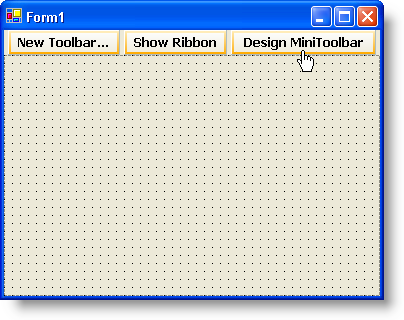

////

|metadata|
{
    "name": "wintoolbarsmanager-creating-a-minitoolbar",
    "controlName": ["WinToolbarsManager"],
    "tags": [],
    "guid": "{4CBE0CF4-78B7-42A1-82F9-BF3104BC7FA6}",  
    "buildFlags": [],
    "createdOn": "0001-01-01T00:00:00Z"
}
|metadata|
////

= Creating a MiniToolbar

{Warning}

== Before You Begin

The MiniToolbar resembles a standard toolbar in several ways. You can even design the MiniToolbar in a Designer just like standard toolbars. Granted, the MiniToolbar Designer is slightly different than the standard toolbar designer, but that is because the MiniToolbar does not set on the form in any one place; it appears on a right-click with a context menu or programmatically by the  pick:[win-forms="link:{ApiPlatform}win.ultrawintoolbars{ApiVersion}~infragistics.win.ultrawintoolbars.minitoolbar~show.html[Show]"]  method. Another main difference between a standard toolbar and the MiniToolbar is that the MiniToolbar already exists whereas standard toolbars need to be instantiated.

== What You Will Accomplish

Through this topic, you will learn how to create a fully functioning MiniToolbar through the Designer. You will add tools to the MiniToolbar with the familiar New Tool dialog box.

== Follow These Steps

[start=1]
. *Setup the form.*

.. Create a new Visual Basic or C# project.
.. Double-click the UltraToolbarsManager component in the toolbox.
.. Click Yes to close the dialog box that appears. The ultraToolbarsManager1 component appears in the component tray.
.. Make sure that the ultraToolbarsManager1 component is selected. You will see three buttons at the top of the form: New Toolbar..., Show Ribbon, and Design MiniToolbar.

.. Click Design MiniToolbar. The MiniToolbar Designer appears.

[start=2]
. *Add tools to the MiniToolbar.*

.. Click Insert New Tool. A popup menu appears.

.. Click Insert New Tool from the popup menu. The New Tool dialog box appears.

.. Click Add twice to add two Button tools. As you add the buttons, you will notice the MiniToolbar populating in the previous dialog box.

.. Change the Tool Type to Font List and click Add. A FontList tool is added to the MiniToolbar.
.. Change the Tool Type to State Button and click Add three more times. Three StateButton tools are added to the MiniToolbar.
.. Click Close to close the New Tool dialog box.
.. Change the Tool Row Count from 2 to 1. Your MiniToolbar should now look like this:

[start=3]
. *Write the code-behind to handle the Show method.*

.. Create a MouseUp event for the Form1_Fill_Panel. In C#, you can do this by clicking the event button in the Properties window and then double-clicking the MouseUp event. In Visual Basic, switch to the code-behind, select Form1_Fill_Panel from the left drop-down at the top of the code window, then select MouseUp from the right drop-down at the top of the code window.
.. Use the following code in the MouseUp event.

*In Visual Basic:*

----
Me.UltraToolbarsManager1.MiniToolbar.Show()
----

*In C#:*

----
this.ultraToolbarsManager1.MiniToolbar.Show();
----

[start=4]
. *Run the application*

When you run the application, you will see a blank form. Right-click anywhere on the form and the MiniToolbar will appear. Move your mouse closer to it and it will become less transparent. Move your mouse away from the MiniToolbar and it will become more transparent. When your mouse is far enough away, the MiniToolbar will disappear completely.

