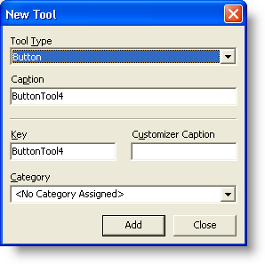

////

|metadata|
{
    "name": "wintoolbarsmanager-creating-a-ribbon",
    "controlName": ["WinToolbarsManager"],
    "tags": ["Getting Started"],
    "guid": "{B9C36B34-D0FD-4FB5-B8BD-7B05B5BC976F}",  
    "buildFlags": [],
    "createdOn": "2006-06-10T10:46:28Z"
}
|metadata|
////

= Creating a Ribbon

{Warning}

== Before You Begin

Developers already familiar with WinToolbarsManager's™ object model will discover that the Ribbon isn't all that different. WinToolbarsManager has a collection of  pick:[win-forms="link:{ApiPlatform}win.ultrawintoolbars{ApiVersion}~infragistics.win.ultrawintoolbars.toolscollection.html[Tools]"]  inside a collection of  pick:[win-forms="link:{ApiPlatform}win.ultrawintoolbars{ApiVersion}~infragistics.win.ultrawintoolbars.toolbarscollection.html[Toolbars]"] . The  pick:[win-forms="link:{ApiPlatform}win.ultrawintoolbars{ApiVersion}~infragistics.win.ultrawintoolbars.ribbon.html[Ribbon]"]  adds just one level to that structure. The Ribbon has a collection of Tools, inside a collection of  pick:[win-forms="link:{ApiPlatform}win.ultrawintoolbars{ApiVersion}~infragistics.win.ultrawintoolbars.ribbongroupcollection.html[Groups]"] , inside a collection of  pick:[win-forms="link:{ApiPlatform}win.ultrawintoolbars{ApiVersion}~infragistics.win.ultrawintoolbars.ribbontabcollection.html[Tabs]"] . This extra level of functionality gives you the detailed organization that your applications require.

== What You Will Accomplish

This walkthrough will guide you through the steps to create a Ribbon at design time. Creating a Ribbon will involve creating a  pick:[win-forms="link:{ApiPlatform}win.ultrawintoolbars{ApiVersion}~infragistics.win.ultrawintoolbars.ribbontab.html[RibbonTab]"] , a  pick:[win-forms="link:{ApiPlatform}win.ultrawintoolbars{ApiVersion}~infragistics.win.ultrawintoolbars.ribbongroup.html[RibbonGroup]"]  inside that tab, and some tools inside that group.

== Follow these Steps

[start=1]
. *Add the WinToolbarsManager to the form.*

.. Find the UltraToolbarsManager component in the toolbox and double-click it. A dialog box will display.
.. Click OK. The ultraToolbarsManager1 component is added to the component tray.

[start=2]
. *Add a tab to the Ribbon.*

.. Click Show Ribbon at the top of the form. When you do this, the form's appearance will change to emulate the Office 2007 look and feel. The Ribbon also displays.
.. Click the Add Tab button. A new tab is created with the name ribbon1. You can also see the New Group button now.

[start=3]
. *Add a group to a Ribbon tab.*

Click New Group. A new group is created with the name ribbonGroup1. You can keep clicking the New Group button for as many groups as you need.

image::images/WinToolbarsManager_Creating_a_Ribbon_03.png[ultratoolbarsmanager at design time with ribbon group showing]

To perform this task at run time, see link:wintoolbarsmanager-add-a-group-to-a-ribbon-tab.html[Add a Group to a Ribbon Tab].
[start=4]
. *Add some tools to the Ribbon group.*

.. Click Insert New Tool. A popup menu displays with the options of Insert New Tool... or Insert Existing Tool... Right now, only Insert New Tool is active since there are no tools existing in the Tools collection.
.. Click Insert New Tool... from the popup menu. The New Tool dialog box displays.

.. Click Add three times to add three ButtonTools to the Ribbon group.
.. Click Close to close the New Tool dialog box.

To perform this task as run time, see link:wintoolbarsmanager-add-a-tool-to-a-ribbon-group.html[Add a Tool to a Ribbon Group].
[start=5]
. *Modify the names of the tab, group, and tools.*

.. While the ultraToolbarsManager1 component is selected, find the Ribbon object in the properties window and expand it.
.. Find the Tabs collection and click the ellipsis (...) to the right of the properties window. The RibbonTab Collection Editor dialog box displays.
.. Change the Caption property to 'My Tab.'
.. Find the Groups collection and click the ellipsis (...) at the right side of the properties window. The RibbonGroup Collection Editor dialog box displays.
.. Change the Caption property to 'My Group.'
.. Click OK to exit the RibbonGroup Collection Editor dialog box.
.. Click OK to exit the RibbonTab Collection Editor dialog box.
.. Right-click ButtonTool1 and change it's Name to 'My Button 1.' Do the same for ButtonTool2 and ButtonTool3 naming them 'My Button 2' and 'My Button 3' respectively.

[start=6]
. *Run the application.*

When you run the application, you will see something very similar to what you saw at design time. The Ribbon designer is very simple to work with. It even allows you to convert an existing toolbar into a Ribbon with ease.

