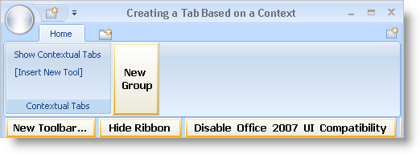
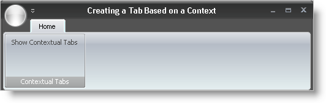
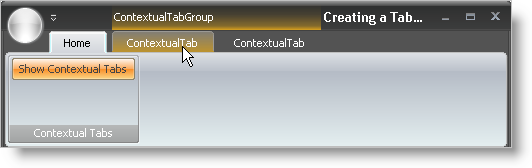

////

|metadata|
{
    "name": "wintoolbarsmanager-creating-a-tab-based-on-a-context",
    "controlName": ["WinToolbarsManager"],
    "tags": [],
    "guid": "{E2C865D3-F270-4CC3-8784-C738C27ADDBB}",  
    "buildFlags": [],
    "createdOn": "2006-06-10T10:47:09Z"
}
|metadata|
////

= Creating a Tab Based on a Context

{Warning}

== Before You Begin

Special situations arise that may not be the default situation or even close to it. The Ribbon's contextual tab takes these situations into account by giving you the option to display specific Ribbon tabs only if certain requirements are met first. A possible example could be an image in a word processing program. You may want to show image related groups and tools only when an image is selected. This cuts down on clutter in the Ribbon and saves space in the user interface.

== What You Will Accomplish

You will learn how to create a new tab in the Ribbon based on a context. You will create an instance of a  pick:[win-forms="link:{ApiPlatform}win.ultrawintoolbars{ApiVersion}~infragistics.win.ultrawintoolbars.contextualtabgroup.html[ContextualTabGroup]"] that will display contextual tabs when a  pick:[win-forms="link:{ApiPlatform}win.ultrawintoolbars{ApiVersion}~infragistics.win.ultrawintoolbars.statebuttontool.html[StateButtonTool]"]  is toggled.

== Follow these Steps

[start=1]
. *Setup the Ribbon.*

.. Find the UltraToolbarsManager component in the toolbox and double-click it. The ultraToolbarsManager1 component is added to the component tray.
.. When ultraToolbarsManager1 is selected, you will see a New Toolbar... and Show Ribbon button near the top of the form. Click the Show Ribbon button. The Ribbon displays.
.. Click the Add Tab button. A new tab appears.
.. Click the Add Group button in the new tab. A new group appears.
.. In the new group, click the Insert New Tool button. A popup menu appears.
.. Click Insert New Tool on the popup menu. The New Tool dialog box appears.
.. In the New Tool dialog box, change the Tool Type to State Button and change the Caption to 'Show Contextual Tabs'.
.. Click Add. The new tool is added to the group.
.. Click Close to close the New Tool dialog box.
[start=10]
.. With the main form selected, find the Size property in the properties window. Set the Width to 500 and the Height to 250.

Your form should look something like this:

[start=2]
. *Generate the necessary events.*

.. Double-click inside the grey area of the form (not on the Ribbon). A FormLoad event is generated in the code-behind.
.. Switch back to design view and double-click a blank area in the Ribbon (the area to the right of the New Group button will do fine). A  pick:[win-forms="link:{ApiPlatform}win.ultrawintoolbars{ApiVersion}~infragistics.win.ultrawintoolbars.ultratoolbarsmanager~toolclick_ev.html[ToolClick]"]  event for ultraToolbarsManager1 is generated in the code-behind.

[start=3]
. *Add using/Imports statements*

Before you start writing any code, you should place using/imports directives in your code-behind so you don't need to always type out a member's fully qualified name.

*In Visual Basic:*

----
Imports Infragistics.Win
Imports Infragistics.Win.UltraWinToolbars
----

*In C#:*

----
using Infragistics.Win;
using Infragistics.Win.UltraWinToolbars;
----

[start=4]
. *Create RibbonTabs that will be added to a ContextualTabGroup.*

Inside the FormLoad event, you will need to create two tabs and add them to the Ribbon's  pick:[win-forms="link:{ApiPlatform}win.ultrawintoolbars{ApiVersion}~infragistics.win.ultrawintoolbars.ribbontabcollection.html[Tabs]"]  collection. Right now, you are doing nothing different then if you were creating two standard tabs.

*In Visual Basic:*

----
Private Sub Creating_a_Tab_Based_on_a_Context_Load( _
  ByVal sender As System.Object, _
  ByVal e As System.EventArgs) Handles MyBase.Load
	' Create two tabs and add them to the Ribbon's tabs collection.
	Dim contextualTab1 As New RibbonTab("Contextual Tab1", "ContextualTab")
	Dim contextualTab2 As New RibbonTab("Contextual Tab2", "ContextualTab")
	Me.ultraToolbarsManager1.Ribbon.Tabs.AddRange(New RibbonTab() _
	  {contextualTab1, contextualTab2})
----

*In C#:*

----
private void Creating_a_Tab_Based_on_a_Context_Load(object sender, EventArgs e)
{
	// Create two tabs and add them to the Ribbon's tabs collection.
	RibbonTab contextualTab1 = 
	  new RibbonTab("Contextual Tab1", "ContextualTab");
	RibbonTab contextualTab2 = 
	  new RibbonTab("Contextual Tab2", "ContextualTab");
	this.ultraToolbarsManager1.Ribbon.Tabs.AddRange(new RibbonTab[]
	  { contextualTab1, contextualTab2 }); 
	...
----

[start=5]
. *Instantiate the already existing ContextualTabGroupCollection.*

Rather than create a new  pick:[win-forms="link:{ApiPlatform}win.ultrawintoolbars{ApiVersion}~infragistics.win.ultrawintoolbars.contextualtabgroupcollection.html[ContextualTabGroupCollection]"] , you'll just use the one that already exists off the Ribbon. Place the following code in the FormLoad event after the previous block of code.

*In Visual Basic:*

----
	' Create an instance of the Ribbon's ContextualTabGroupCollection
	' for easier access.
	Dim tabGroupColl As ContextualTabGroupCollection = _
	  Me.UltraToolbarsManager1.Ribbon.ContextualTabGroups
----

*In C#:*

----
	...
	// Create an instance of the Ribbon's ContextualTabGroupCollection
	// for easier access.
	ContextualTabGroupCollection tabGroupColl =
	  this.ultraToolbarsManager1.Ribbon.ContextualTabGroups
	  as ContextualTabGroupCollection;
	...
----

[start=6]
. *Create a new ContextualTabGroup and add it to the ContextualTabGroups collection.*

Now that tabGroupColl represents 

[source]
----
this.ultraToolbarsManager1.Ribbon.ContextulTabGroups
----

, you can use its  pick:[win-forms="link:{ApiPlatform}win.ultrawintoolbars{ApiVersion}~infragistics.win.ultrawintoolbars.contextualtabgroupcollection~add.html[Add]"]  method to add a new ContextualTabGroup to the collection. Since we can access the ContextualTabGroup from the tabGroupColl variable by index or key, we don't need to instantiate it with its own variable. Add the following code to the FormLoad event after the previous block of code.

*In Visual Basic:*

----
' Add a new ContextualTabGroup to the collection.
	tabGroupColl.Add(New ContextualTabGroup( _
	  "Contextual Group1", "ContextualTabGroup"))
----

*In C#:*

----
	...
	// Add a new ContextualTabGroup to the collection.
	tabGroupColl.Add(new ContextualTabGroup(
	  "Contextual Group1", "ContextualTabGroup"));
	...
----

[start=7]
. *Add the tabs to the ContextualTabGroup and hide them.*

Once you place a tab in the Tabs collection of a ContextualTabGroup, they become contextual tabs. You also need to set the  pick:[win-forms="link:{ApiPlatform}win.ultrawintoolbars{ApiVersion}~infragistics.win.ultrawintoolbars.contextualtabgroup~visible.html[Visible]"]  property to false so that the contextual tabs don't display right away. Add the following code to the FormLoad event after the previous block of code.

*In Visual Basic:*

----
' Add the two tabs to the ContextualTabGroup's collection of tabs.
	' Since there is only one tab group, we will use the index rather
	' than the key to retrieve it.
	tabGroupColl(0).Tabs.AddRange(New RibbonTab() _
	  {contextualTab1, contextualTab2})
	' Hide the tab group when the form loads.
	tabGroupColl(0).Visible = False
----

*In C#:*

----
	...
	// Add the two tabs to the ContextualTabGroup's collection of tabs.
	// Since there is only one tab group, we will use the index rather
	// than the key to retrieve it.
	tabGroupColl[0].Tabs.AddRange(new RibbonTab[] 
	  {contextualTab1, contextualTab2});
	// Hide the tab group when the form loads.
	tabGroupColl[0].Visible = false;
}
----

[start=8]
. *Add the code for the ToolClick event.*

You need some way to trigger the contextual tabs. Normally, you might show a contextual tab if the proper requirements have been met. For this walkthrough, we are using a StateButtonTool to show and hide the contextual tabs. The logic is simple: if the state button is selected, show the tabs; if the state button is deselected, hide the tabs. Add the following IF/ ELSE statement to the ToolClick event.

*In Visual Basic:*

----
Private Sub ultraToolbarsManager1_ToolClick(sender As Object,_
  e As Infragistics.Win.UltraWinToolbars.ToolClickEventArgs)
	' Create an instance of the tool that was clicked.
	Dim button As StateButtonTool = e.Tool
	If button.Checked = True Then 'If the StateButtonTool is selected...
	  Me.ultraToolbarsManager1.Ribbon.ContextualTabGroups(0).Visible = True
	Else ' If the StateButtonTool is deselected...
	  Me.ultraToolbarsManager1.Ribbon.ContextualTabGroups(0).Visible = False
	End If
End Sub
----

*In C#:*

----
private void ultraToolbarsManager1_ToolClick(object sender,
  Infragistics.Win.UltraWinToolbars.ToolClickEventArgs e)
{
	// Create an instance of the tool that was clicked.
	StateButtonTool button = e.Tool as StateButtonTool;
	if(button.Checked == true) //If the StateButtonTool is selected...
	  this.ultraToolbarsManager1.Ribbon.ContextualTabGroups[0].Visible = true;
	else // If the StateButtonTool is deselected...
	  this.ultraToolbarsManager1.Ribbon.ContextualTabGroups[0].Visible = false;
}
----

[start=9]
. *Run the application.*

When the form loads, you will see just one tab with one group and the StateButtonTool that you placed inside of that group.

Now click the Show Contextual Tabs button. You will see two tabs added to the Ribbon with a highlighted area above them.

