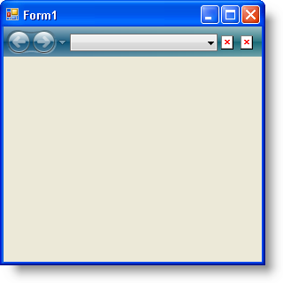
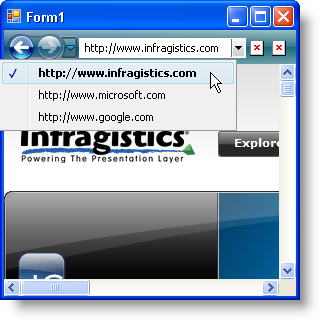

////

|metadata|
{
    "name": "wintoolbarsmanager-creating-an-internet-browsing-history",
    "controlName": ["WinToolbarsManager"],
    "tags": ["Application Scenarios","Navigation"],
    "guid": "{54387CBD-5D0A-485C-80C7-424B6AD4A210}",  
    "buildFlags": [],
    "createdOn": "0001-01-01T00:00:00Z"
}
|metadata|
////

= Creating an Internet Browsing History

== Before You Begin

Microsoft® Internet Explorer® 7 comes with a brand new user interface that is familiar, yet provides usability improvements, making it much easier to use than previous versions. One of these improvements is the navigation bar, including a Back button, Forward button, and a drop-down list containing a list of visited web pages. This navigation scheme keeps track of the end user's navigation history while making it easily accessible.

== What You Will Accomplish

This walkthrough will help you create a simple web browsing application with the Navigation toolbar, a ComboBox tool, and an in-box WebBrowser control. Upon completing this walkthrough, you will understand the basics of the Navigation toolbar, how it maintains a navigation history, and how to navigate through its history.

== Follow these Steps

[start=1]
. *Add the NavigationToolbar to your form.*

.. Find  pick:[win-forms="link:{ApiPlatform}win.ultrawintoolbars{ApiVersion}~infragistics.win.ultrawintoolbars.ultratoolbarsmanager.html[UltraToolbarsManager]"]  in the toolbox and double-click it. The ultraToolbarsManager1 component is added to the component tray. Click Yes in the resulting UltraToolbarsManager Initialization dialog box.
.. With the ultraToolbarsManager1 component selected, expand the  pick:[win-forms="link:{ApiPlatform}win.ultrawintoolbars{ApiVersion}~infragistics.win.ultrawintoolbars.navigationtoolbar.html[NavigationToolbar]"]  object in the properties window and set its Visible property to True.
.. On the NavigationToolbar, click Insert New Tool and then Insert New Tool... from the resulting pop-up menu. The New Tool dialog box displays.
.. Change the Tool Type to  pick:[win-forms="link:{ApiPlatform}win.ultrawintoolbars{ApiVersion}~infragistics.win.ultrawintoolbars.comboboxtool.html[ComboBox]"]  and the Caption to "AddressBar". The Key will automatically populate with the Caption’s text. Click Add.
.. Change the Tool Type to  pick:[win-forms="link:{ApiPlatform}win.ultrawintoolbars{ApiVersion}~infragistics.win.ultrawintoolbars.buttontool.html[ButtonTool]"]  and the Caption to ‘Refresh’. Click Add.
.. Add one more ButtonTool with a Caption of ‘Stop’.
.. Click Close to dismiss the New Tool dialog box.
.. With the ultraToolbarsManager1 component still selected, locate the  pick:[win-forms="link:{ApiPlatform}win.ultrawintoolbars{ApiVersion}~infragistics.win.ultrawintoolbars.toolbarsettings.html[ToolbarSettings]"]  object in the properties window and set the  pick:[win-forms="link:{ApiPlatform}win.ultrawintoolbars{ApiVersion}~infragistics.win.ultrawintoolbars.toolbarsettings~fillentirerow.html[FillEntireRow]"]  property to True.
.. Locate the NavigationToolbar object in the properties window and drill down through the  pick:[win-forms="link:{ApiPlatform}win.ultrawintoolbars{ApiVersion}~infragistics.win.ultrawintoolbars.toolscollection.html[Tools]"] , AddressBar,  pick:[win-forms="link:{ApiPlatform}win.ultrawintoolbars{ApiVersion}~infragistics.win.ultrawintoolbars.sharedprops.html[SharedProps]"]  objects and set the  pick:[win-forms="link:{ApiPlatform}win.ultrawintoolbars{ApiVersion}~infragistics.win.ultrawintoolbars.sharedprops~spring.html[Spring]"]  property to True.
[start=10]
.. Still in the properties window for the AddressBar tool, locate the  pick:[win-forms="link:{ApiPlatform}win.ultrawintoolbars{ApiVersion}~infragistics.win.ultrawintoolbars.comboboxtool~dropdownstyle.html[DropDownStyle]"]  property and set it to DropDown. This will allow the end user to edit the contents of the combo box.

At this point, your form should look similar to the following screen shot:

[start=2]
. *Set up a web browser* .

.. Expand the Common Controls section of the Visual Studio® toolbox, locate the WebBrowser control, and double-click it. A web browser is added to your form and automatically docks in its parent container.
.. Double-click the Form's header. Visual Studio switches to code view and creates the Form's Load event for you.
.. Add the following line of code to the Load event. This code causes the web browser to navigate to the end user's home page.

*In Visual Basic:*

----
Me.WebBrowser1.GoHome()
----

*In C#:*

----
this.webBrowser1.GoHome();
----

[start=3]
. *Create references to the ComboBox tool and its ValueList.*

.. You are going to need a reference to the combo box tool so you can access it in various methods that you will create. You are also going to need a  pick:[win-forms="link:{ApiPlatform}win{ApiVersion}~infragistics.win.valuelist.html[ValueList]"]  that will represent the combo box's history. Create two global variables just above the form's Load event.

*In Visual Basic:*

----
Dim vl As Infragistics.Win.ValueList
Dim combo As Infragistics.Win.UltraWinToolbars.ComboBoxTool
----

*In C#:*

----
Infragistics.Win.ValueList vl;
Infragistics.Win.UltraWinToolbars.ComboBoxTool combo;
----

.. Now you need to set these variables in the form's Load event. Be sure you place these two lines of code before the GoHome method; otherwise, you risk a null reference exception if you access the combo box at a later time through the WebBrowser’s DocumentCompleted event.

*In Visual Basic:*

----
Me.combo = Me.UltraToolbarsManager1.Tools("AddressBar")
Me.vl = Me.combo.ValueList
----

*In C#:*

----
this.combo = this.ultraToolbarsManager1.Tools["AddressBar"] 
	as Infragistics.Win.UltraWinToolbars.ComboBoxTool;
this.vl = this.combo.ValueList;
----

[start=4]
. *Create a method that will browse to a particular web page* .

Create a method, called BrowseTo, which will browse to the appropriate web page, add the URL to the Navigation toolbar’s navigation history, and add the URL to the combo box’s drop-down list.

*In Visual Basic:*

----
Private Sub BrowseTo()
    ' Browse to the web page
    Me.WebBrowser1.Navigate(Me.combo.Text)
    ' Add the url to the navigation history
    Me.UltraToolbarsManager1.NavigationToolbar.NavigateTo _
        (Me.combo.Text, Nothing)
    ' Add the url to the combo's drop-down list.
    Me.vl.ValueListItems.Insert _
        (0, New Infragistics.Win.ValueListItem(Me.combo.Text))
End Sub
----

*In C#:*

----
private void BrowseTo()
{
	// Browse to the web page
	this.webBrowser1.Navigate(this.combo.Text);
	// Add the url to the navigation history
	this.ultraToolbarsManager1.NavigationToolbar.NavigateTo
		(this.combo.Text, null);
	// Add the url to the combo's drop-down list.
	this.vl.ValueListItems.Insert
		(0, new Infragistics.Win.ValueListItem(this.combo.Text));
}
----

[start=5]
. *Create a method that checks the URL for errors* .

You want to allow your end user to enter just the domain of the web page they are browsing to. You also want to make sure that the address bar has content in it before you browse to a web page. You can check for these situations in a separate method and call it when the end user clicks the Refresh button. Inside of this method, once you are confident that the URL is valid, you can call the BrowseTo method created in the previous step. Create another method, call it CheckUrl, and make sure the address bar has valid input using an IF/ELSE statement.

*In Visual Basic:*

----
Private Sub CheckUrl()
    ' If the address bar is empty, do nothing.
    If Me.combo.Text = String.Empty Then
        Return
    ' If the address bar does not begin with "http://",
    ' add it. This allows the end user to simply type in 
    ' the domain of the website and not the full url.
    ElseIf Not Me.combo.Text.StartsWith("http://") = True Then
        ' Fix the url.
        Me.combo.Text = "http://" + Me.combo.Text
        Me.BrowseTo()
    ' The address bar is in the "correct" format. Of
    ' course, there are many other formatting issues
    ' that could arise and you would have to check for.
    Else
        Me.BrowseTo()
    End If
End Sub
----

*In C#:*

----
private void CheckUrl()
{
	// If the address bar is empty, do nothing.
	if (this.combo.Text == String.Empty) return;
	// If the address bar does not begin with "http://",
	// add it. This allows the end user to simply type in 
	// the domain of the website and not the full url.
	else if (!(this.combo.Text.StartsWith("http://")))
	{
		// Fix the url.
		this.combo.Text = "http://" + this.combo.Text;
		this.BrowseTo();
	}
	// The address bar is in the "correct" format. Of
	// course, there are many other formatting issues
	// that could arise and you would have to check for.
	else
	{
		this.BrowseTo();
	}
}
----

[start=6]
. *Handle WinToolbarsManager’s ToolClick event* .

Create a handler for the  pick:[win-forms="link:{ApiPlatform}win.ultrawintoolbars{ApiVersion}~infragistics.win.ultrawintoolbars.ultratoolbarsmanager~toolclick_ev.html[ToolClick]"]  event either with the lightning-bolt in the properties window if using C#, or with the drop-down boxes at the top of code view if using Visual Basic. The Refresh button will handle the actual browsing, while the Stop button will stop the browser from browsing.

*In Visual Basic:*

----
Private Sub UltraToolbarsManager1_ToolClick(ByVal sender As Object, _
      ByVal e As Infragistics.Win.UltraWinToolbars.ToolClickEventArgs) _
      Handles UltraToolbarsManager1.ToolClick
        Select Case (e.Tool.Key)
            Case "Refresh"
                Me.CheckUrl()
            Case "Stop"
                Me.WebBrowser1.Stop()
        End Select
    End Sub
----

*In C#:*

----
private void ultraToolbarsManager1_ToolClick(object sender,
	Infragistics.Win.UltraWinToolbars.ToolClickEventArgs e)
{
	switch (e.Tool.Key)
	{
		case "Refresh":
			this.CheckUrl();
			break;
		case "Stop":
			this.webBrowser1.Stop();
			break;
	}
}
----

[start=7]
. *Browse through the internet history* .

At this point, you've completed most of the internet browsing functionality. Now you need to setup the WebBrowser control to browse when the end user navigates through the internet history with the Navigation toolbar. This task is quite simple and involves only two lines of code. You will need to handle the  pick:[win-forms="link:{ApiPlatform}win.ultrawintoolbars{ApiVersion}~infragistics.win.ultrawintoolbars.ultratoolbarsmanager~afternavigation_ev.html[AfterNavigation]"]  event of UltraToolbarsManager. This event fires once navigation has completed on the Navigation toolbar. You will need to first set the text of the address bar to the item in the navigation history that the end user navigated to. You will then need to browse to that web page in the WebBrowser control. Create a handler for the AfterNavigation event either with the lightning-bolt in the properties window if using C#, or with the drop-down boxes at the top of code view if using Visual Basic.

*In Visual Basic:*

----
Private Sub UltraToolbarsManager1_AfterNavigation(ByVal sender As Object, _
  ByVal e As Infragistics.Win.UltraWinToolbars.AfterNavigationEventArgs) _
  Handles UltraToolbarsManager1.AfterNavigation
    Me.combo.Text = e.CurrentItem.Text
    Me.WebBrowser1.Navigate(Me.combo.Text)
End Sub
----

*In C#:*

----
private void ultraToolbarsManager1_AfterNavigation
	(object sender, 
	Infragistics.Win.UltraWinToolbars.AfterNavigationEventArgs e)
{
	this.combo.Text = e.CurrentItem.Text;
	this.webBrowser1.Navigate(this.combo.Text);
}
----

[start=8]
. *Run the application* .

When you run the application, the WebBrowser control will automatically browse to your home page (assuming you have an internet connection). If you type www.google.com and click the Refresh button, the WebBrowser control navigates to Google.com. The application also adds www.google.com to the navigation history as well as the combo box. Continue to navigate to web pages and the application will continue to maintain a history. Click on any item in the navigation history drop-down list and the web browser will navigation to that web page and the combo box will populate with the proper URL.

