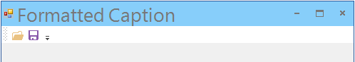

////

|metadata|
{
    "name": "wintoolbarsmanager-customizing-non-client-area-with-wintoolbarsmanager",
    "controlName": [],
    "tags": [],
    "guid": "1d3921b4-fe74-484a-91be-10e8414c407a",  
    "buildFlags": [],
    "createdOn": "2014-01-22T20:43:23.7812064Z"
}
|metadata|
////

= Customizing Non-Client Area with WinToolbarsManager

== Topic Overview

=== Purpose

This topic demonstrates customizing of the non-client area with  _WinToolbarsManager_™ component.

== Customizing Non-Client Area

=== Introduction

The non-client area of the form is the area that is not fully exposed for customization. The  _WinToolbarsManager_   component exposes the form’s non-client area (caption area) for customization.

=== Customizing non-client area of the form

The following elements and properties are customized in the screenshot illustrated below.

* Caption “ *Formatted Caption* ”
* Caption background appearance (Light-blue color)
* Component Style (Office2013)
* The link:{ApiPlatform}win.ultrawintoolbars{ApiVersion}~infragistics.win.ultrawintoolbars.ultratoolbarsmanager~formdisplaystyle.html[FormDisplayStyle] property

.Note:
[NOTE]
====
The `FormDisplayStyle` property is only in effect when the component’s link:{ApiPlatform}win.ultrawintoolbars{ApiVersion}~infragistics.win.ultrawintoolbars.ultratoolbarsmanager~dockwithincontainer.html[DockWithinContainer] property is set to the Form  *and*  the component counterpart ( _WinFormManager_  ) is not on the same form.
====

The result from the code example illustrated above.

Code example for customizing the form’s caption area.

*In C#:*

[source,csharp]
----
// Set the formatted text for the caption area
ultraToolbarsManager1.Ribbon.Caption =
    "Formatted Caption";
// Set the caption's background color
ultraToolbarsManager1.Ribbon.CaptionAreaAppearance.BackColor = Color.LightSkyBlue;
// Set the display style for the form
ultraToolbarsManager1.FormDisplayStyle = FormDisplayStyle.RoundedFixed;
// Set a specific style for the form
ultraToolbarsManager1.Style = ToolbarStyle.Office2013;
----

*In Visual Basic:*

[source,vb]
----
' Set the formatted text for the caption area
ultraToolbarsManager1.Ribbon.Caption = "Formatted Caption"
' Set the caption's background color
ultraToolbarsManager1.Ribbon.CaptionAreaAppearance.BackColor = Color.LightSkyBlue
' Set the display style for the form
ultraToolbarsManager1.FormDisplayStyle = FormDisplayStyle.RoundedFixed
' Set a specific style for the form
ultraToolbarsManager1.Style = ToolbarStyle.Office2013
----

=== WinToolbarsManager and WinFormManager

The  _WinToolbarsManager_   and  _WinFormManager_   components are mutually exclusive; meaning only one of the components can be docked within a form, the other component must be docked in the client area of the form.

.Note:
[NOTE]
====
It is neither required nor desired to include both  _WinToolbarsManager_   and  _WinFormManager_   in the same form.
====

The following table lists some of the properties used in both components for customizing the same client area of the form.

[options="header", cols="a,a"]
|====
|_WinToolbarsManager_|_WinFormManager_

|`ultraToolbarsManager1.Ribbon.Caption`
|`ultraFormManager1.FormStyleSettings.Caption`

|`ultraToolbarsManager1.Ribbon.CaptionAreaAppearance.BackColor`
|`ultraFormManager1.FormStyleSettings.CaptionAreaAppearance.BackColor`

|`ultraToolbarsManager1.FormDisplayStyle`
|`ultraFormManager1.FormStyleSettings.FormDisplayStyle`

|`ultraToolbarsManager1.Style`
|`ultraFormManager1.FormStyleSettings.Style`

|====

== Related Content

=== Topics

The following topic provides additional information related to this topic.

[options="header", cols="a,a"]
|====
|Topic|Purpose

| link:winformmanager-customize-a-form-with-winformmanager.html[Customize a Form with WinFormManager]
|This topic illustrates setting up a form with the _WinFormManager_ component and customizing it to style the different areas of the form such as the caption area, the form borders, and the close, restore, maximize, minimize and context help buttons.

|====