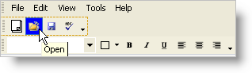

////

|metadata|
{
    "name": "wintoolbarsmanager-define-the-appearance-of-toolbars-and-tools",
    "controlName": ["WinToolbarsManager"],
    "tags": ["Styling"],
    "guid": "{5AB3410B-9C34-4889-89F1-3C535347B87A}",  
    "buildFlags": [],
    "createdOn": "2005-07-07T00:00:00Z"
}
|metadata|
////

= Define the Appearance of Toolbars and Tools

For the  pick:[win-forms="link:{ApiPlatform}win.ultrawintoolbars{ApiVersion}~infragistics.win.ultrawintoolbars.ultratoolbar.html[ToolBars]"] , the  pick:[win-forms="link:{ApiPlatform}win.ultrawintoolbars{ApiVersion}~infragistics.win.ultrawintoolbars.ultratoolbar~settings.html[Settings]"]  properties return the  pick:[win-forms="link:{ApiPlatform}win.ultrawintoolbars{ApiVersion}~infragistics.win.ultrawintoolbars.toolbarsettings.html[ToolBarSettings]"]  object of the UltraToolBar whose members include the  pick:[win-forms="link:{ApiPlatform}win.ultrawintoolbars{ApiVersion}~infragistics.win.ultrawintoolbars.ultratoolbarsmanager~appearance.html[Appearance]"] ,  pick:[win-forms="link:{ApiPlatform}win.ultrawintoolbars{ApiVersion}~infragistics.win.ultrawintoolbars.toolbarsettings~dockedappearance.html[DockedAppearance]"] ,  pick:[win-forms="link:{ApiPlatform}win.ultrawintoolbars{ApiVersion}~infragistics.win.ultrawintoolbars.toolbarsettings~floatingappearance.html[FloatingAppearance]"]  properties where you can set individual properties for the appearance you would like for the toolbar.

For the tools the AppearancesSmall and AppearancesLarge properties (which are of type  pick:[win-forms="link:{ApiPlatform}win.ultrawintoolbars{ApiVersion}~infragistics.win.ultrawintoolbars.toolappearances.html[ToolAppearances]"] ) contain Appearance properties that let you control the appearance of individual tools. AppearancesSmall contains the appearance settings for use for the tool when small images are being rendered and AppearancesLarge is for when you choose the options Large Icons on Menu or Large Icon on ToolBar. Both AppearancesSmall and AppearancesLarge can be found in both the  pick:[win-forms="link:{ApiPlatform}win.ultrawintoolbars{ApiVersion}~infragistics.win.ultrawintoolbars.sharedprops.html[SharedProps]"]  and  pick:[win-forms="link:{ApiPlatform}win.ultrawintoolbars{ApiVersion}~infragistics.win.ultrawintoolbars.instanceprops.html[InstanceProps]"]  objects off the tool.

== Design Time

Right click on the UltraToolBarsManager and select customize. Taking it for granted that you already have created toolbars and tools, in the toolbars tab select a toolbar and open the Settings properties. You will see the different Appearance properties, which you can open up and set whichever properties you want for a unique look.

In the tool tab choose one of your button tools.Select AllProps and open the SharedProps class, then in the AppearanceSmall or AppearancesLarge property you will see the different Appearance properties such as Appearance, AppearanceOnToolBar, AppearanceOnMenu etc. Set some properties on each of them to see the different effects that you can achieve.

== Run Time

*In Visual Basic:*

----
Imports Infragistics.Win
...
Private Sub Define_the_Appearance_of_Toolbars_and_Tools_Load(ByVal sender As System.Object, _
  ByVal e As System.EventArgs) Handles MyBase.Load
	Me.UltraToolbarsManager1.Toolbars(1).Settings.BorderStyleDocked = _
	  UIElementBorderStyle.Dashed
	Me.UltraToolbarsManager1.Toolbars(1).Settings.Appearance.BorderColor = _
	  Color.LimeGreen
	Me.UltraToolbarsManager1.Toolbars(1).Settings.DockedAppearance.BorderColor = _
	  Color.Goldenrod
	Me.UltraToolbarsManager1.Toolbars(1).Settings.FloatingAppearance.BackColor = _
	  Color.Aquamarine
	Me.UltraToolbarsManager1.Toolbars(1).Settings.FloatingAppearance.BackColor2 = _
	  Color.Cyan
	Me.UltraToolbarsManager1.Toolbars(1).Settings.FloatingAppearance. _
	  BackGradientStyle = GradientStyle.Circular
	Me.UltraToolbarsManager1.Toolbars(1).Tools(1).SharedProps.AppearancesSmall. _
	  AppearanceOnToolbar.BackColor = Color.Beige
	Me.UltraToolbarsManager1.Toolbars(1).Tools(1).SharedProps.AppearancesSmall. _
	  HotTrackAppearance.BackColor = Color.Blue
End Sub
----

*In C#:*

----
using Infragistics.Win;
...
private void Define_the_Appearance_of_Toolbars_and_Tools_Load( 
  object sender, EventArgs e)
{
	this.ultraToolbarsManager1.Toolbars[1].Settings.BorderStyleDocked = 
	  UIElementBorderStyle.Dashed;
	this.ultraToolbarsManager1.Toolbars[1].Settings.Appearance.BorderColor = 
	  Color.LimeGreen;
	this.ultraToolbarsManager1.Toolbars[1].Settings.DockedAppearance.BorderColor = 
	  Color.Goldenrod;
	this.ultraToolbarsManager1.Toolbars[1].Settings.FloatingAppearance.BackColor = 
	  Color.Aquamarine;
	this.ultraToolbarsManager1.Toolbars[1].Settings.FloatingAppearance.BackColor2 = 
	  Color.Cyan;
	this.ultraToolbarsManager1.Toolbars[1].Settings.FloatingAppearance.
	  BackGradientStyle = GradientStyle.Circular;
	this.ultraToolbarsManager1.Toolbars[1].Tools[1].SharedProps.
	  AppearancesSmall.AppearanceOnToolbar.BackColor = Color.Beige;
	this.ultraToolbarsManager1.Toolbars[1].Tools[1].SharedProps.
	  AppearancesSmall.HotTrackAppearance.BackColor = Color.Blue;
}
----

