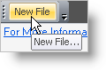

////

|metadata|
{
    "name": "wintoolbarsmanager-display-tooltips-for-tools",
    "controlName": ["WinToolbarsManager"],
    "tags": [],
    "guid": "{39B9267D-4914-4CEB-AF2F-A07DEFA735E6}",  
    "buildFlags": [],
    "createdOn": "2005-07-07T00:00:00Z"
}
|metadata|
////

= Display ToolTips for Tools

The WinToolbarsManager™ component has the functionality to display tooltips when the user mouses over a tool.

Tooltips can be displayed by setting the  pick:[win-forms="link:{ApiPlatform}win.ultrawintoolbars{ApiVersion}~infragistics.win.ultrawintoolbars.ultratoolbarsmanager~showtooltips.html[ShowTooltips]"]  property to true, and will not be displayed when the ShowTooltips property is False. The text for the tooltip can be specified for each tool by setting the  pick:[win-forms="link:{ApiPlatform}win.ultrawintoolbars{ApiVersion}~infragistics.win.ultrawintoolbars.sharedprops~tooltiptext.html[TooltipText]"]  property. If there is no value set for the TooltipText property, then the value set for the Caption property of the tool will be displayed as the tooltip. If neither of these properties are set, then no tooltip will be displayed.

*In Visual Basic:*

----
Imports Infragistics.Win.UltraWinToolbars
...
Private Sub Display_ToolTips_for_Tools_Load(ByVal sender As System.Object, _
  ByVal e As System.EventArgs) Handles MyBase.Load
	' Caption property is displayed as the tooltip
	Me.UltraToolbarsManager1.ShowToolTips = True
	Dim btnNew As New ButtonTool("New")
	Me.UltraToolbarsManager1.Tools.Add(btnNew)
	Me.UltraToolbarsManager1.Toolbars(0).Tools.Add(btnNew)
	btnNew.SharedProps.Caption = "New File"
	btnNew.SharedProps.ToolTipText = "New File..."
End Sub
----

*In C#:*

----
using Infragistics.Win.UltraWinToolbars;
...
private void Display_ToolTips_for_Tools_Load(object sender, EventArgs e)
{
	// Caption property is displayed as the tooltip
	this.ultraToolbarsManager1.ShowToolTips = true;
	ButtonTool btnNew = new ButtonTool("New");
	this.ultraToolbarsManager1.Tools.Add(btnNew);
	this.ultraToolbarsManager1.Toolbars[0].Tools.Add(btnNew);
	btnNew.SharedProps.Caption = "New File";
	btnNew.SharedProps.ToolTipText = "New File...";
}
----

