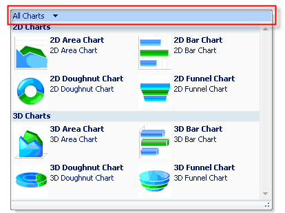
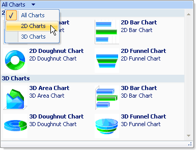

////

|metadata|
{
    "name": "wintoolbarsmanager-filtering-a-group-in-the-popupgallerytool",
    "controlName": ["WinToolbarsManager"],
    "tags": [],
    "guid": "{370B6D0D-B00E-4125-94C8-CC8A015F0B17}",  
    "buildFlags": [],
    "createdOn": "2006-06-10T10:53:29Z"
}
|metadata|
////

= Filtering a Group in the PopupGalleryTool

== Before You Begin

The  pick:[win-forms="link:{ApiPlatform}win.ultrawintoolbars{ApiVersion}~infragistics.win.ultrawintoolbars.popupgallerytool.html[PopupGalleryTool]"]  can display several items in its drop-down, so how do you organize all these items? Each item in the PopupGalleryTool can be sorted into groups as you learned in link:wintoolbarsmanager-adding-groups-and-items-to-the-popupgallerytool.html[Adding Groups and Items to the PopupGallery Tool]. You can then allow the end user to filter these groups so only one of them displays at a time. Most of this functionality is built-in to the PopupGalleryTool; however, there are a few steps you need to take to gain this functionality.

== What You Will Accomplish

This walkthrough builds upon the Adding Groups and Items to the PopupGalleryTool walkthrough to add filtering to the groups already created. You will add code to the FormLoad event that will first create three filters. The first filter will display all groups. The second filter will display just the 2D Chart group. The third filter will display just the 3D Chart group.

== Follow these Steps

[start=1]
. *Create the Filters.*

From a high level, you will basically create three filters, define the contents (groups) of those filters, and add the filters to the PopupGalleryTool's  pick:[win-forms="link:{ApiPlatform}win.ultrawintoolbars{ApiVersion}~infragistics.win.ultrawintoolbars.gallerytoolitemgroupfiltercollection.html[GroupFilters]"]  collection. Begin by instantiating three instances of the  pick:[win-forms="link:{ApiPlatform}win.ultrawintoolbars{ApiVersion}~infragistics.win.ultrawintoolbars.gallerytoolitemgroupfilter.html[GalleryToolItemGroupFilter]"]  class. Using an array of filters will make it easier to create, maintain, and add them to the GroupFilters collection. One of the parameters of the class constructor accepts an array of strings. These strings are the keys of the groups you want in the filter. One filter will have both groups contained within it to give the end user the option to view all items. The other filters will have one group each. The following code will create three filters:

*In Visual Basic:*

----
' Create three filters from the two groups. One filter will
' contain both 2D and 3D charts, the other two filters will
' contain the individual 2D or 3D chart types.
Dim filter() As GalleryToolItemGroupFilter = { _
  New GalleryToolItemGroupFilter("All Charts", _
			"All Charts", _
			New String() {"2D Charts", "3D Charts"}), _
  New GalleryToolItemGroupFilter("2D Charts", _
			"2D Charts", _
			 New String() {"2D Charts"}), _
  New GalleryToolItemGroupFilter("3D Charts", _
			"3D Charts", _
			New String() {"3D Charts"})}
----

*In C#:*

----
// Create three filters from the two groups. One filter will
// contain both 2D and 3D charts, the other two filters will
// contain the individual 2D or 3D chart types.
GalleryToolItemGroupFilter[] filter = 
  new GalleryToolItemGroupFilter[] {
  new GalleryToolItemGroupFilter("All Charts", 
                                 "All Charts", 
                                 new string[] {"2D Charts", "3D Charts"}),
  new GalleryToolItemGroupFilter("2D Charts", 
                                 "2D Charts", 
                                 new string[] {"2D Charts"}),
  new GalleryToolItemGroupFilter("3D Charts", 
                                 "3D Charts", 
                                 new string[] {"3D Charts"})};
----

[start=2]
. *Add the filters to the GroupFilters collection.*

The next step is fairly simple. Now that you have created the three filters, you need to add them to the GroupFilters collection. Once you do this, the filters will automatically function, there are no other properties needing to be set. Call the AddRange method off the GroupFilters collection to add an array of GalleryToolItemGroupFilters. Since we already created this array, you simply need to pass the filter array to the AddRange method.

*In Visual Basic:*

----
' Add the three filters to the GroupFilters collection.
chartGallery.GroupFilters.AddRange(filter)
----

*In C#:*

----
// Add the three filters to the GroupFilters collection.
chartGallery.GroupFilters.AddRange(filter);
----

[start=3]
. *Run the application.*

When you run the application, it will appear the same as it did at the end of the Adding Groups and Items to the PopupGalleryTool walkthrough. However, the difference is in the drop-down. Click the drop-down button and you will notice a filtering area at the top of the drop-down.

Clicking anywhere in this area will cause another drop-down to display containing the three filters that you added to the GroupFilters collection.

