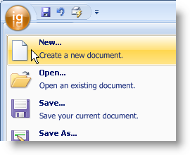

////

|metadata|
{
    "name": "wintoolbarsmanager-format-a-tools-description-on-the-ribbons-application-menu",
    "controlName": ["WinToolbarsManager"],
    "tags": [],
    "guid": "{D22466D8-BB08-4032-A938-B8E5A43B3FB7}",  
    "buildFlags": [],
    "createdOn": "0001-01-01T00:00:00Z"
}
|metadata|
////

= Format a Tool's Description on the Ribbon's Application Menu

{Warning}

In the topic link:wintoolbarsmanager-add-a-tool-to-the-tool-area-of-the-ribbons-application-menu.html[Add a Tool to the Tool Area of the Ribbon's Application Menu], we discussed how to add a tool to the Application Menu, but not how to format the description of that tool. Each tool has a property in their  pick:[win-forms="link:{ApiPlatform}win.ultrawintoolbars{ApiVersion}~infragistics.win.ultrawintoolbars.sharedprops.html[SharedProps]"]  object called  pick:[win-forms="link:{ApiPlatform}win.ultrawintoolbars{ApiVersion}~infragistics.win.ultrawintoolbars.sharedprops~descriptiononmenu.html[DescriptionOnMenu]"] . This property is set with a string. The string can be regular text or formatted text. You will see this string display directly under the caption, which you can set using the Caption property off the SharedProps object. The DescriptionOnMenu property supports all the functionality that the  pick:[win-forms="link:{ApiPlatform}win{ApiVersion}~infragistics.win.formattedlinklabel.formattedlinkeditor~value.html[Value]"]  property of the FormattedLinkEditor supports. For more information on how to format the text in the DescriptionOnMenu property, see link:winformattedlinklabel-formatting-text-and-hyperlinks.html[Formatting Text and Hyperlinks] and the link:winformattedtexteditor-style-attribute.html[Style Attribute].

The following code demonstrates how to format a tool's description when it displays on the Ribbon's Application menu.

.Note
[NOTE]
====
This example assumes that you have read link:wintoolbarsmanager-add-a-tool-to-the-tool-area-of-the-ribbons-application-menu.html[Add a Tool to the Tool Area of the Ribbon's Application Menu] and are using the same example).
====

*In Visual Basic:*

----
NewMenuItem.SharedProps.DescriptionOnMenu = _
  "
Create a new document.
"
----

*In C#:*

----
newMenuItem.SharedProps.DescriptionOnMenu = 
  "
Create a new document.
";
----