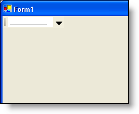

////

|metadata|
{
    "name": "wintoolbarsmanager-maskededit-tool-whats-new-2006-1",
    "controlName": [],
    "tags": [],
    "guid": "{EF1D1A4D-FDC6-4068-A618-1A0920DF77FC}",  
    "buildFlags": [],
    "createdOn": "0001-01-01T00:00:00Z"
}
|metadata|
////

= MaskedEdit Tool

The  pick:[win-forms="link:{ApiPlatform}win.ultrawintoolbars{ApiVersion}~infragistics.win.ultrawintoolbars.maskededittool.html[MaskedEditTool]"]  class is an editor tool that allows you to specify a mask that will restrict the input the end user enters.

== Related Topics

link:wintoolbarsmanager-add-a-maskededit-tool-to-a-toolbar.html[Add a MaskedEdit Tool to a Toolbar]