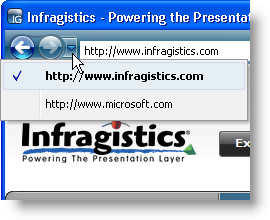

////

|metadata|
{
    "name": "wintoolbarsmanager-navigation-toolbar-navigate-to-a-new-item",
    "controlName": ["WinToolbarsManager"],
    "tags": ["Navigation"],
    "guid": "{77182DD9-2C3B-4DD1-A708-FA29AD44A43F}",  
    "buildFlags": [],
    "createdOn": "2007-12-09T12:09:16Z"
}
|metadata|
////

= Navigate to a New Item

The easiest way to create a navigation history is to simply navigate to a new item. The Navigation toolbar will automatically add each navigated item to the navigation history, so all you need to do is call the  pick:[win-forms="link:{ApiPlatform}win.ultrawintoolbars{ApiVersion}~infragistics.win.ultrawintoolbars.navigationtoolbar~navigateto.html[NavigateTo]"]  method. When you call the NavigateTo method, Navigation toolbar adds the item to the  pick:[win-forms="link:{ApiPlatform}win.ultrawintoolbars{ApiVersion}~infragistics.win.ultrawintoolbars.navigationtoolbar~backhistory.html[BackHistory]"]  collection, thus creating a navigation history.

The NavigateTo method exposes two overloads. The  pick:[win-forms="link:{ApiPlatform}win.ultrawintoolbars{ApiVersion}~infragistics.win.ultrawintoolbars.navigationtoolbar~navigateto(string,object).html[first overload]"]  accepts a string and an object while the  pick:[win-forms="link:{ApiPlatform}win.ultrawintoolbars{ApiVersion}~infragistics.win.ultrawintoolbars.navigationtoolbar~navigateto(navigationhistoryitem).html[second overload]"]  accepts a  pick:[win-forms="link:{ApiPlatform}win.ultrawintoolbars{ApiVersion}~infragistics.win.ultrawintoolbars.navigationhistoryitem.html[NavigationHistoryItem]"]  object. We're concerned with the first overload, a string and an object. The string is the text that displays in the recent history menu, accessed by the drop-down button to the right of the forward button. The object is an optional object that you can associate with the item. This object can be another string, an image, a collection of NavigationHistoryItem objects, or anything else. If you prefer not to attach an object, pass in null (Nothing).

The following code will navigate to a new item, therefore adding it to the BackHistory collection.

.Note
[NOTE]
====
*Hint:* You can place this code in the  pick:[win-forms="link:{ApiPlatform}win.ultrawintoolbars{ApiVersion}~infragistics.win.ultrawintoolbars.ultratoolbarsmanager~toolkeydown_ev.html[ToolKeyDown]"]  event and test for both the correct  pick:[win-forms="link:{ApiPlatform}win.ultrawintoolbars{ApiVersion}~infragistics.win.ultrawintoolbars.textboxtool.html[TextBoxTool]"]  and Enter key through the event arguments. Doing this will allow your end user to enter text in a text box and navigate to the destination by pressing Enter. The image above demonstrates this by navigating to a web site through an associated WebBrowser control. See link:wintoolbarsmanager-creating-an-internet-browsing-history.html[Creating an Internet Browsing History] for more information.
====

*In Visual Basic:*

----
Me.UltraToolbarsManager1.NavigationToolbar.NavigateTo _
	("http://www.infragistics.com", Nothing);
----

*In C#:*

----
this.ultraToolbarsManager1.NavigationToolbar.NavigateTo
	("http://www.infragistics.com", null);
----