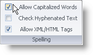
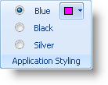

////

|metadata|
{
    "name": "wintoolbarsmanager-new-glyphs-for-statebutton-tool-whats-new-20071",
    "controlName": [],
    "tags": [],
    "guid": "{E1BCA0E4-7573-43F6-8AC0-724C36BF4035}",  
    "buildFlags": [],
    "createdOn": "2006-11-12T15:21:31Z"
}
|metadata|
////

= New Glyphs for StateButton Tool

The Check box and Radio Button are two tool types that were previously not available to toolbars created with WinToolbarsManager™. We've now made these two control types available through the StateButton tool. By setting the  pick:[win-forms="link:{ApiPlatform}win.ultrawintoolbars{ApiVersion}~infragistics.win.ultrawintoolbars.statebuttontool~toolbardisplaystyle.html[ToolbarDisplayStyle]"]  property to Glyph, the StateButton tool is transformed into a checkbox. Also, if the  pick:[win-forms="link:{ApiPlatform}win.ultrawintoolbars{ApiVersion}~infragistics.win.ultrawintoolbars.statebuttontool~optionset.html[OptionSet]"]  property (already existing in previous versions) is set, the StateButton will transform into a selection of radio buttons.

== Related Topics

link:wintoolbarsmanager-transform-a-statebuttontool-into-a-checkbox.html[Transform a StateButtonTool into a Checkbox]

link:wintoolbarsmanager-transform-a-statebuttontool-into-a-radio-button.html[Transform a StateButtonTool into a Radio Button]