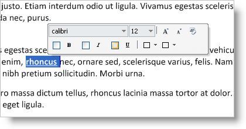

////

|metadata|
{
    "name": "wintoolbarsmanager-new-minitoolbar-whats-new-20071",
    "controlName": [],
    "tags": [],
    "guid": "{2B57D1D4-88AB-468D-B326-580329C65B92}",  
    "buildFlags": [],
    "createdOn": "2006-11-12T15:24:15Z"
}
|metadata|
////

= New MiniToolbar

Microsoft® Word 2007 introduced a new type of toolbar that floats near the currently selected text, and offers formatting types of tools. In the 2007 Volume 1 release, Infragistics is offering the MiniToolbar as well.

The MiniToolbar is simply another type of toolbar that can appear above the mouse pointer either with or without an accompanying context menu. Adding tools to the MiniToolbar is the same process as that of any other toolbar. Create the tools (or use previously existing tools), add them to the  pick:[win-forms="link:{ApiPlatform}win.ultrawintoolbars{ApiVersion}~infragistics.win.ultrawintoolbars.minitoolbar~tools.html[Tools]"]  collection, add them to the MiniToolbar's Tools collection, and you're done. You also have control over how many rows of tools you want the MiniToolbar to display.

On a right-click, the MiniToolbar will show as semi-transparent until you mouse over it fully, at which point the MiniToolbar will become fully opaque. As your mouse moves further away from the MiniToolbar, it becomes more transparent. When you move a certain distance away from the MiniToolbar, it completely disappears.

== Related Topics

link:wintoolbarsmanager-show-the-minitoolbar-programmatically.html[Show the MiniToolbar Programmatically]

link:wintoolbarsmanager-show-the-minitoolbar-with-a-context-menu.html[Show the MiniToolbar with a Context Menu]

link:wintoolbarsmanager-creating-a-minitoolbar.html[Creating a MiniToolbar]

link:wintoolbarsmanager-use-a-previously-created-ribbongroup-as-a-minitoolbar.html[Use a Previously Created RibbonGroup as a MiniToolbar]