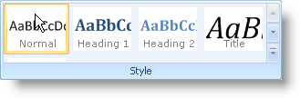

////

|metadata|
{
    "name": "wintoolbarsmanager-new-popupgallery-tool-whats-new-20063",
    "controlName": [],
    "tags": [],
    "guid": "{DBDE1008-9B36-421E-83EC-08DC1C5A8293}",  
    "buildFlags": [],
    "createdOn": "0001-01-01T00:00:00Z"
}
|metadata|
////

= New PopupGallery Tool

The PopupGallery tool is a smart, new way to give end users a preview of selections they need to make. The PopupGallery tool gives the end user a glimpse of the items contained within it. The tool supports a preview area which can be scrolled using the Up and Down buttons. Clicking the drop-down button will display a resizable window containing the gallery items.

Another feature of the PopupGallery tool is the ability to divide gallery items into groups. Once in groups, the end user can filter the gallery by individual groups, minimizing clutter.

== Related Topics

link:wintoolbarsmanager-installing-microsoft-office-2007-ui-capabilities.html[Installing Microsoft Office 2007 UI Capabilities]

link:wintoolbarsmanager-using-microsoft-office-2007-ui-capabilities.html[Using Microsoft Office 2007 UI Capabilities]