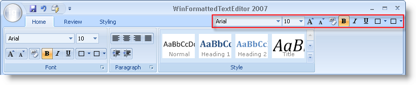

////

|metadata|
{
    "name": "wintoolbarsmanager-new-tab-item-toolbar-for-the-ribbon-whats-new-20071",
    "controlName": [],
    "tags": [],
    "guid": "{4EE57964-8402-4F85-B1DF-0563F049A56B}",  
    "buildFlags": [],
    "createdOn": "0001-01-01T00:00:00Z"
}
|metadata|
////

= New Tab Item Toolbar for the Ribbon

If you thought the Ribbon had enough locations to place tools last release, think again! We've added yet another toolbar to the Ribbon, giving you the extreme flexibility you've come to expect from Infragistics' tools. This new Tab Item toolbar displays and behaves as a standard toolbar. You'll find it on the Ribbon, above the Ribbon Groups, and to the right of the Ribbon Tabs.

The Tab Item toolbar can serve the same purpose as the link:wintoolbarsmanager-quick-access-toolbar.html[Quick Access Toolbar], always giving the end user timely access to needed tools. You can also use the Tab Item toolbar as any other standard toolbar containing tools that will assist the end user with application-related tasks.

Coupled with the completely customizable link:wintoolbarsmanager-new-minitoolbar-whats-new-20071.html[MiniToolbar], also new this release, you will never find your application lacking tools ever again.

== Related Topics

link:wintoolbarsmanager-creating-a-ribbon.html[Creating a Ribbon]

link:wintoolbarsmanager-add-a-tool-to-a-ribbon-group.html[Add a Tool to a Ribbon Group]