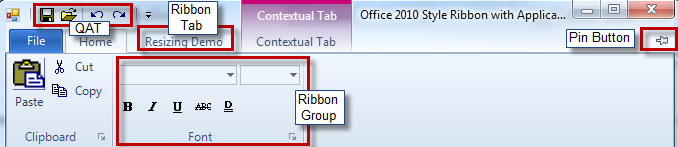

////

|metadata|
{
    "name": "wintoolbarsmanager-office-2010-ribbon-look-and-feel",
    "controlName": ["WinToolbarsManager"],
    "tags": ["Styling"],
    "guid": "3b7ec374-434c-41a9-9e86-f4de5ad1d841",  
    "buildFlags": [],
    "createdOn": "2010-09-20T14:02:53.7921674Z"
}
|metadata|
////

= Office 2010 Ribbon Look and Feel

The Ribbon in the WinToolbarsManager™ component gains a new style: Office2010. The Office 2010 style ribbon is similar to the previous versions of the ribbon, with a few changes in the color scheme and styles, plus a few additional features.

A new link:{ApiPlatform}win{ApiVersion}~infragistics.win.office2010colortable.html[Office2010ColorTable] has been added to manage all the colors used in this style. You can change between the colors using the link:{ApiPlatform}win{ApiVersion}~infragistics.win.office2010colortable~colorscheme.html[ColorScheme] property of the Office2010ColorTable object.

.Note
[NOTE]
====
By default, the color scheme is set to Blue.
====

*In Visual Basic:*

----
Infragistics.Win.Office2010ColorTable.ColorScheme = 
Infragistics.Win.Office2010ColorScheme.Silver
----

*In C#:*

----
Infragistics.Win.Office2010ColorTable.ColorScheme =
  Infragistics.Win.Office2010ColorScheme.Silver;
----

The ribbon will utilize the new look automatically when the UltraToolbarsManager.Style property is set to Office2010.

*In Visual Basic:*

----
Me.ultraToolbarsManager1.Style = Infragistics.Win.UltraWinToolbars.ToolbarStyle.Office2010
----

*In C#:*

----
this.ultraToolbarsManager1.Style = Infragistics.Win.UltraWinToolbars.ToolbarStyle.Office2010;
----

When the UltraToolbarsManager Style property resolves to Office2010, the style of the File Menu Button, visible on the top-left corner of the Ribbon, will be replaced with the Office 2010-style File Menu button. Also the Ribbon has an extended glass which extends into the client area, and the tab strip draws over the glass.

A link:{ApiPlatform}win.ultrawintoolbars{ApiVersion}~infragistics.win.ultrawintoolbars.ribbon~filemenustyle.html[FileMenuStyle] property has been added to the Ribbon object, which defines the type of menu (ApplicationMenu, ApplicationMenu2010, None) that drops down when the File Menu Button is clicked. An application menu similar to Microsoft Office 2010 Backstage view can be obtained, by setting the FileMenuStyle property to ApplicationMenu2010. This Office 2010-style application menu is comprised of Header, Navigation Menu and Content Area.

.Note
[NOTE]
====
By default the FileMenuStyle property is set to ApplicationMenu.
====

[Screenshot showing the BackStage View]

With this Office 2010 style a Pin/Unpin button is available in the top-right corner of the ribbon. This typically can be used to collapse/expand the ribbon.

The following screenshot shows different areas of the ribbon that has a different look and feel with the Office2010 style.

Related Topics:

link:wintoolbarsmanager-office-2010-style-application-menu.html[The Office 2010 Style Application Menu]

link:wintoolbarsmanager-add-tools-to-application-menu-2010.html[Add Tools to Application Menu 2010]

link:wintoolbarsmanager-customize-areas-of-application-menu-2010-and-file-menu-button.html[Customize Areas of Application Menu 2010 and File Menu Button]

link:styling-guide-office-2010-look-and-feel.html[Office 2010 Look and Feel]