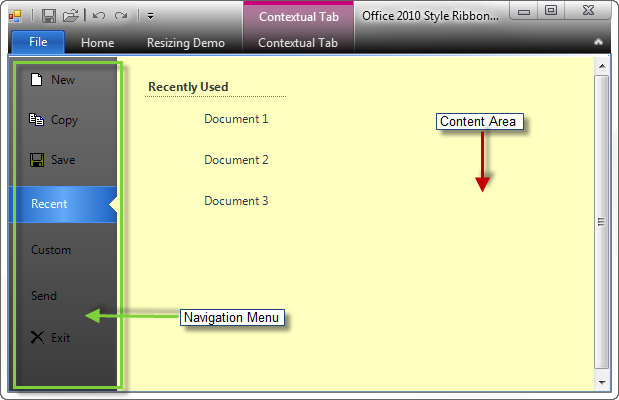

////

|metadata|
{
    "name": "wintoolbarsmanager-office-2010-style-application-menu",
    "controlName": ["WinToolbarsManager"],
    "tags": ["Styling"],
    "guid": "cfecbae9-5d90-4ba1-8cbb-246c264ce676",  
    "buildFlags": [],
    "createdOn": "2010-09-23T21:18:34.0653391Z"
}
|metadata|
////

= Office 2010 Style Application Menu

With the release of Office 2010, Microsoft® has introduced a new user interface for the Ribbon. The Ribbon has been remodeled with new styles, and a unique view for the file menu known as Backstage (Office 2010 style application menu) has been added. This Office 2010 style application menu has been implemented within our WinToolbarsManager™ component, which can be displayed in place of the standard application menu.

To support this feature, a new link:{ApiPlatform}win.ultrawintoolbars{ApiVersion}~infragistics.win.ultrawintoolbars.ribbon~filemenustyle.html[FileMenuStyle] property has been added to the Ribbon object that indicates the type of file menu (ApplicationMenu, ApplicationMenu2010 or None) to be dropped down. When this property is set to ApplicationMenu2010, the Office 2010 style application menu will be used in place of the standard application menu.

.Note
[NOTE]
====
By default, the FileMenuStyle property is set to ApplicationMenu.
====

You can view the Office 2010 style application menu by:

* Clicking on the menu button.

.Note
[NOTE]
====
The style of the menu button depends on the Style property of the UltraToolbarsManager component. To get an Office 2010 style File menu button, set the Style property to Office2010\.
====

* Programmatically calling ApplicationMenu2010. link:{ApiPlatform}win.ultrawintoolbars{ApiVersion}~infragistics.win.ultrawintoolbars.applicationmenu2010~dropdown.html[DropDown]() or ApplicationMenu2010.DropDown(activeContentTool) method
* When keytips are active:

** Pressing the associated key
** Selecting the menu button by pressing the left-arrow key, and activating the Office 2010 style application menu using either Enter, Space or the down-arrow key

*In Visual Basic:*

----
Imports Infragistics.Win.UltraWinToolbarsManager
…
Me.ultraToolbarsManager1.Ribbon.ApplicationMenu2010.DropDown()
----

*In C#:*

----
using Infragistics.Win.UltraWinToolbarsManager
…
this.ultraToolbarsManager1.Ribbon.ApplicationMenu2010.DropDown();
----

The left side of the Office 2010 style application menu is the Navigation Menu (similar to ToolAreaLeft in the standard application menu), which is responsible for displaying UltraToolbarsManger tools. The right side of the application menu 2010 is called the content area, which hosts any sub-items or controls that pop up from the tools in the navigation menu.

When the Office 2010 style application menu is displayed, the first enabled and visible PopupToolBase in the navigation menu’s tools collection will be set as the ActiveContentTool, and its sub-items or controls will be displayed in the content area. This can be overridden by setting the ActiveContentTool in the link:{ApiPlatform}win.ultrawintoolbars{ApiVersion}~infragistics.win.ultrawintoolbars.ultratoolbarsmanager~beforeapplicationmenu2010displayed_ev.html[BeforeApplicationMenu2010Displayed] event handler or by calling the ApplicationMenu2010.DropDown(activeContentTool) method programmatically and passing the instance tool that should be active and shown in the content area.

When the Office 2010 style application menu is visible the tools on Quick Access Toolbar (QAT) will be disabled by default. This behavior can be overridden by setting the link:{ApiPlatform}win.ultrawintoolbars{ApiVersion}~infragistics.win.ultrawintoolbars.applicationmenu2010~disableqat.html[DisableQAT] property on the link:{ApiPlatform}win.ultrawintoolbars{ApiVersion}~infragistics.win.ultrawintoolbars.ribbon~applicationmenu2010.html[Ribbon.ApplicationMenu2010] object to False.

The following events are available for handling various actions when using the application menu 2010:

link:{ApiPlatform}win.ultrawintoolbars{ApiVersion}~infragistics.win.ultrawintoolbars.ultratoolbarsmanager~beforeapplicationmenu2010displayed_ev.html[BeforeApplicationMenu2010Displayed] – This is a cancellable event that will fire prior to the Office 2010 style application menu being displayed.

link:{ApiPlatform}win.ultrawintoolbars{ApiVersion}~infragistics.win.ultrawintoolbars.ultratoolbarsmanager~afterapplicationmenu2010displayed_ev.html[AfterApplicationMenu2010Displayed] – Event that fires after the Office 2010 style application menu has been displayed.

link:{ApiPlatform}win.ultrawintoolbars{ApiVersion}~infragistics.win.ultrawintoolbars.ultratoolbarsmanager~beforeapplicationmenu2010closed_ev.html[BeforeApplicationMenu2010Closed] – Event that fires before the Office 2010 style application menu is closed, which is cancellable.

link:{ApiPlatform}win.ultrawintoolbars{ApiVersion}~infragistics.win.ultrawintoolbars.ultratoolbarsmanager~afterapplicationmenu2010closed_ev.html[AfterApplicationMenu2010Closed] – Event that fires after the Office 2010 style application menu has been closed.

Related Topics:

link:wintoolbarsmanager-add-tools-to-application-menu-2010.html[Add Tools to Application Menu 2010]

link:wintoolbarsmanager-customize-areas-of-application-menu-2010-and-file-menu-button.html[Customize Areas of Application Menu 2010 and File Menu Button]