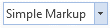
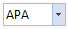

////

|metadata|
{
    "name": "wintoolbarsmanager-office-2013-ribbon-look-and-feel",
    "controlName": [],
    "tags": [],
    "guid": "6efb2226-8e3c-4993-8cfd-2dde5deac1b0",  
    "buildFlags": [],
    "createdOn": "2013-08-12T16:01:21.6190555Z"
}
|metadata|
////

= Office 2013 Ribbon Look and Feel

== Topic Overview

=== Purpose

This topic provides an overview of the Office 2013 Ribbon features, styles and differences compared with Office 2010.

=== In this topic

This topic contains the following sections:

* <<_Ref361932124,Office 2013 Ribbon>>
* <<_Ref361932134,Introduction>>
* <<_Ref361932142,Preview>>
* <<_Ref361932150,Office 2013 Ribbon Features>>

** <<_Ref361932157,Auto-hiding>>
** <<_Ref361932165,Removed Glass from the Ribbon>>
** <<_Ref361932185,Pin Button location>>
** <<_Ref361932192,Form Rendering>>
** <<_Ref361932205,File Menu (Application Menu 2010)>>

* <<_Ref361932215,Office 2013 Ribbon Styling>>

** <<_Ref361932225,Form Border New Style>>
** <<_Ref361932253,Quick Access Toolbar>>
** <<_Ref361932266,Ribbon Tabs>>
** <<_Ref361932276,Ribbon Groups>>
** <<_Ref361932287,Contextual Tab Groups>>
** <<_Ref361932296,Tool Appearance>>
** <<_Ref361932306,Key Tips and Keyboard Navigation>>
** <<_Ref361932317,Caption Area Background Image>>

* <<_Ref361932350,Areas and Controls Affected by Office 2013 Ribbon Feature>>

** <<_Ref361932359,AppStylist>>
** <<_Ref361932371,Assemblies>>
** <<_Ref353179659,Enumerations>>
** <<_Ref361932389,Glyph Editor>>
** <<_Ref361932403,Controls>>
** <<_Ref361932411,Globalization Localization>>

* <<_Ref361932420,Related Content>>

[[_Ref361932124]]
== Office 2013 Ribbon

[[_Ref361932134]]

=== Introduction

Microsoft introduced a new version of the Ribbon with the release of Office 2013. The Office 2013 Ribbon is similar to the previous versions of the Ribbon with a new color scheme, different styles and other features.

The link:{ApiPlatform}win.ultrawintoolbars{ApiVersion}~infragistics.win.ultrawintoolbars.ultratoolbarsmanager_members.html[UltraToolbarsManager] component already provides support for multiple view styles to replicate the Office 2007, Office 2010 and Scenic Ribbons. The Office 2013 Ribbon feature typically involves changes to the existing Ribbon design style.

[[_Ref361932142]]

=== Preview

Office 2013 ribbon.

Use the `UltraToolbarsManager.Style` property to set the Ribbon with Office 2013 style.

1. Configuring with code example.

*In C#:*

[source,csharp]
----
ultraToolbarsManager1.Style = ToolbarStyle.Office2013;
----

*In Visual Basic:*

[source,vb]
----
ultraToolbarsManager1.Style = ToolbarStyle.Office2013
----

2. Using the Properties window in visual Studio to configure the style.

image::images/WinToolbarsManager_Office_2013_Ribbon_2.png[]

[[_Ref361932150]]
== Office 2013 Ribbon Features

[[_Ref361932157]]

=== Auto-hiding

New to Office 2013 Ribbon is the addition of the ribbon display option button; located on the caption area of the Ribbon. Use a drop-down button to display the available Ribbon options. Thus empowering the user with the ability to recover display area by hiding the entire ribbon, including the captions, or replacing it with a caption bar containing three buttons ( *Show Ribbon* ,  *Ribbon Display Options* , and  *Close* ).

*  *Auto-hide Ribbon*  minimizes the space reserved for the ribbon by replacing the existing ribbon with a narrow bar with three right-aligned buttons ( *Show Ribbon* ,  *Ribbon Display Options* , and  *Close* )

*  *Show Ribbon*  – Displays the entire ribbon (including Tabs, Quick Access Toolbar, and Caption) in a dropdown that automatically disappears when it loses focus
*  *Ribbon Display Options*  – Displays the same menu as the display options on the normal caption
*  *Close*  – Closes the form

*  *Show Tabs*  – This option is similar to the unpinned state of the Office 2010 version of the ribbon
*  *Show Tabs and Commands*  – This option is similar to the pinned/normal state of previous versions of the ribbon

[[_Ref361932165]]

=== Removed Glass from the Ribbon

Designed with a flat, unembellished appearance, the Office 2013 Ribbon, is less invasive than its Office 2010 equivalent rendered in pseudo 3D. Microsoft disabled the Aero Glass theme in Office 2013.

[options="header", cols="a,a"]
|====
|Office 2010 with Aero Glass theme|Office 2013 without Aero Glass theme

|image::images/WinToolbarsManager_Office_2013_Ribbon_5.png[]
|image::images/WinToolbarsManager_Office_2013_Ribbon_6.png[]

|====

The `IsGlassSupported` property resolves to false whenever using the Office 2013 Toolbar Style.

[[_Ref361932185]]

=== Pin Button location

In Office 2013 the pin/unpin button moves from the caption area to the ribbon group area.

[options="header", cols="a,a"]
|====
|Office 2010|Office 2013

|image::images/WinToolbarsManager_Office_2013_Ribbon_7.png[]
|image::images/WinToolbarsManager_Office_2013_Ribbon_8.png[]

|====

[[_Ref361932192]]

=== Form Rendering

Form rendering in Office 2013 is changed with a thin-rectangular border (with shadows/glow).

[[_Ref361932205]]

=== File Menu (Application Menu 2010)

In Office 2010, when the file menu area, also known as Application Menu 2010, is visible it encompasses the entire lower portion of the container starting just below the tabs. The user would need to press the File tab or any other tab in order to close the Application Menu 2010.

==== Office 2010

Office 2013 changed the Application Menu 2010 so that it appears to fill the entire container. It displays the Application Menu 2010 over the same area but renders the area above the Application Menu 2010 differently. It removes the tab items and adds a stationary  *Back*  button above the navigation area to allow the user to close the Application Menu 2010.

==== Office 2013

[[_Ref361932215]]
== Office 2013 Ribbon Styling

[[_Ref361932225]]

=== Form Border New Style

The link:{ApiPlatform}win.ultrawintoolbars{ApiVersion}~infragistics.win.ultrawintoolbars.ultratoolbarsmanager_members.html[UltraToolbarsManager] has the ability to integrate with the hosting form to render custom form borders. Office 2013 uses a new border style, not seen in previous versions. The form borders are rectangular with a single-pixel border around the form. Additionally, the form is given a glow/shadow affect when active.

==== Active Form

* 1pixel border around the form, colored to match the “ *File”*  Application Menu Button.
* Glow / Shadow effect around the form.

==== Inactive Form

* 1pixel border around the form, colored dark grey with light gray text (Office 2013).
* No glow effect.

[[_Ref361932253]]

=== Quick Access Toolbar

With the release of Office 2013, the 2 separators used in the Office 2010 Ribbon to separating the tools between the system menu icon and the Quick Access Toolbar (QAT) quick customize menu are gone.

In the Office 2013 Ribbon, there are no separators on the QAT.

[options="header", cols="a,a"]
|====
|Office 2010|Office 2013

|image::images/WinToolbarsManager_Office_2013_Ribbon_14.png[]
|image::images/WinToolbarsManager_Office_2013_Ribbon_15.png[]

|====

[[_Ref361932266]]

=== Ribbon Tabs

Both Office 2010 and Office 2013 have the same ribbon functionality. The only difference between them is their appearance.

For a selected tab, the shape of the tab has changed to have squared instead of rounded corners. Additionally, the font color of the selected tab now matches that of the “ *File* ” Application Menu Button.

[options="header", cols="a,a"]
|====
|Office 2010|Office 2013

|image::images/WinToolbarsManager_Office_2013_Ribbon_16.png[]
|image::images/WinToolbarsManager_Office_2013_Ribbon_17.png[]

|====

When a non-selected tab is hot tracked (Moving the mouse over it) on the Office 2010 Ribbon, it displays the tab with glowing borders. On the Office2013 Ribbon, the tab border is not shown; only the font color changes to indicate the hot tracking appearance.

[options="header", cols="a,a"]
|====
|Office 2010|Office 2013

|image::images/WinToolbarsManager_Office_2013_Ribbon_18.png[]
|image::images/WinToolbarsManager_Office_2013_Ribbon_19.png[]

|====

[[_Ref361932276]]

=== Ribbon Groups

Both the Office 2010 and Office 2013 Ribbons use separators between adjacent ribbon groups. In Office 2010, the separator touches the lower edge of the tab page and fades away as it reaches the top edge while in Office 2013 the separator uses a solid line that does not reach the top or the bottom of the ribbon group. The background of the ribbon group is a solid off-white color matching that of the ribbon tab.

[options="header", cols="a,a"]
|====
|Office 2010 Separator|Office 2013 Separator

|image::images/WinToolbarsManager_Office_2013_Ribbon_20.png[]
|image::images/WinToolbarsManager_Office_2013_Ribbon_21.png[]

|====

[[_Ref361932287]]

=== Contextual Tab Groups

The only cosmetic differences exist between Office 2010 and the Office 2013 Ribbon contextual tab groups. Both Office 2010 and Office 2013 contextual tab group headers render with a solid line along the top indicating their group color.

The Office 2010 Ribbon contextual tab group header paints the glass section with a color gradient that fades away from top to bottom; the lines separating the contextual tab group fade away from top to bottom and do not touch the top edge of the tab page. Selecting a tab renders the selected tab page with a top border which has the color of the contextual tab group.

The Office 2013 Ribbon contextual tab group header is no longer a gradient, but a solid rendering using an alpha blend of the group color. Additionally, the top border of the selected tab does not change to match the color of the contextual tab group. Instead, the font color of the selected tab, hot tracked tab, and group header matches the group color.

[options="header", cols="a,a"]
|====
|Office 2010|Office 2013

|image::images/WinToolbarsManager_Office_2013_Ribbon_22.png[]
|image::images/WinToolbarsManager_Office_2013_Ribbon_23.png[]

|====

[[_Ref361932296]]

=== Tool Appearance

The styling in Office 2013 tools has changed considerably since the release of Office 2010. In general, replacing the glow effect and gradient styles of previous versions with a solid borderless style.

[options="header", cols="a,a,a"]
|====
|State|Office 2010|Office 2013

|Normal
|image::images/WinToolbarsManager_Office_2013_Ribbon_24.png[]
|image::images/WinToolbarsManager_Office_2013_Ribbon_25.png[]

|Hot tracked
|image::images/WinToolbarsManager_Office_2013_Ribbon_26.png[]
|image::images/WinToolbarsManager_Office_2013_Ribbon_27.png[]

|Selected
|image::images/WinToolbarsManager_Office_2013_Ribbon_28.png[]
|image::images/WinToolbarsManager_Office_2013_Ribbon_29.png[]

|Pressed
|image::images/WinToolbarsManager_Office_2013_Ribbon_30.png[]
|image::images/WinToolbarsManager_Office_2013_Ribbon_31.png[]

|====

[[_Ref361932306]]

=== Key Tips and Keyboard Navigation

Microsoft Office Ribbon provides users with `keyTips` to facilitate their using the keyboard to navigate through the tabs and tab members. Although `KeyTips` and keyboard navigation are identical in Office 2010 and Office 2013, changes have been made to the appearance of the `keyTips` element.

Office 2010 and previous versions of the ribbon, renders `keyTips` as light-gradient with rounded borders while Office 2013 `keyTips` renders them with a solid dark color and squared corners.

==== Office 2010

In.

==== Office 2013

[[_Ref361932317]]

=== Caption Area Background Image

Office 2013 allows the selection of a background image (not provided) to render in the caption area of the application using the following property.

`ultraToolbarsManager1.Ribbon.CaptionAreaAppearance.ImageBackground`

[[_Ref361932350]]
== Areas and Controls Affected by Office 2013 Ribbon Feature

[[_Ref361932359]]

=== AppStylist

The addition of new  _AutoHide_   functionality to the Office 2010 Ribbon resulted in Application Styling changes between the Office 2010 and Office 2013 Ribbon.

[[_Ref361932371]]

=== Assemblies

To incorporate the Office 2013 Ribbon features into the current architecture new values were added to the existing <<_Ref353179659,Enumerations>>. Due to the updates in the existing enumerations the assemblies that use those enumerations for styling such as, Editor controls or Button controls were updated as well.

The following list contains the assemblies affected by these changes:

* Infragistics4.Win.UltraWinEditors
* Infragistics4.Win.UltraWinGrid
* Infragistics4.Win.UltraWinMaskedEdit
* Infragistics4.Win.UltraWinSchedule
* Infragistics4.Win.UltraWinTabControl
* Infragistics4.Win.UltraWinListView
* Infragistics4.Win.UltraWinDataSource
* Infragistics4.Win.UltraWinToolbars

[[_Ref353179659]]

=== Enumerations

The following table lists the existing enumerations that contain the new values added to them in order to support Office 2013 view style.

[options="header", cols="a,a"]
|====
|Enumeration|New Value

|Infragistics.Win.AppStyling.ViewStyle
|Office2013

|Infragistics.Win.GlyphStyle
|Office2013

|Infragistics.Win.IGControls.MenuStyle
|Office2013

|Infragistics.Win.EmbeddableElementDisplayStyle
|Office2013

|Infragistics.Win.Pager.PagerDisplayStyle
|Office2013

|Infragistics.Win.UltraWinScrollBar.ScrollBarViewStyle
|Office2013

|Infragistics.Win.UIElementButtonStyle
|Office2013

|Infragistics.Win.UltraWinForm.UltraFormStyle
|Office2013

|====

[[_Ref361932389]]

=== Glyph Editor

The existing Glyph Editor for link:{ApiPlatform}win.ultrawineditors{ApiVersion}~infragistics.win.ultrawineditors.ultracheckeditor_members.html[UltraCheckEditor] and link:{ApiPlatform}win.ultrawineditors{ApiVersion}~infragistics.win.ultrawineditors.ultraoptionset_members.html[UltraOptionSet] glyphs were updated to include an option for the Office 2013 style. The Glyph Editor dialog displays for any property of the link:{ApiPlatform}win{ApiVersion}~infragistics.win.standardglyphinfo_members.html[GlyphInfo] type. The Office 2013 style has been added to the  _AppStylist for Windows Forms_   design dialog (shown in the screenshot called “Check Box Designer” and “Radio Button Designer”) for the link:{ApiPlatform}win.ultrawineditors{ApiVersion}~infragistics.win.ultrawineditors.ultracheckeditor_members.html[UltraCheckEditor] and link:{ApiPlatform}win.ultrawineditors{ApiVersion}~infragistics.win.ultrawineditors.ultraoptionset_members.html[UltraOptionSet] controls. These options are configured using the link:{ApiPlatform}win.misc{ApiVersion}~infragistics.win.misc.ultrawinnavigationbar.ultranavigationbarrole~checkboxglyphinfo.html[CheckBoxGlyphInfo] and link:{ApiPlatform}win.misc{ApiVersion}~infragistics.win.misc.ultrawinnavigationbar.ultranavigationbarrole~radiobuttonglyphinfo.html[RadioButtonGlyphInfo] properties, respectively.

==== _UltraCheckEditor_   component Role settings

The following screenshot illustrates the Office 2013 Style option selection in the design dialog, which appears by performing the following steps:

1. Open the AppStylist and click the `Roles` tab.

2. Select the UltraCheckEditor control from the list of controls; this displays the “Common Component Properties” section below it.

3. Select the “CheckBoxGlyphInfo” property; this enables the button with three dots (…) on the far-right of that row.

4. Click the button to display the designer dialog that contains the Office 2013 Style option.

==== _UltraOptionSet_   component Role settings

The following screenshot illustrates the Office 2013 Style option selection in the design dialog, which appears by performing the following steps:

1. Open the AppStylist and click the `Roles` tab.

2. Select the UltraOptionSet control from the list of controls; this displays the “Common Component Properties” section below it.

3. Select the “RadioButtonGlyphInfo” property; this enables the button with three dots (…) on the far-right of that row.

4. Click the button to display the designer dialog that contains the Office 2013 Style option.

image::images/WinToolbarsManager_Office_2013_Ribbon_36.png[]

[[_Ref361932403]]

=== Controls

The following controls support the Office 2013 Ribbon style. The screenshots illustrate the various way items render on the Office 2013 Ribbon.

[options="header", cols="a,a"]
|====
|*Controls*|*Screenshot*

| link:{ApiPlatform}win.misc{ApiVersion}~infragistics.win.misc.ultrabutton_members.html[UltraButton] 

link:{ApiPlatform}win.misc{ApiVersion}~infragistics.win.misc.ultradropdownbutton_members.html[UltraDropDownButton]

| ==== Normal   

 

==== HotTracked

 

==== Pressed

 

| link:{ApiPlatform}win.ultrawineditors{ApiVersion}~infragistics.win.ultrawineditors.ultrawincalc.ultracalculatordropdown_members.html[UltraCalculatorDropDown] 

link:{ApiPlatform}win.ultrawinschedule{ApiVersion}~infragistics.win.ultrawinschedule.ultracalendarcombo_members.html[UltraCalendarCombo] 

link:{ApiPlatform}win.ultrawineditors{ApiVersion}~infragistics.win.ultrawineditors.ultracolorpicker_members.html[UltraColorPicker] 

link:{ApiPlatform}win.ultrawingrid{ApiVersion}~infragistics.win.ultrawingrid.ultracombo_members.html[UltraCombo] link:{ApiPlatform}win.ultrawineditors{ApiVersion}~infragistics.win.ultrawineditors.ultracomboeditor_members.html[UltraComboEditor] 

link:{ApiPlatform}win.ultrawineditors{ApiVersion}~infragistics.win.ultrawineditors.ultracurrencyeditor_members.html[UltraCurrencyEditor] 

link:{ApiPlatform}win.ultrawineditors{ApiVersion}~infragistics.win.ultrawineditors.ultradatetimeeditor_members.html[UltraDateTimeEditor] 

link:{ApiPlatform}win.ultrawineditors{ApiVersion}~infragistics.win.ultrawineditors.ultrafontnameeditor_members.html[UltraFontNameEditor] 

link:{ApiPlatform}win.ultrawineditors{ApiVersion}~infragistics.win.ultrawineditors.ultratimezoneeditor_members.html[UltraTimeZoneEditor]

| ==== Normal

 

==== Hot tracked Text (DropDown) 

 

==== Hot tracked Text (DropDownList) 

 

==== Hot tracked Button 

| link:{ApiPlatform}win.ultrawineditors{ApiVersion}~infragistics.win.ultrawineditors.ultracheckeditor_members.html[UltraCheckEditor] (Checked and Unchecked)

| ==== Normal   

 

 

==== HotTracked

 

 

==== Pressed

 

 

| link:{ApiPlatform}win.ultrawineditors{ApiVersion}~infragistics.win.ultrawineditors.ultranumericeditor_members.html[UltraNumericEditor] 

link:{ApiPlatform}win.ultrawineditors{ApiVersion}~infragistics.win.ultrawineditors.ultratimespaneditor_members.html[UltraTimeSpanEditor]
| ==== Normal 

 

==== Hot tracked Text 

 

==== Hot tracked Button 

 

| link:{ApiPlatform}win.ultrawinstatusbar{ApiVersion}~infragistics.win.ultrawinstatusbar.ultrastatusbar_members.html[UltraStatusBar]

| ==== Normal 

 

==== Hot track Thumb 

 

==== Pressed Thumb 

 

==== Hot track button 

 

==== Pressed Button 

|====

[[_Ref361932411]]

=== Globalization Localization

The menu options and tooltip of the new  *Auto-Hide*  button displays localized text For example if the Office 2013 Ribbon runs on a Non-English version of a computer, the developer can use the customizable resource strings to localize the strings displayed in the dropdown menu and the Tooltip based on the language of that environment.

The following table illustrates customizable text elements (Left column) with corresponding resource strings (Right column) that can be used to customize or localize the text element.

[options="header", cols="a,a"]
|====
|Customizable text element|Resource string name

|image::images/WinToolbarsManager_Office_2013_Ribbon_60.png[]
|RibbonDisplayOptions

|image::images/WinToolbarsManager_Office_2013_Ribbon_61.png[]
|RibbonDisplayOptions_AutoHide_Title

|image::images/WinToolbarsManager_Office_2013_Ribbon_62.png[]
|RibbonDisplayOptions_AutoHide_Description

|====

Code example for customizing the text elements.

*In C#:*

[source,csharp]
----
private Infragistics.Shared.ResourceCustomizer _rc;
_rc = Infragistics.Win.UltraWinToolbars.Resources.Customizer;
_rc.SetCustomizedString("RibbonDisplayOptions", "[Localized] - RibbonDisplayOptions");
_rc.SetCustomizedString("RibbonDisplayOptions_AutoHide_Title", "[Localized] - AutoHide Title");
_rc.SetCustomizedString("RibbonDisplayOptions_AutoHide_Description", "[Localized] - AutoHide Description");
----

*In Visual Basic:*

[source,vb]
----
Private _rc As Infragistics.Shared.ResourceCustomizer
_rc = Infragistics.Win.UltraWinToolbars.Resources.Customizer
_rc.SetCustomizedString("RibbonDisplayOptions", "[Localized] - RibbonDisplayOptions")
_rc.SetCustomizedString("RibbonDisplayOptions_AutoHide_Title", "[Localized] - AutoHide Title")
_rc.SetCustomizedString("RibbonDisplayOptions_AutoHide_Description", "[Localized] - AutoHide Description")
----

The result from the above example.

image::images/WinToolbarsManager_Office_2013_Ribbon_63.png[]

For more information on how to customize resource strings, please refer to link:win-customizing-assembly-resource-strings.html[Customizing Assembly Resource Strings] topic.

[[_Ref361932420]]
== Related Content

=== Topics

The following topics provide additional information related to this topic.

[options="header", cols="a,a"]
|====
|Topic|Purpose

| link:styling-guide-office-2010-look-and-feel.html[Office 2010 Look and Feel]
|In NetAdvantage® for Windows Forms 2010 Volume 3, we added a new look and feel to our controls: the Microsoft® Office 2010 look and feel.

| link:styling-guide-office-2007-look-and-feel.html[Office 2007 Look and Feel]
|The Office 2007 Look and Feel is a visual theme that matches Microsoft® Office 2007. The most notable features of this Look and Feel is the Ribbon, Office 2007 color scheme, glyphs for option sets and check boxes, and glass color gradients.

|====