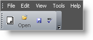

////

|metadata|
{
    "name": "wintoolbarsmanager-position-images-and-text-on-button-tools",
    "controlName": ["WinToolbarsManager"],
    "tags": [],
    "guid": "{D7230429-5419-4CF7-A143-584E68D10319}",  
    "buildFlags": [],
    "createdOn": "2005-07-07T00:00:00Z"
}
|metadata|
////

= Position Images and Text on Button Tools

pick:[win-forms="link:{ApiPlatform}win.ultrawintoolbars{ApiVersion}~infragistics.win.ultrawintoolbars.buttontool.html[Button]"]  tools can have a  pick:[win-forms="link:{ApiPlatform}win.ultrawintoolbars{ApiVersion}~infragistics.win.ultrawintoolbars.toolpropsbase~displaystyle.html[DisplayStyle]"]  of Image or TextAndImage. DisplayStyle can be assigned to apply to a tool wherever it appears, or it can vary depending on whether the tool is appearing on a toolbar or menu. When you choose TextAndImage you can also choose to display the text above, below to the left or to the right of the image, by using the  pick:[win-forms="link:{ApiPlatform}win.ultrawintoolbars{ApiVersion}~infragistics.win.ultrawintoolbars.toolbarsettings~captionplacement.html[CaptionPlacement]"]  property. This property is accessed through the  pick:[win-forms="link:{ApiPlatform}win.ultrawintoolbars{ApiVersion}~infragistics.win.ultrawintoolbars.ultratoolbar~settings.html[Settings]"]  property which returns the ToolBarSettings on the ToolBar.

== Design Time

Right-click on the  pick:[win-forms="link:{ApiPlatform}win.ultrawintoolbars{ApiVersion}~infragistics.win.ultrawintoolbars.ultratoolbarsmanager.html[UltraToolBarsManger]"]  and select Customize. In the toolbar tab select a toolbar that you defined and open the Settings property and scroll down to CaptionPlacement and choose where you want the text to be displayed.

== Run Time

*In Visual Basic:*

----
Imports Infragistics.Win
Imports Infragistics.Win.UltraWinToolbars
...
Private Sub Position_Images_and_Text_on_Button_Tools_Load( _
  ByVal sender As System.Object, _
  ByVal e As System.EventArgs) Handles MyBase.Load
	Me.UltraToolbarsManager1.Toolbars(1).Settings.CaptionPlacement = _
	  TextPlacement.BelowImage
	Me.UltraToolbarsManager1.Toolbars(1).Tools(1).SharedProps.DisplayStyle = _
	  ToolDisplayStyle.ImageAndText
End Sub
----

*In C#:*

----
using Infragistics.Win;
using Infragistics.Win.UltraWinToolbars;
...
private void Position_Images_and_Text_on_Button_Tools_Load(
  object sender, EventArgs e)
{
	this.ultraToolbarsManager1.Toolbars[1].Settings.CaptionPlacement = 
	  TextPlacement.BelowImage;
	this.ultraToolbarsManager1.Toolbars[1].Tools[1].SharedProps.DisplayStyle = 
	  ToolDisplayStyle.ImageAndText;
}
----

