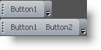

////

|metadata|
{
    "name": "wintoolbarsmanager-prevent-the-creation-of-multiple-tool-instances",
    "controlName": ["WinToolbarsManager"],
    "tags": [],
    "guid": "{51F13BD7-E055-494F-B9A7-D6F6646705AF}",  
    "buildFlags": [],
    "createdOn": "2005-07-07T00:00:00Z"
}
|metadata|
////

= Prevent the Creation of Multiple Tool Instances

By default, the user can create as many instance tools from a single root tool as they want. This behavior can be changed for a specific tool so that the tool cannot be instantiated more than one time in the WinToolbarsManager™ component. You can do this for as many tools as you feel are necessary, giving you the ability to limit the number of tools used for certain tools, while allowing other tools to be duplicated at will for use on user-defined toolbars.

Each tool has a property called  pick:[win-forms="link:{ApiPlatform}win.ultrawintoolbars{ApiVersion}~infragistics.win.ultrawintoolbars.sharedprops~allowmultipleinstances.html[AllowMultipleInstances]"] . When this property is set to True, a root tool can be instantiated within the UltraToolBarsManager element multiple times. When it is False, the tool can only be instantiated once. If the user attempts to add the tool a second time, the first instance will be removed.

This property can be set at design-time by right clicking on the UltraToolBarsManager element and selecting "Customize". Select the tool in the Tools tab and the AllowMultipleInstances property will be available under  pick:[win-forms="link:{ApiPlatform}win.ultrawintoolbars{ApiVersion}~infragistics.win.ultrawintoolbars.sharedprops.html[SharedProps]"] .

*In Visual Basic:*

----
Imports Infragistics.Win.UltraWinToolbars
...
Private Sub Prevent_the_Creation_of_Multiple_Tool_Instances_Load( _
  ByVal sender As System.Object, _
  ByVal e As System.EventArgs) Handles MyBase.Load
	' Allows multiple instances to be created itself
	' Creates the tool
	Dim btnNew As New ButtonTool("NewFile")
	btnNew.SharedProps.Caption = "New File"
	' Adds the tool to the tools collection
	Me.UltraToolbarsManager1.Tools.Add(btnNew)
	' Allows multiple instances of this tool
	btnNew.SharedProps.AllowMultipleInstances = True
	' First instance is created
	Me.UltraToolbarsManager1.Toolbars(0).Tools.Add(btnNew)
	' Second instance is created
	Me.UltraToolbarsManager1.Toolbars(1).Tools.Add(btnNew)
	' Allows only one instance to be created of itself
	' Creates the tool
	Dim btnSave As New ButtonTool("Save")
	btnSave.SharedProps.Caption = "Save"
	' Adds the tool to the tools collection
	Me.UltraToolbarsManager1.Tools.Add(btnSave)
	' Does not allow multiple instances of this tool
	btnSave.SharedProps.AllowMultipleInstances = False
	' First instance is created
	Me.UltraToolbarsManager1.Toolbars(0).Tools.Add(btnSave)
	' At this point the first instance will be deleted and the second one will be added
	Me.UltraToolbarsManager1.Toolbars(1).Tools.Add(btnSave)
End Sub
----

*In C#:*

----
using Infragistics.Win.UltraWinToolbars;
...
private void Prevent_the_Creation_of_Multiple_Tool_Instances_Load(
  object sender, EventArgs e)
{
	// Allows multiple instances to be created itself
	// Creates the tool
	ButtonTool btnNew = new ButtonTool("NewFile");
	btnNew.SharedProps.Caption = "New File";
	// Adds the tool to the tools collection
	this.ultraToolbarsManager1.Tools.Add(btnNew);
	// Allows multiple instances of this tool
	btnNew.SharedProps.AllowMultipleInstances = true;
	// First instance is created
	this.ultraToolbarsManager1.Toolbars[0].Tools.Add(btnNew);
	// Second instance is created
	this.ultraToolbarsManager1.Toolbars[1].Tools.Add(btnNew);
	// Allows only one instance to be created of itself
	// Creates the tool
	ButtonTool btnSave = new ButtonTool("Save");
	btnSave.SharedProps.Caption = "Save";
	// Adds the tool to the tools collection 
	this.ultraToolbarsManager1.Tools.Add(btnSave);
	// Does not allow multiple instances of this tool
	btnSave.SharedProps.AllowMultipleInstances = false;
	// First instance is created 
	this.ultraToolbarsManager1.Toolbars[0].Tools.Add(btnSave);
	// At this point the first instance will be deleted and the second one will be added 
	this.ultraToolbarsManager1.Toolbars[1].Tools.Add(btnSave);
}
----

