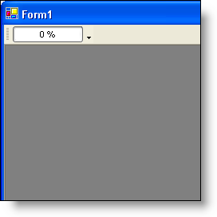

////

|metadata|
{
    "name": "wintoolbarsmanager-progressbar-tool-whats-new-2006-1",
    "controlName": [],
    "tags": [],
    "guid": "{8EB27501-5FE2-4B55-AA2D-17995870DAFA}",  
    "buildFlags": [],
    "createdOn": "0001-01-01T00:00:00Z"
}
|metadata|
////

= ProgressBar Tool

With the new  pick:[win-forms="link:{ApiPlatform}win.ultrawintoolbars{ApiVersion}~infragistics.win.ultrawintoolbars.progressbartool.html[ProgressBarTool]"]  class, you can now display a progress bar within a toolbar or menu. This tool exposes several properties for controlling the appearance and style of the progress area. Although there is no edit mode for the ProgressBar tool, you can still click and double-click on the progress bar, and the  pick:[win-forms="link:{ApiPlatform}win.ultrawintoolbars{ApiVersion}~infragistics.win.ultrawintoolbars.toolbase~toolclick_ev.html[ToolClick]"]  and  pick:[win-forms="link:{ApiPlatform}win.ultrawintoolbars{ApiVersion}~infragistics.win.ultrawintoolbars.toolbase~tooldoubleclick_ev.html[ToolDoubleClick]"]  events will fire, respectively.

== Related Topics

link:wintoolbarsmanager-add-a-progressbar-tool-to-a-toolbar.html[Add a ProgressBar Tool to a Toolbar]