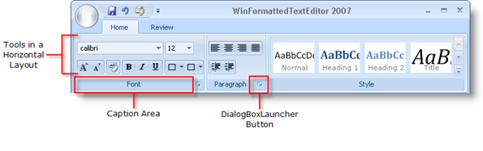

////

|metadata|
{
    "name": "wintoolbarsmanager-ribbon-groups",
    "controlName": ["WinToolbarsManager"],
    "tags": [],
    "guid": "{EA206612-129D-48F5-8126-A1702B98ACD4}",  
    "buildFlags": [],
    "createdOn": "0001-01-01T00:00:00Z"
}
|metadata|
////

= Ribbon Groups

{Warning}

Each tab, whether normal or contextual, contains groups. Use groups to keep similar tools together. In a word processing application, you may want to group all tools involving the font of a selection, including tools such as bold, italics, and underline.

A group's tools can be laid out either horizontally or vertically. If tools are in a vertical (default) layout, they will stack in groups of three (depending on the tool's size) before moving on to a new column. If tools are in a horizontal layout, they will be evenly dispersed in two rows.

Each group has a caption area which can contain text describing the Group. You may also choose to include a DialogBoxLauncher button. A DialogBoxLauncher button is a small button at the right side of a group's caption. This button can have its own ToolTip. Use the DialogBoxLauncher button to open a dialog box which may have more advanced options than the tools in the group. If the group contains tools related to Font styles, then a dialog box with more advanced Font options would be appropriate.

To create a group at design time, you simply need to click the New Group button in the current tab. See link:wintoolbarsmanager-add-a-group-to-a-ribbon-tab.html[Add a Group to a Ribbon Tab] to find out how to do this at run time.