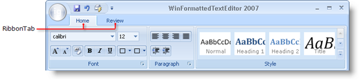
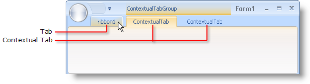

////

|metadata|
{
    "name": "wintoolbarsmanager-ribbon-tabs",
    "controlName": ["WinToolbarsManager"],
    "tags": [],
    "guid": "{892EC484-F3AB-4CA8-874C-C7363AD61E2B}",  
    "buildFlags": [],
    "createdOn": "0001-01-01T00:00:00Z"
}
|metadata|
////

= Ribbon Tabs

{Warning}

There are two types of Ribbon tabs: normal and contextual. A normal tab (referred to as simply "tab"), is always visible (unless you set its Visible property to False).

A contextual tab is visible only in specific situations. For example, you may need an Image tab to show whenever an image is selected in a word processing application. The end user doesn't need to see that tab unless they are editing an image. When a contextual tab is visible, it has its own caption in the Ribbon header area along with a highlight signifying that it is contextual.

To create a tab at design time, you simply need to click the Add Tab button. See link:wintoolbarsmanager-add-a-tab-to-the-ribbon.html[Add a Tab to the Ribbon] to find out how to do this at run time.