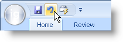

////

|metadata|
{
    "name": "wintoolbarsmanager-ribbon-whats-new-20063",
    "controlName": [],
    "tags": ["Navigation","Styling"],
    "guid": "{4850F211-8922-460E-B857-A52733857AF9}",  
    "buildFlags": [],
    "createdOn": "0001-01-01T00:00:00Z"
}
|metadata|
////

= Ribbon

Microsoft® Office 2007 includes several new and exciting styles. Microsoft completely redesigned their entire UI scheme to make items on toolbars and menus more accessible and easier to locate. Infragistics has adapted this new UI metaphor into our very own Ribbon. Using the Ribbon, there is no need for a main menu bar; all of the application options can be visible with one click of a tab. There are several exciting features of the new Ribbon which will significantly improve the face of your application's UI.

== Application Menu

Taken from the standard main menu, the application menu is now a graphical element supporting the new Office 2007 look and feel. The application menu is divided into three separate areas:

* The left area can display buttons intended for file operations.
* The right area can display buttons same as the left area. Another use for the right area might be a most recently used list.
* The bottom area can display buttons such as application options or an exit button.

== Quick Access Toolbar

The Quick Access Toolbar (QAT) is a standard-type toolbar that is always visible in the Ribbon. The QAT is extremely versatile in the fact that you can add almost any standard tool to it. The QAT can also be placed either above the Ribbon (default) or below the Ribbon.

== Tabs and Tab Groups

The Ribbon has a very familiar object model to those who have used our WinToolbarsManager component in the past. The Ribbon is built on a collection of tabs and tab groups. Add a tab to the ribbon, a group to the tab, and then tools to the group. You can even display contextual tabs that display only at a certain time or situation.

== Related Topics

link:wintoolbarsmanager-ribbon-about-the-ribbon.html[About the Ribbon]

link:wintoolbarsmanager-using-the-ribbon.html[Using the Ribbon]

link:wintoolbarsmanager-installing-microsoft-office-2007-ui-capabilities.html[Installing Microsoft Office 2007 UI Capabilities]

link:wintoolbarsmanager-using-microsoft-office-2007-ui-capabilities.html[Using Microsoft Office 2007 UI Capabilities]