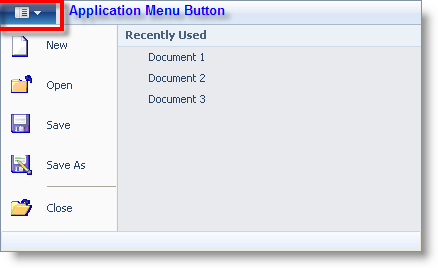
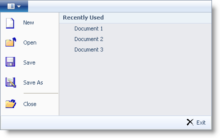
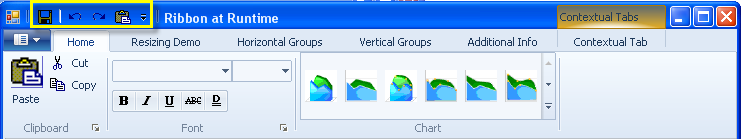
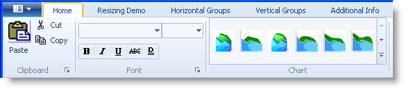
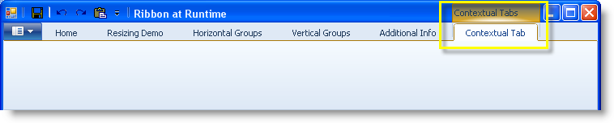
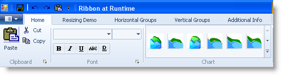

////

|metadata|
{
    "name": "wintoolbarsmanager-scenic-ribbon-look-and-feel",
    "controlName": ["WinToolbarsManager"],
    "tags": ["Styling"],
    "guid": "{2921E120-A90A-4CCA-BD86-42544FCB82D1}",  
    "buildFlags": [],
    "createdOn": "0001-01-01T00:00:00Z"
}
|metadata|
////

= Scenic Ribbon Look and Feel

This topic highlights the style changes in the WinToolBarsManager™ component, when using the Scenic Ribbon style. The new style can be applied by setting the Style property to ScenicRibbon either at design time or through code.

*In Visual Basic:*

----
Me.ultraToolbarsManager1.Style = ToolbarStyle.ScenicRibbon
----

*In C#:*

----
this.ultraToolbarsManager1.Style = ToolbarStyle.ScenicRibbon;
----

== Application Menu:

The Application Menu with the ScenicRibbon style will have the left and right tool areas by default. There is no footer tool area. However at the time of changing to the new style, if the footer tool area has some visible tools, they will still be available and functional. In this case you will be responsible to remove the tools in the footer area, if you prefer to have a complete ScenicRibbon style.

The Application Menu button appears as a tab in the ribbon tab area. Also, double-clicking the Application menu button will no longer close the application like in the Fluent Ribbon. The default key tip for the Application Menu button remains “F”.

Application Menu with left and right tool areas:

Application Menu with left, right and footer tool areas:

== Quick Access Toolbar

== Ribbon Tabs

== Contextual Tab Groups

== Ribbon Groups

