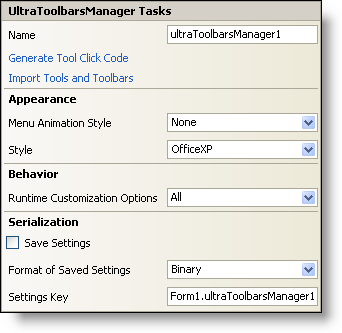

////

|metadata|
{
    "name": "wintoolbarsmanager-smart-tag",
    "controlName": ["WinToolbarsManager"],
    "tags": ["Design Environment"],
    "guid": "{48638BEA-E3C1-4C08-A303-20FF18ADFBFF}",  
    "buildFlags": [],
    "createdOn": "0001-01-01T00:00:00Z"
}
|metadata|
////

= WinToolbarsManager Smart Tag

In Visual Studio 2005 (.NET Framework 2.0), each Infragistics Windows Forms control/component is equipped with a Smart Tag. By simply selecting the control/component, a Smart Tag anchor appears. When you click this anchor, a pop-up panel appears, providing you with quick and easy access to the most common properties and settings of the control/component.

The WinToolbarsManager™ Smart Tag contains the name of the component, as well as the following sections:

* Appearance -- Provides common tasks involving the appearance, look, and feel of the control.
* Behavior -- Provides easy access to properties that govern how the control behaves on the form.
* Serialization -- Provides quick access to properties used in the IPersistComponentSettings interface.

See below for a description of the item (e.g., field, drop-down list, checkbox) in each section, as well as the item's corresponding property in the properties grid.

[options="header", cols="a,a,a"]
|====
|Appearance|Description|Corresponding Property

|Menu Animation Style
|Select from the drop-down how the toolbar menu should animate. Choose from Random, Unfold, Slide, and Fade.
| pick:[win-forms="link:infragistics4.win.ultrawintoolbars.v{ProductVersion}~infragistics.win.ultrawintoolbars.ultratoolbarsmanager~menuanimationstyle.html[MenuAnimationStyle]"] 

|Style
|Change the style of the WinToolbarsManager to make it look like Office XP, Office 2000, Office 2003, Visual Studio 2005, or Office 2007.
| pick:[win-forms="link:infragistics4.win.ultrawintoolbars.v{ProductVersion}~infragistics.win.ultrawintoolbars.ultratoolbarsmanager~style.html[Style]"] 

|====

[options="header", cols="a,a,a"]
|====
|Behavior|Description|Corresponding Property

|Runtime Customization 

Options
|By clicking the drop-down, several options are available. These options exist to customize the WinToolbarsManager at runtime.
| pick:[win-forms="link:infragistics4.win.ultrawintoolbars.v{ProductVersion}~infragistics.win.ultrawintoolbars.ultratoolbarsmanager~runtimecustomizationoptions.html[RuntimeCustomizationOptions]"] 

|====

[options="header", cols="a,a,a"]
|====
|Serialization|Description|Corresponding Property

|Save Settings
|If you select this checkbox, the component will automatically load/save its property settings with the application's settings.
| pick:[win-forms="link:infragistics4.win.ultrawintoolbars.v{ProductVersion}~infragistics.win.ultrawintoolbars.ultratoolbarsmanager~savesettings.html[SaveSettings]"] 

|Format of Saved Settings
|The component can save its settings in either binary or XML format.
| pick:[win-forms="link:infragistics4.win.ultrawintoolbars.v{ProductVersion}~infragistics.win.ultrawintoolbars.ultratoolbarsmanager~savesettingsformat.html[SaveSettingsFormat]"] 

|Settings Key
|You can specify the settings key that will be used to uniquely identify the settings' values that will be loaded/saved. By default, Visual Studio 2005 sets the settings key value based on the name of the containing form/control and the name of the component.
| pick:[win-forms="link:infragistics4.win.ultrawintoolbars.v{ProductVersion}~infragistics.win.ultrawintoolbars.ultratoolbarsmanager~settingskey.html[SettingsKey]"] 

|====