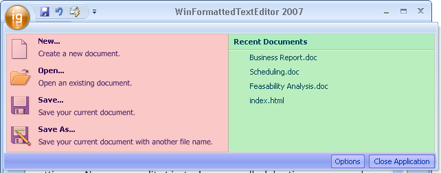

////

|metadata|
{
    "name": "wintoolbarsmanager-the-ribbon-application-menu",
    "controlName": ["WinToolbarsManager"],
    "tags": [],
    "guid": "{7F70E977-0E81-459B-BAE5-045F4420AEDB}",  
    "buildFlags": [],
    "createdOn": "0001-01-01T00:00:00Z"
}
|metadata|
////

= The Ribbon Application Menu

{Warning}

In the upper-left corner of the Ribbon, you will find a round button. This button is the application menu for an application using the Ribbon, which is the default. Of course, if you'd like to use the standard File menu included with WinToolbarsManager™, you can hide this button by setting the  pick:[win-forms="link:{ApiPlatform}win.ultrawintoolbars{ApiVersion}~infragistics.win.ultrawintoolbars.ribbon~filemenustyle.html[FileMenuStyle]"]  property to None.

.Note
[NOTE]
====
The ApplicationMenu.Visible property of the Ribbon object is now obsolete. Instead use the FileMenuStyle property.
====

.Note
[NOTE]
====
If you hide the Application menu, you may also want to relocate the Quick Access Toolbar (discussed in the link:wintoolbarsmanager-quick-access-toolbar.html[Quick Access Toolbar] topic) to below the Ribbon (or hide it altogether).
====

Upon clicking the Application menu, you will see a sort of dialog box that is divided into three sections. The left section, named  pick:[win-forms="link:{ApiPlatform}win.ultrawintoolbars{ApiVersion}~infragistics.win.ultrawintoolbars.applicationmenu~toolarealeft.html[ToolAreaLeft]"]  (The area shaded red in the image below), is where you might want to place formatted tools with commands such as Open, Save, Save As, and Close. The right section, named  pick:[win-forms="link:{ApiPlatform}win.ultrawintoolbars{ApiVersion}~infragistics.win.ultrawintoolbars.applicationmenu~toolarearight.html[ToolAreaRight]"]  (The area shaded green in the image below), can contain the same type of items as the ToolAreaRight section, but has been primarily designed to host a most recently used list or other common commands. The third section is at the bottom of the file menu, named  pick:[win-forms="link:{ApiPlatform}win.ultrawintoolbars{ApiVersion}~infragistics.win.ultrawintoolbars.applicationmenu~footertoolbar.html[FooterToolbar]"]  (The area shaded blue in the image below). The footer area could potentially contain an "Exit from Application" button.

You can add tools to the file menu at design-time by clicking the file menu and then clicking Insert Tool in any of the three areas. See link:wintoolbarsmanager-add-a-tool-to-the-tool-area-of-the-ribbons-application-menu.html[Add a Tool to the Tool Area of the Ribbon's Application Menu] to find out how to do this at run time.