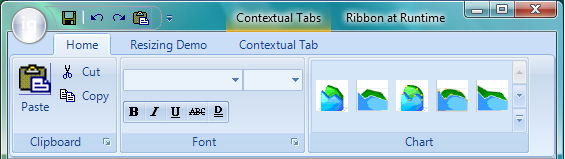

////

|metadata|
{
    "name": "wintoolbarsmanager-the-ribbon-now-supports-glass-in-windows-vista",
    "controlName": [],
    "tags": [],
    "guid": "{467DE629-6601-46FF-8294-4903ED24F483}",  
    "buildFlags": [],
    "createdOn": "2007-05-02T17:19:50Z"
}
|metadata|
////

= The Ribbon Now Supports Glass in Windows Vista

Staying on the cutting edge of technology is important for application developers. Realizing this importance, we've added the ability for the Ribbon to display glass in the caption area when being viewed on a Windows® Vista™ system. The glass effect allows the Ribbon caption header to display in a semi-transparent fashion. This feature is available by default when Composition is enabled through the operating system settings; there is no need to set additional properties on the Ribbon itself.

== Related Topics

link:wintoolbarsmanager-working-with-the-ribbon.html[Working with the Ribbon]