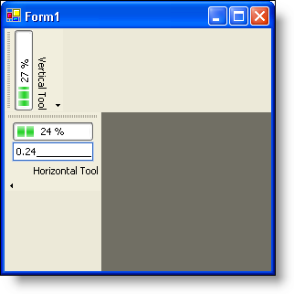

////

|metadata|
{
    "name": "wintoolbarsmanager-tool-orientation-whats-new-2006-1",
    "controlName": [],
    "tags": [],
    "guid": "{B2D875CB-65F4-4AB8-8A47-4647367516D4}",  
    "buildFlags": [],
    "createdOn": "0001-01-01T00:00:00Z"
}
|metadata|
////

= Tool Orientation

In previous versions of Infragistics Windows Forms, when a toolbar is docked to the top or bottom (or floating), the tools are arranged from left to right with their text displaying horizontally. When a toolbar is docked to the left or right, the tools are arranged from top to bottom with their text displaying vertically. This is similar to how toolbars behave in Microsoft® Office and Visual Studio®.

By using the new  pick:[win-forms="link:infragistics4.win.ultrawintoolbars.v{ProductVersion}~infragistics.win.ultrawintoolbars.toolbarsettings~toolorientation.html[ToolOrientation]"]  property of the  pick:[win-forms="link:infragistics4.win.ultrawintoolbars.v{ProductVersion}~infragistics.win.ultrawintoolbars.toolbarsettings.html[ToolbarSettings]"]  class, you can now specify whether you want the tool to display horizontally or vertically, despite how the toolbar is docked. By setting the ToolOrientation property to  pick:[win-forms="link:infragistics4.win.ultrawintoolbars.v{ProductVersion}~infragistics.win.ultrawintoolbars.toolorientation.html[Horizontal]"] , the tool (as well as the tool's text) will be oriented as if it were attached to a horizontal toolbar, even though it may be attached to a vertical toolbar. If you were to set the ToolOrientation property to  pick:[win-forms="link:infragistics4.win.ultrawintoolbars.v{ProductVersion}~infragistics.win.ultrawintoolbars.toolorientation.html[Vertical]"] , the tool (as well as its text) will be oriented as if it were attached to a vertical toolbar.

== Related Topics

link:wintoolbarsmanager-change-the-orientation-of-tools-on-a-toolbar.html[Change the Orientation of Tools on a Toolbar]