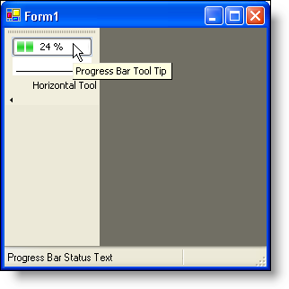

////

|metadata|
{
    "name": "wintoolbarsmanager-tool-statustext-whats-new-2006-1",
    "controlName": [],
    "tags": [],
    "guid": "{EB26CB5A-DF2E-42CB-BFE0-0B6AD079F95A}",  
    "buildFlags": [],
    "createdOn": "0001-01-01T00:00:00Z"
}
|metadata|
////

= Tool StatusText

When a tool is activated, text is automatically displayed in an AutoStatusText type panel of an  pick:[win-forms="link:{ApiPlatform}win.ultrawinstatusbar{ApiVersion}~infragistics.win.ultrawinstatusbar.ultrastatusbar.html[UltraStatusBar]"]  on the same container as the WinToolbarsManager™. Previously, this value was based on the resolved ToolTip for the tool that was activated. You can set the  pick:[win-forms="link:{ApiPlatform}win.ultrawintoolbars{ApiVersion}~infragistics.win.ultrawintoolbars.sharedprops~statustext.html[StatusText]"]  property of each tool’s  pick:[win-forms="link:{ApiPlatform}win.ultrawintoolbars{ApiVersion}~infragistics.win.ultrawintoolbars.toolbase~sharedprops.html[SharedProps]"]  property to the text that should be displayed in the panel, allowing you to display different text for the ToolTips and status text.

