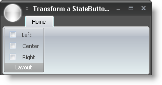

////

|metadata|
{
    "name": "wintoolbarsmanager-transform-a-statebuttontool-into-a-checkbox",
    "controlName": ["WinToolbarsManager"],
    "tags": [],
    "guid": "{12D54D33-4C0D-440F-BEB8-4C79E0CC94F7}",  
    "buildFlags": [],
    "createdOn": "0001-01-01T00:00:00Z"
}
|metadata|
////

= Transform a StateButtonTool into a Checkbox

Prior to Infragistics Windows Forms 2007 Volume 1, the only way to place a check box or option set on a toolbar was to use either the WinCheckEditor™ or WinOptionSet™ controls in a control container. On top of that, control containers weren't even supported on the Ribbon. However, with one simple property, we've changed all that. Setting the new  pick:[win-forms="link:{ApiPlatform}win.ultrawintoolbars{ApiVersion}~infragistics.win.ultrawintoolbars.statebuttontool~toolbardisplaystyle.html[ToolbarDisplayStyle]"]  property to  pick:[win-forms="link:{ApiPlatform}win.ultrawintoolbars{ApiVersion}~infragistics.win.ultrawintoolbars.statebuttontoolbardisplaystyle.html[Glyph]"] , you can transform any StateButtonTool into a CheckBox. The StateButtonTool already contains a  pick:[win-forms="link:{ApiPlatform}win.ultrawintoolbars{ApiVersion}~infragistics.win.ultrawintoolbars.statebuttontool~checked.html[Checked]"]  property, so the tool is ready to go with minimal effort.

The following code assumes that you already have a StateButtonTool in a Ribbon Group named 'stateButtonTool1'. See link:wintoolbarsmanager-add-a-tool-to-a-ribbon-group.html[Add a Tool to a Ribbon Group] for more information. The first line of code retrieves an instance of the previously created StateButtonTool. The second line of code forces the StateButtonTool to display a check box glyph rather than a state button.

*In Visual Basic:*

----
Imports Infragistics.Win.UltraWinToolbars
...
Dim Left As StateButtonTool = _
  CType(Me.UltraToolbarsManager1.Ribbon.Tabs(0).Groups(0).Tools("Left"), _
  StateButtonTool)
Left.ToolbarDisplayStyle = StateButtonToolbarDisplayStyle.Glyph
Dim Center As StateButtonTool = _
  CType(Me.UltraToolbarsManager1.Ribbon.Tabs(0).Groups(0).Tools("Center"), _
  StateButtonTool)
Center.ToolbarDisplayStyle = StateButtonToolbarDisplayStyle.Glyph
Dim Right As StateButtonTool = _
  CType(Me.UltraToolbarsManager1.Ribbon.Tabs(0).Groups(0).Tools("Right"), _
  StateButtonTool)
Right.ToolbarDisplayStyle = StateButtonToolbarDisplayStyle.Glyph
----

*In C#:*

----
using Infragistics.Win.UltraWinToolbars;
...
StateButtonTool Left =
  this.ultraToolbarsManager1.Ribbon.Tabs[0].Groups[0].Tools["Left"]
  as StateButtonTool;
Left.ToolbarDisplayStyle = StateButtonToolbarDisplayStyle.Glyph;
StateButtonTool Center =
  this.ultraToolbarsManager1.Ribbon.Tabs[0].Groups[0].Tools["Center"]
  as StateButtonTool;
Center.ToolbarDisplayStyle = StateButtonToolbarDisplayStyle.Glyph;
StateButtonTool Right =
  this.ultraToolbarsManager1.Ribbon.Tabs[0].Groups[0].Tools["Right"]
  as StateButtonTool;
  Right.ToolbarDisplayStyle = StateButtonToolbarDisplayStyle.Glyph;
----