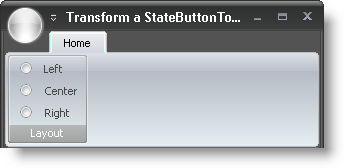

////

|metadata|
{
    "name": "wintoolbarsmanager-transform-a-statebuttontool-into-a-radio-button",
    "controlName": ["WinToolbarsManager"],
    "tags": ["Tips and Tricks"],
    "guid": "{CA9DECC7-6744-47DF-993F-E6CF1F0FFA2A}",  
    "buildFlags": [],
    "createdOn": "0001-01-01T00:00:00Z"
}
|metadata|
////

= Transform a StateButtonTool into a Radio Button

In 2007 Volume 1, WinToolbarsManager™ gained the ability to display check boxes and radio buttons through the  pick:[win-forms="link:{ApiPlatform}win.ultrawintoolbars{ApiVersion}~infragistics.win.ultrawintoolbars.statebuttontool.html[StateButtonTool]"] , specifically, the  pick:[win-forms="link:{ApiPlatform}win.ultrawintoolbars{ApiVersion}~infragistics.win.ultrawintoolbars.statebuttontool~toolbardisplaystyle.html[ToolbarDisplayStyle]"]  property of the StateButtonTool. You can link:wintoolbarsmanager-transform-a-statebuttontool-into-a-checkbox.html[transform a StateButtonTool into a check box], or by setting one extra property, you can transform it into a radio button. To display a check box or a radio button, you need to change the same property, ToolbarDisplayStyle. What this property changes is the look of the glyph – whether you see a check box or radio button. By default, just setting this property will display a check box. However, if you also set the  pick:[win-forms="link:{ApiPlatform}win.ultrawintoolbars{ApiVersion}~infragistics.win.ultrawintoolbars.statebuttontool~optionset.html[OptionSet]"]  property to a new or previously created OptionSet, the glyph will display as a radio button.

The following code assumes that you have three StateButtonTools on a Ribbon Group named 'StateButtonTool1', 'StateButtonTool2', and 'StateButtonTool3' respectively. See link:wintoolbarsmanager-add-a-tool-to-a-ribbon-group.html[Add a Tool to a Ribbon Group] for more information. It is also assumed that you have already created an OptionSet. See link:wintoolbarsmanager-create-groups-of-mutually-exclusive-statebuttons.html[Create Groups of Mutually-Exclusive StateButtons] for more information on creating OptionSets.

The first line of code retrieves a reference to the first StateButtonTool. The second line of code displays the StateButtonTool as a check box (glyph). The third line of code sets the OptionSet for that StateButtonTool, therefore displaying the tool as a radio button.

*In Visual Basic:*

----
Imports Infragistics.Win.UltraWinToolbars
...
' Creates a new OptionSet
' AllowAllUp is set to True, so all state buttons can be unchecked at the same time
Me.UltraToolbarsManager1.OptionSets.Add(True, "Layout")
Dim Left As StateButtonTool = _
  CType(Me.UltraToolbarsManager1.Ribbon.Tabs(0).Groups(0).Tools("Left"), _
  StateButtonTool)
Left.ToolbarDisplayStyle = StateButtonToolbarDisplayStyle.Glyph
Left.OptionSet = Me.UltraToolbarsManager1.OptionSets(0)
Dim Center As StateButtonTool = _
  CType(Me.UltraToolbarsManager1.Ribbon.Tabs(0).Groups(0).Tools("Center"), _
  StateButtonTool)
Center.ToolbarDisplayStyle = StateButtonToolbarDisplayStyle.Glyph
Center.OptionSet = Me.UltraToolbarsManager1.OptionSets(0)
Dim Right As StateButtonTool = _
  CType(Me.UltraToolbarsManager1.Ribbon.Tabs(0).Groups(0).Tools("Right"), _
  StateButtonTool)
Right.ToolbarDisplayStyle = StateButtonToolbarDisplayStyle.Glyph
Right.OptionSet = Me.UltraToolbarsManager1.OptionSets(0)
----

*In C#:*

----
using Infragistics.Win.UltraWinToolbars;
...
// Creates a new OptionSet
// AllowAllUp is set to True, so all state buttons can be unchecked at the same time
this.ultraToolbarsManager1.OptionSets.Add(true, "Layout");
StateButtonTool Left =
  this.ultraToolbarsManager1.Ribbon.Tabs[0].Groups[0].Tools["Left"]
  as StateButtonTool;
Left.ToolbarDisplayStyle = StateButtonToolbarDisplayStyle.Glyph;
Left.OptionSet = this.ultraToolbarsManager1.OptionSets[0];
StateButtonTool Center =
  this.ultraToolbarsManager1.Ribbon.Tabs[0].Groups[0].Tools["Center"]
  as StateButtonTool;
Center.ToolbarDisplayStyle = StateButtonToolbarDisplayStyle.Glyph;
Center.OptionSet = this.ultraToolbarsManager1.OptionSets[0];
StateButtonTool Right =
  this.ultraToolbarsManager1.Ribbon.Tabs[0].Groups[0].Tools["Right"]
  as StateButtonTool;
Right.ToolbarDisplayStyle = StateButtonToolbarDisplayStyle.Glyph;
Right.OptionSet = this.ultraToolbarsManager1.OptionSets[0];
----