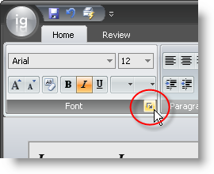

////

|metadata|
{
    "name": "wintoolbarsmanager-use-the-dialogboxlauncher-button-to-display-a-dialog-box",
    "controlName": ["WinToolbarsManager"],
    "tags": [],
    "guid": "{C2A4D23C-5D7B-4E31-B5C7-3BE9358FE420}",  
    "buildFlags": [],
    "createdOn": "0001-01-01T00:00:00Z"
}
|metadata|
////

= Use the DialogBoxLauncher to Display a Dialog Box

{Warning}

Each Ribbon group can display a unique button that can perform any task that a regular button can. This button is called the  pick:[win-forms="link:{ApiPlatform}win.ultrawintoolbars{ApiVersion}~infragistics.win.ultrawintoolbars.ribbongroup~dialogboxlauncherkey.html[DialogBoxLauncher]"]  button. A general use case might be to display a dialog box relating to the tools inside the group. The Advanced button can also display a formatted ToolTip, possibly showing a thumbnail of the dialog box you want to display to the end user. For more information on formatted ToolTips, see link:wintooltipmanager-creating-a-formatted-tooltip.html[Creating a Formatted ToolTip].

The following code demonstrates how to create a standard button tool and set it to a group's Advanced button. The code will also show how to create a ToolClick event for that button so you can launch the WinFormattedTextEditor's Font dialog box. If you need help creating a Ribbon group inside a Ribbon tab, see link:wintoolbarsmanager-add-a-group-to-a-ribbon-tab.html[Add a Group to a Ribbon Tab].

*In Visual Basic:*

----
Imports Infragistics.Win.UltraWinToolbars
Imports Infragistics.Win.FormattedLinkLabel
...
Private Sub Use_the_DialogBoxLauncher_Button_to_Display_a_Dialog_Box_Load( _
  ByVal sender As System.Object, ByVal e As System.EventArgs) Handles MyBase.Load
   ' Create a tool that will open the Font dialog box.
   Dim fontDialog As New ButtonTool("FontDialog")
   ' Add the tool to WinToolbarsManager's Tools collection.
   Me.ultraToolbarsManager1.Tools.Add(fontDialog)
   ' Set the tool as the group's DialogBoxLauncher button.
   Me.ultraToolbarsManager1.Ribbon.Tabs(0).Groups(0).DialogBoxLauncherKey = _
     "FontDialog"
   ' Create a ToolClick event handler for the tool.
   AddHandler fontDialog.ToolClick, AddressOf fontDialog_ToolClick
End Sub
' Create the event that will fire when the DialogBoxLauncher button is clicked.
Private Sub fontDialog_ToolClick(sender As Object, e As ToolClickEventArgs)
   ' Display the WinFormattedTextEditor's Font dialog box.
   Me.UltraFormattedTextEditor1.EditInfo.ShowFontDialog()
End Sub
----

*In C#:*

----
using Infragistics.Win.UltraWinToolbars;
using Infragistics.Win.FormattedLinkLabel;
...
private void Use_the_DialogBoxLauncher_Button_to_Display_a_Dialog_Box_Load(
  object sender, 
  EventArgs e)
{
	// Create a tool that will open the Font dialog box.
	ButtonTool fontDialog = new ButtonTool("FontDialog");
	// Add the tool to WinToolbarsManager's Tools collection.
	this.ultraToolbarsManager1.Tools.Add(fontDialog);
	// Set the tool as the group's DialogBoxLauncher button.
	this.ultraToolbarsManager1.Ribbon.Tabs[0].Groups[0].DialogBoxLauncherKey = 
	  "FontDialog";
	// Create a ToolClick event handler for the tool.
	fontDialog.ToolClick += 
	  new ToolClickEventHandler(this.fontDialog_ToolClick);
}
// Create the event that will fire when the DialogBoxLauncher button is clicked.
private void fontDialog_ToolClick(object sender, ToolClickEventArgs e)
{
	// Display the WinFormattedTextEditor's Font dialog box.
	this.ultraFormattedTextEditor1.EditInfo.ShowFontDialog();
}
----