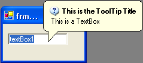

////

|metadata|
{
    "name": "wintooltip-whats-new-2005-3",
    "controlName": [],
    "tags": [],
    "guid": "{E4C36D60-895B-481A-B604-F3A33DF583BF}",  
    "buildFlags": [],
    "createdOn": "0001-01-01T00:00:00Z"
}
|metadata|
////

= WinToolTip 2005.3

A new WinToolTip™ component has been added to the Win Assembly. Users can place the ToolTip component on a form just like the Microsoft Tooltip component, but with some extra features such as:

* BalloonTip support.
* Control over the time before the tip appears and how long it stays visible.
* Defaultable settings that can be set on the Component or on the individual Control-level.
* Appearance settings
* Control the position of the ToolTip

== Related Topics

link:wintooltipmanager-control-the-timing-of-a-tooltips-appearance.html[Control the Timing of a Tooltip's Appearance]

link:wintooltipmanager-set-up-wintooltipmanager-at-design-time.html[Set Up WinToolTipManager at Design Time]

link:wintooltipmanager-set-up-wintooltipmanager-at-run-time.html[Set Up WinToolTipManager at Run Time]

link:wintooltipmanager-tooltip-styles.html[Tooltip Styles]