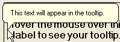

////

|metadata|
{
    "name": "wintooltipmanager-about-wintooltipmanager",
    "controlName": ["WinToolTipManager"],
    "tags": ["Getting Started"],
    "guid": "{0EC0F9DF-ACD9-4321-B780-7A7E4F9AD35E}",  
    "buildFlags": [],
    "createdOn": "0001-01-01T00:00:00Z"
}
|metadata|
////

= About WinToolTipManager

The WinToolTipManager™ component adds an extender property called "UltraToolTip" to any Windows Forms control. The UltraToolTip property allows for a control to be managed by WinToolTipmanager. This allows a ToolTip to automatically display when the mouse hovers over the control.

* Appearance Support -- Full appearance support including alpha-blending, gradients, images, etc.
* BalloonTips -- Rounds the corners of the tooltip to give it a balloon look.

