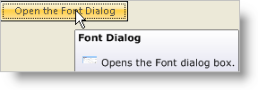

////

|metadata|
{
    "name": "wintooltipmanager-creating-a-formatted-tooltip",
    "controlName": ["WinToolTipManager"],
    "tags": ["How Do I","Styling"],
    "guid": "{33BFD689-628F-4AF0-B23C-26012E66908A}",  
    "buildFlags": [],
    "createdOn": "0001-01-01T00:00:00Z"
}
|metadata|
////

= Creating a Formatted ToolTip

== Before You Begin

In Infragistics Windows Forms 2006 Volume 3, we added formatted text to the capabilities of the WinToolTipManager™ control. This new functionality comes in the form of the  pick:[win-forms="link:{ApiPlatform}win{ApiVersion}~infragistics.win.ultrawintooltip.ultratooltipinfo~tooltiptextformatted.html[ToolTipTextFormatted]"]  property. Using this property, you can use all the formatting features of the WinFormattedTextEditor™ control inside of a ToolTip.

Creating a formatted ToolTip at design time is fairly simple. It involves dropping the appropriate controls on the form and then setting the ToolTipTextFormatted extender property of whatever control you need a ToolTip for. You also have the convenience of the formatted text designer at design time. This dialog box will help you insert text and images graphically.

== What You Will Accomplish

None of these visual aids are available at run time. However, using code will give you much more control over what you can and cannot do with formatted text. Below you will learn how to create a ToolTip with formatted text and an image. You will learn how to use different style attributes, as well as encoding an image into a string.

== Follow these Steps

[start=1]
. Double-click the UltraButton, UltraToolTipManager, and Microsoft®'s ImageList in the Visual Studio toolbox. Placing these controls on the form at design time will make your job much easier when you start writing code. You can arrange the button however you want. Add some meaningful text to the button such as "Open the Font Dialog" since that is what your button will do (according to the ToolTip text you will soon create). Your form should look similar to this:

[start=2]
. You need to add an image to the ImageList. To do this, make sure imageList1 is selected in the component tray, and then click the ellipsis (...) in the Images property of the Properties window. In the following dialog box, click Add. Select an image from your file system and click Open. When you are done, click OK. If you would like to use a thumbnail of WinFormattedTextEditor's Font dialog box, right-click the following image and select Save Picture As.

[start=3]
. Before you start writing any code, place a few using/imports directives in your code-behind so you don't need to always type out a member's fully qualified name.

*In Visual Basic:*

----
Imports Infragistics.Win
Imports Infragistics.Win.UltraWinToolTip
Imports Infragistics.Win.FormattedLinkLabel
----

*In C#:*

----
using Infragistics.Win;
using Infragistics.Win.UltraWinToolTip;
using Infragistics.Win.FormattedLinkLabel;
----

[start=4]
. If you want to embed an image object inside formatted text, you will need to encode the image into a string. Use the EncodeImage static method off the FormattedLinkEditor object. EncodeImage accepts an image and returns a string. This string is the image encoded into a string that can be set on the data attribute of the image tag. You will pass in the image from the ImageList to the EncodeImage method and at the same time, setting it to a new string.

*In Visual Basic:*

----
Dim image As String = FormattedLinkEditor.EncodeImage(Me.ImageList1.Images(0))
----

*In C#:*

----
string image = FormattedLinkEditor.EncodeImage(this.imageList1.Images[0]);
----

[start=5]
. The next step is to create a ToolTipInfo object, which will contain the actual formatted text. You should also set ToolTipInfo's ToolTipTextStyle property to Formatted. By default, if you set the ToolTipInfo's ToolTipTextFormatted property, the text will be formatted. However, if the ToolTipTextStyle property is set to Raw, the ToolTip will be displayed as raw text rather than formatted. If you set the ToolTipText property instead of ToolTipTextFormatted, the text will display raw instead of formatted unless you set ToolTipTextStyle to Formatted.

*In Visual Basic:*

----
Dim TipInfo as New UltraToolTipInfo()
TipInfo.ToolTipTextStyle = ToolTipTextStyle.Formatted
----

*In C#:*

----
UltraToolTipInfo tipInfo = new UltraToolTipInfo();
tipInfo.ToolTipTextStyle = ToolTipTextStyle.Formatted;
----

[start=6]
. Now that you created the ToolTipInfo object, you need to connect the button to it through the WinToolTipManager. To accomplish this, use the SetUltraToolTip method. SetUltraToolTip takes in two arguments: the control you would like the ToolTip to display on, and the ToolTipInfo object that will display the ToolTip. The control we are using is ultraButton1 and the ToolTipInfo object is tipInfo. You also need to set the DisplayStyle property to Office2007 if you want the ToolTip to look like a new Office 2007 ToolTip.

*In Visual Basic:*

----
Me.UltraToolTipManager1.SetUltraToolTip(Me.UltraButton1, TipInfo)
Me.UltraToolTipManager1.DisplayStyle = ToolTipDisplayStyle.Office2007
----

*In C#:*

----
this.ultraToolTipManager1.SetUltraToolTip(this.ultraButton1, tipInfo);
this.ultraToolTipManager1.DisplayStyle = ToolTipDisplayStyle.Office2007;
----

[start=7]
. Now that you've done all the behind-the-scene connections, you can set the ToolTipTextFormatted property to the actual formatted text. If you don't know what tags and attributes are offered in the WinFormattedTextEditor control, see link:winformattedlinklabel-formatting-text-and-hyperlinks.html[Formatting Text and Hyperlinks] and the link:winformattedtexteditor-style-attribute.html[Style Attribute] for a complete listing. If you would still like to use the WYSIWYG (What You See Is What You Get) designer, switch to Design view, select ultraButton1, and click the ellipsis in the ToolTipTextFormatted property of the UltraToolTip object in the Properties window. This will open the designer and you can craft your custom ToolTip. Once finished, copy the raw text and paste it in code view. Alternatively, you can use the code below which is an example of a ToolTip on a button that opens the Font dialog box of the WinFormattedTextEditor control.

.Note
[NOTE]
====
The formatting of the following code snippet has been modified for readability by splitting it up into separate strings and adding them together. It is possible to place the entire formatted text in one line of code. Keep in mind that you need to use the '\"' character instead of only a double quote. You can also improve readabilty by substituting a single quote for the double quote. This will prevent the compiler from interpreting it as the premature end of the line.
====

*In Visual Basic:*

----
TipInfo.ToolTipTextFormatted = "
 " + _
				"Font Dialog
 " + _
					"
 " + _
				" " + _
				"Opens the Font dialog box.
"
----

*In C#:*

----
tipInfo.ToolTipTextFormatted = "
 " +
				"Font Dialog
 " + 
					"
 " + 
				" " +
				"Opens the Font dialog box.
";
----

[start=8]
. Run the application. As you hover your mouse over the button, the ToolTip will pop up.

