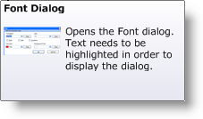

////

|metadata|
{
    "name": "wintooltipmanager-formatted-tooltips-whats-new-20063",
    "controlName": [],
    "tags": [],
    "guid": "{804A8498-6768-4F45-BE18-11BAFC5FDD20}",  
    "buildFlags": [],
    "createdOn": "0001-01-01T00:00:00Z"
}
|metadata|
////

= Formatted Tooltips

ToolTips have been a staple of quick information-gathering for years now. However, ToolTips tend to appear bland with the same fonts and colors being used time and time again. Formatted ToolTips put an end to this monotony. Using  pick:[win-forms="link:{ApiPlatform}win{ApiVersion}~infragistics.win.formattedlinklabel.formattedlinkeditor.html[FormattedLinkEditor]"] , our ToolTips can now potentially display simple Web pages.

With formatted ToolTips, you can choose to add an image to a ToolTip. You can right-align text, use a horizontal rule, or even use the versatile link:winformattedtexteditor-style-attribute.html[style attribute]. Formatted ToolTips are the next generation of pop-up help.

Below you will find an image of our formatted ToolTip behaving exactly as the ToolTips do in Microsoft® Office 2007. You will then find useful links that will take you to topics designed to guide you through creating the above-mentioned ToolTip.

]

== Related Topics

link:wintooltipmanager-creating-a-formatted-tooltip.html[Creating a Formatted ToolTip]

link:styling-guide-office-2007-look-and-feel.html[Office 2007 Look and Feel]