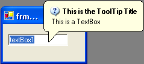

////

|metadata|
{
    "name": "wintooltipmanager-set-up-wintooltipmanager-at-design-time",
    "controlName": ["WinToolTipManager"],
    "tags": ["Design Environment","How Do I"],
    "guid": "{0F5C753A-37C6-47B3-9691-873DFAA4DE4D}",  
    "buildFlags": [],
    "createdOn": "2005-08-09T00:00:00Z"
}
|metadata|
////

= Set Up WinToolTipManager at Design Time

The  pick:[win-forms="link:{ApiPlatform}win{ApiVersion}~infragistics.win.ultrawintooltip.ultratooltipmanager.html[UltraToolTipManager]"]  class adds an extender property called "UltraToolTip" to any control. The UltraToolTip property allows for a control to be managed by the WinToolTipManager™. This allows a tooltip to automatically display when the mouse hovers over the control.

[start=1]
. *Start by placing some controls on a form.*

These can be any controls, but for the purposes of this example, a TextBox will be used.
[start=2]
. *Place an UltraToolTipManager component on the Form.*
[start=3]
. *Set the ToolTipText property on the TextBox.*

By default, the WinToolTipManager will show a tooltip when the mouse hovers over a control only when that control has it's  pick:[win-forms="link:{ApiPlatform}win{ApiVersion}~infragistics.win.ultrawintooltip.ultratooltipinfo~tooltiptext.html[ToolTipText]"]  set to a valid string.

[start=4]
. *Set optional properties.*

Once the ToolTipText is set, a tooltip will be displayed for the TextBox when the mouse hovers over it at run-time.

If you want the tooltip to display a title as well, set the  pick:[win-forms="link:{ApiPlatform}win{ApiVersion}~infragistics.win.ultrawintooltip.ultratooltipinfo~tooltiptitle.html[ToolTipTitle]"]  property.

If you want the tooltip to display an Image in the title, set the  pick:[win-forms="link:{ApiPlatform}win{ApiVersion}~infragistics.win.ultrawintooltip.ultratooltipinfo~tooltipimage.html[ToolTipImage]"] . ToolTipImage gives you some options for some common images. To display a custom Image, set the ToolTipImage property to  pick:[win-forms="link:{ApiPlatform}win{ApiVersion}~infragistics.win.tooltipimage.html[Custom]"]  and set the  pick:[win-forms="link:{ApiPlatform}win{ApiVersion}~infragistics.win.appearance~image.html[Appearance.Image]"]  or ToolTipTitleAppearance.Image property.

At this point, you can also set other Appearance properties such as BackColor, ForeColor, etc.
[start=5]
. *Run the application.*

Run the application and hover the mouse over the TextBox. The WinToolTip will display after a delay specified by the  pick:[win-forms="link:{ApiPlatform}win{ApiVersion}~infragistics.win.ultrawintooltip.ultratooltipmanager~initialdelay.html[InitialDelay]"]  property of the WinToolTipManager (half a second by default).

