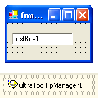
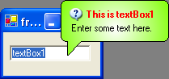

////

|metadata|
{
    "name": "wintooltipmanager-set-up-wintooltipmanager-at-run-time",
    "controlName": ["WinToolTipManager"],
    "tags": ["How Do I"],
    "guid": "{58E0C7AA-3873-4CCE-8136-493072068C71}",  
    "buildFlags": [],
    "createdOn": "2005-08-09T00:00:00Z"
}
|metadata|
////

= Set Up WinToolTipManager at Run Time

WinToolTipManager™ adds an extender property called "UltraToolTip" to any control. The UltraToolTip property allows for a control to be managed by the WinToolTipManager. This allows a tooltip to automatically display when the mouse hovers over the control.

[start=1]
. Before you start writing any code, you should place using/imports directives in your code-behind so you don't need to always type out a member's fully qualified name.

*In Visual Basic:*

----
Imports Infragistics.Win
Imports Infragistics.Win.UltraWinToolTip
----

*In C#:*

----
using Infragistics.Win;
using Infragistics.Win.UltraWinToolTip;
----

[start=2]
. *Place controls on the form*

These can be any controls, but for the purposes of this example, a TextBox will be used.
[start=3]
. *Place an UltraToolTipManager component on the Form.*

[start=4]
. *Get the ToolTipInfo for the control.*

In order to set up WinToolTip properties, you must first get the  pick:[win-forms="link:{ApiPlatform}win{ApiVersion}~infragistics.win.ultrawintooltip.ultratooltipinfo.html[ToolTipInfo]"]  for the control. Do this using the  pick:[win-forms="link:{ApiPlatform}win{ApiVersion}~infragistics.win.ultrawintooltip.ultratooltipmanager~getultratooltip.html[GetUltraToolTip]"]  method of the WinToolTipManager. Place the following code in the Form_Load event.

*In Visual Basic:*

----
' Get the ToolTipInfo for TextBox1
Dim toolTipInfo As UltraToolTipInfo = _
  Me.ultraToolTipManager1.GetUltraToolTip(Me.textBox1)
----

*In C#:*

----
// Get the ToolTipInfo for TextBox1
UltraToolTipInfo toolTipInfo = 
  this.ultraToolTipManager1.GetUltraToolTip(this.textBox1);
----

[start=5]
. *Set the ToolTipText.*

In order to display a tooltip, the ToolTipText property must be set to some text. Add the following code.

*In Visual Basic:*

----
' Set the ToolTipText
toolTipInfo.ToolTipText = "Enter some text here."
----

*In C#:*

----
// Set the ToolTipText.
toolTipInfo.ToolTipText = "Enter some text here.";
----

[start=6]
. *Set optional properties*

Once the ToolTipText is set, a tooltip will be displayed for the TextBox when the mouse hovers over it at run-time. If you want the tooltip to display a title, set the  pick:[win-forms="link:{ApiPlatform}win{ApiVersion}~infragistics.win.ultrawintooltip.ultratooltipmanager~tooltiptitle.html[ToolTipTitle]"]  property. If you want the tooltip to display an Image in the title, set the  pick:[win-forms="link:{ApiPlatform}win{ApiVersion}~infragistics.win.ultrawintooltip.ultratooltipmanager~tooltipimage.html[ToolTipImage]"] . ToolTipImage gives you some options for some common images. To display a custom Image, set the ToolTipImage property to Custom and set the Appearance.Image or TitleAppearance.Image property. At this point, you can also set other Appearance properties such as BackColor, ForeColor, etc.

*In Visual Basic:*

----
' Set the ToolTipTitle
toolTipInfo.ToolTipTitle = "This is textBox1"
' Apply an image
toolTipInfo.ToolTipImage = ToolTipImage.Info
' Apply an appearance
toolTipInfo.Appearance.BackColor = Color.White
toolTipInfo.Appearance.BackColor2 = Color.Chartreuse
toolTipInfo.Appearance.BackGradientStyle = GradientStyle.Circular
toolTipInfo.Appearance.ForeColor = Color.Black
' Apply an appearance to the Title.
toolTipInfo.ToolTipTitleAppearance.ForeColor = Color.Red
----

*In C#:*

----
// Set the ToolTipTitle
toolTipInfo.ToolTipTitle = "This is textBox1";
// Apply an image
toolTipInfo.ToolTipImage = ToolTipImage.Info;
// Apply an appearance
toolTipInfo.Appearance.BackColor = Color.White;
toolTipInfo.Appearance.BackColor2 = Color.Chartreuse;
toolTipInfo.Appearance.BackGradientStyle = GradientStyle.Circular;
toolTipInfo.Appearance.ForeColor = Color.Black;
// Apply an appearance to the Title.
toolTipInfo.ToolTipTitleAppearance.ForeColor = Color.Red;
----

[start=7]
. *Run the application*

Run the application and hover the mouse over the TextBox. The WinToolTip will display after a delay specified by the  pick:[win-forms="link:{ApiPlatform}win{ApiVersion}~infragistics.win.ultrawintooltip.ultratooltipmanager~initialdelay.html[InitialDelay]"]  property of the WinToolTipManager (half a second by default).

