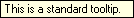
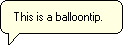
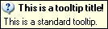
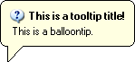
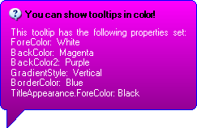
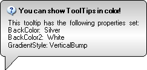
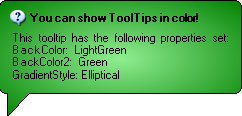

////

|metadata|
{
    "name": "wintooltipmanager-tooltip-styles",
    "controlName": ["WinToolTipManager"],
    "tags": ["Styling"],
    "guid": "{23AD78BF-5680-48B1-BBE6-FC25188B3D9C}",  
    "buildFlags": [],
    "createdOn": "2005-08-09T00:00:00Z"
}
|metadata|
////

= Tooltip Styles

WinToolTipManager™ allows you to specify the style of the tooltip, as well as colors, images, and fonts.

== DisplayStyle Property

The  pick:[win-forms="link:{ApiPlatform}win{ApiVersion}~infragistics.win.ultrawintooltip.ultratooltipmanager~displaystyle.html[DisplayStyle]"]  Property of WinToolTipManager controls the basic style of the ToolTip. There are options for standard tooltips which appear rectangular, just like the regular DotNet ToolTip class, or balloon tips which have rounded corners and a callout, like a speech bubble.

== Titles

In addition to displaying text like a regular tooltip, the WinToolTip can also display a title. The title appears above the text and you have the option of including an image. To assign a title to your tooltips, use the  pick:[win-forms="link:{ApiPlatform}win{ApiVersion}~infragistics.win.ultrawintooltip.ultratooltipmanager~tooltiptitle.html[ToolTipTitle]"]  property. This property exists on both the UltraWinToolTipManager component and on the  pick:[win-forms="link:{ApiPlatform}win{ApiVersion}~infragistics.win.ultrawintooltip.ultratooltipinfo.html[UltraToolTipInfo]"]  class. So you can assign a title to all of your tooltips and then override the title on specific controls. And the same is also true of the  pick:[win-forms="link:{ApiPlatform}win{ApiVersion}~infragistics.win.ultrawintooltip.ultratooltipmanager~tooltipimage.html[ToolTipImage]"] .

== Colors and Fonts

Using the  pick:[win-forms="link:{ApiPlatform}win{ApiVersion}~infragistics.win.ultrawintooltip.ultratooltipmanager~appearance.html[Appearance]"]  property, you can modify the colors and fonts of your tooltips and supply a custom image. You can also use gradients or hatch brushes for the background. Like the ToolTipTitle and ToolTipImage properties, Appearance exists on both the UltraWinToolTipManager component and on the UltraToolTipInfo class. So appearance properties can be applied to all tooltips and overridden on specific controls.

