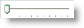

////

|metadata|
{
    "name": "wintrackbar-about-wintrackbar",
    "controlName": ["WinTrackBar"],
    "tags": ["Getting Started","Navigation"],
    "guid": "{5DC34DA5-D841-4148-B586-6467EA3D3D6D}",  
    "buildFlags": [],
    "createdOn": "2008-11-01T16:06:15Z"
}
|metadata|
////

= About WinTrackBar

WinTrackBar™ is an editor control that helps your end user choose a single value from a range of values. WinTrackBar is similar in design to the WinProgressBar control, but WinTrackBar allows the end user to edit the value, WinProgressBar does not. WinTrackBar can also show progress with its thumb. Along with the standard embeddable editor and Presentation Layer Framework™ support, WinTrackBar comes with several extra features:

* *Thumb* -- Your end users can use the thumb to set WinTrackBar's value directly. Clicking on the thumb and then dragging will set WinTrackBar's value to whichever value the end user releases the mouse over. The end user can also click directly on the TrackBar and, depending on the  pick:[win-forms="link:{ApiPlatform}win.ultrawineditors{ApiVersion}~infragistics.win.ultrawineditors.ultratrackbar~trackclickaction.html[TrackClickAction]"]  property, the thumb will move in increments towards that position, or the thumb will move directly to that position.
* *Tickmarks* -- There are two collections of Tickmarks, major and minor. As their names imply, major Tickmarks visualize large changes in value, minor Tickmarks visualize smaller changes in value. You can set the thickness, length, distance from the track, frequency, and location through the  pick:[win-forms="link:{ApiPlatform}win.ultrawineditors{ApiVersion}~infragistics.win.ultrawineditors.ultratrackbar~tickmarksettingsmajor.html[TickMarkSettingsMajor]"]  and  pick:[win-forms="link:{ApiPlatform}win.ultrawineditors{ApiVersion}~infragistics.win.ultrawineditors.ultratrackbar~tickmarksettingsminor.html[TickMarkSettingsMinor]"]  objects.
* *Left and Right Button Collections* -- You can add incremental buttons or min/max buttons for more precision.
* *Styles* -- WinTrackBar includes three separate styles: the standard .NET TrackBar style, Office 2007, and Windows Vista.

