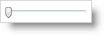

////

|metadata|
{
    "name": "wintrackbar-change-wintrackbars-style",
    "controlName": ["WinTrackBar"],
    "tags": ["How Do I","Navigation","Styling"],
    "guid": "{731DDC94-CC93-4502-9B88-7A858A72026F}",  
    "buildFlags": [],
    "createdOn": "2008-10-01T16:56:33Z"
}
|metadata|
////

= Change WinTrackBar's Style

WinTrackBar includes three styles (set with the  pick:[win-forms="link:{ApiPlatform}win.ultrawineditors{ApiVersion}~infragistics.win.ultrawineditors.ultratrackbar~viewstyle.html[ViewStyle]"]  property) that were modeled after separate Microsoft® look and feels:

* *Standard* – The standard style gives you basic functionality and looks like the standard .NET in-box TrackBar.

* *Office2007* – The Office2007 style resembles the zoom TrackBar found at the bottom of Microsoft Office 2007 products. This style displays a Min and Max button by default.

* Vista – The Vista style emulates the look and feel of the TrackBar found in the Windows Vista operating system.

Change WinTrackBar's style to Office2007 with the following code sample.

*In Visual Basic:*

----
Me.UltraTrackBar1.ViewStyle =_ 
	Infragistics.Win.UltraWinEditors.TrackBarViewStyle.Office2007
----

*In C#:*

----
this.ultraTrackBar1.ViewStyle = 
	Infragistics.Win.UltraWinEditors.TrackBarViewStyle.Office2007;
----